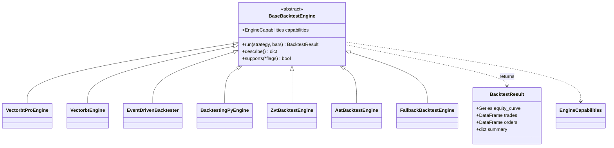

# Backtest engines

> Doc map: [docs/index.md](index.md) · vbt-pro deep dive: [docs/vbtpro-integration.md](vbtpro-integration.md) · Class hierarchy: [docs/class-diagram.md#4-backtest--paper--live-ibrokerage--idataqueuehandler](class-diagram.md#4-backtest--paper--live-ibrokerage--idataqueuehandler).

After the vbt-pro primary-engine rehaul AQP ships seven interchangeable
backtest engines that all return the same
`aqp.backtest.engine.BacktestResult` shape. The runner, persistence, MLflow
tracking, and UI never need to branch on which engine produced a run.

| Engine                 | Use case                                                            | Extra      | License      |
|------------------------|---------------------------------------------------------------------|------------|--------------|
| `VectorbtProEngine`    | **Primary** vectorised engine. Five modes: signals/orders/optimizer/holding/random. | `vectorbtpro` (licensed) | proprietary  |
| `EventDrivenBacktester`| Per-bar Python loop. Used for true async **agent dispatch** via `context['agents']`. | *(core)*   | MIT          |
| `VectorbtEngine`       | OSS vectorbt fallback for the signals path.                         | `vectorbt` | Apache-2.0   |
| `BacktestingPyEngine`  | Single-symbol with grid + SAMBO optimisation.                       | `backtesting` | AGPL-3.0   |
| `ZvtBacktestEngine`    | Permissive-licence CN-bar fallback.                                 | `zvt`      | MIT          |
| `AatBacktestEngine`    | Async / synthetic LOB fallback.                                     | `aat`      | Apache-2.0   |
| `FallbackBacktestEngine` | Cascade — primary plus configured fallback chain.                 | *(core)*   | meta         |

NautilusTrader is **not** wired in (LGPL-3.0; out of scope for this rehaul).

Every concrete engine inherits from `aqp.backtest.base.BaseBacktestEngine`
and declares its feature surface via
`aqp.backtest.capabilities.EngineCapabilities`. Capabilities are
introspectable via the `engine_capabilities` agent tool or
`aqp.backtest.engine_capabilities_index()`.

## Dispatching from YAML

Three equivalent ways to pick an engine inside a strategy recipe:

```yaml
# 1) Engine shortcut (cleanest).
backtest:
  engine: vbt-pro:signals       # or vbt-pro:orders / :optimizer / :holding / :random
  kwargs:
    initial_cash: 100000
    fees: 0.0005

# 2) Explicit class + module.
backtest:
  class: VectorbtProEngine
  module_path: aqp.backtest.vbtpro.engine
  kwargs:
    mode: orders
    initial_cash: 100000

# 3) Omit the engine entirely → the event-driven engine remains the
#    backward-compatible default.
backtest:
  kwargs:
    initial_cash: 100000
    commission_pct: 0.0005
```

Available shortcuts:

| Shortcut             | Resolves to              | Notes                                    |
|----------------------|--------------------------|------------------------------------------|
| `default` / `event` / `event-driven` | `EventDrivenBacktester` | Backward-compatible default.    |
| `primary` / `vbt-pro` / `vectorbt-pro` | `VectorbtProEngine`     | Primary vectorised engine.       |
| `vbt-pro:signals`    | `VectorbtProEngine`      | Inject `mode="signals"`.                 |
| `vbt-pro:orders`     | `VectorbtProEngine`      | Inject `mode="orders"`.                  |
| `vbt-pro:optimizer`  | `VectorbtProEngine`      | Inject `mode="optimizer"`.               |
| `vbt-pro:holding`    | `VectorbtProEngine`      | Buy-and-hold baseline.                   |
| `vbt-pro:random`     | `VectorbtProEngine`      | Random-signals baseline.                 |
| `vectorbt` / `vbt`   | `VectorbtEngine`         | OSS fallback.                            |
| `backtesting` / `bt` | `BacktestingPyEngine`    | Single-symbol path.                      |
| `zvt`                | `ZvtBacktestEngine`      | Lazy import; CN-bar simulator.           |
| `aat`                | `AatBacktestEngine`      | Lazy import; async LOB engine.           |
| `fallback` / `cascade` | `FallbackBacktestEngine` | Engine cascade (see below).            |

`aqp.backtest.runner.run_backtest_from_config` routes every YAML through
the right engine and stamps `engine` into `BacktestRun.metrics`.

## Fallback dispatch

```yaml
backtest:
  engine: fallback
  primary: vbt-pro
  fallbacks: [event, aat, zvt, vectorbt]
```

`DEFAULT_FALLBACK_CHAIN` defaults to `("event", "aat", "zvt", "vectorbt")`
so callers that only set `primary` get a sensible cascade. Failures and
the actually-selected engine surface in
`summary["selected_engine"]` and `summary["fallback_errors"]`.

## Capability matrix

The `engine_capabilities` agent tool returns a JSON capability dataclass
for every importable engine. Highlights:

| Engine                 | signals | orders | callbacks | multi-asset | shorts | leverage | LOB | async | per-bar Python | optimizer | walk-forward |
|------------------------|:-------:|:------:|:---------:|:-----------:|:------:|:--------:|:---:|:-----:|:--------------:|:---------:|:-----------:|
| `VectorbtProEngine`    | yes     | yes    | yes       | yes         | yes    | yes      |     |       |                | yes       | yes         |
| `EventDrivenBacktester`| yes     | yes    | yes       | yes         | yes    |          |     |       | yes            |           | yes         |
| `BacktestingPyEngine`  | yes     |        |           |             | yes    | yes      |     |       |                |           |             |
| `ZvtBacktestEngine`    | yes     |        |           | yes         |        |          |     |       | yes            |           |             |
| `AatBacktestEngine`    | yes     | yes    |           | yes         | yes    |          | yes | yes   | yes            |           |             |

## Agent + ML components

Strategies can plug agents and ML models into either path:

- **Vectorised (vbt-pro)** — use the panel components in
  `aqp.strategies.vbtpro`:
  - [`AgenticVbtAlpha`](../aqp/strategies/vbtpro/agentic_alpha.py) —
    precompute or per-window agent dispatch into wide entries/exits/size
    arrays.
  - [`MLVbtAlpha`](../aqp/strategies/vbtpro/ml_alpha.py) — wraps any
    `aqp.ml.base.Model` (or MLflow URI) and emits arrays via threshold /
    top-k / rank policies.
  - [`AgenticOrderModel`](../aqp/strategies/vbtpro/agent_order_model.py) —
    drives `Portfolio.from_orders` from cached agent decisions.
- **Event-driven (per-bar Python)** — use
  [`AgentDispatcher`](../aqp/strategies/agentic/agent_dispatcher.py)
  exposed via `context['agents']`. Strategies call
  `context['agents'].consult(spec_name, inputs, ttl=...)` from inside
  `on_bar` and the dispatcher de-duplicates via TTL + LRU.
  See [`AgentAwareMomentumAlpha`](../aqp/strategies/agentic/agent_aware_alpha.py)
  for a worked example.

The vbt-pro engine **cannot** dispatch agents per-bar inside its inner
loop — `signal_func_nb` / `order_func_nb` are Numba-jit only. Use the
event-driven engine for those use cases, or pre-compute the decision
panel ahead of time and feed it through `AgenticVbtAlpha` precompute mode.

## Unified result

Every engine returns a `BacktestResult` with:

- `equity_curve: pd.Series` indexed by timestamp.
- `trades: pd.DataFrame` with `timestamp, vt_symbol, side, quantity,
  price, commission, slippage, strategy_id`.
- `orders: pd.DataFrame`.
- `summary: dict` — `sharpe`, `sortino`, `max_drawdown`, `calmar`,
  `total_return`, `final_equity`, `n_bars`, `volatility_ann`, `n_trades`,
  `turnover`, `engine`. The vbt-pro and OSS-vectorbt engines additionally
  populate `vbt_*` keys with native stats; `BacktestingPyEngine` ships
  `bt_*`; ZVT/AAT add `zvt_*` / `aat_*` markers.

## Engine hierarchy



## Which engine to use?

- **Vectorised research / parameter screens / WFO** → `VectorbtProEngine`.
  Five constructor modes; full kwarg surface.
- **Per-bar agent dispatch** (LLM in the loop) → `EventDrivenBacktester`
  with `context['agents'].consult(...)`.
- **Synthetic LOB realism** → `AatBacktestEngine`.
- **Chinese-market data** → `ZvtBacktestEngine`.
- **Single-symbol grid optimisation** → `BacktestingPyEngine` with
  `.optimize(ranges, method="grid"|"sambo", ...)`.

For the vbt-pro deep-integration details (mode dispatch, hooks,
performance notes, Numba constraints) see
[docs/vbtpro-integration.md](vbtpro-integration.md).
