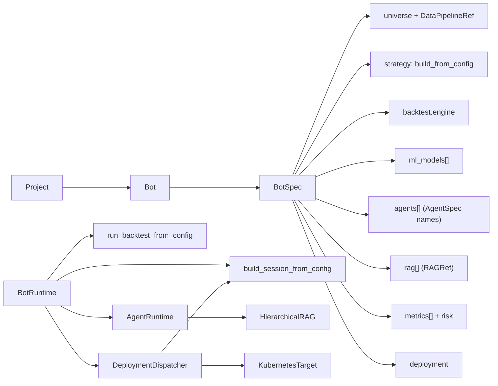
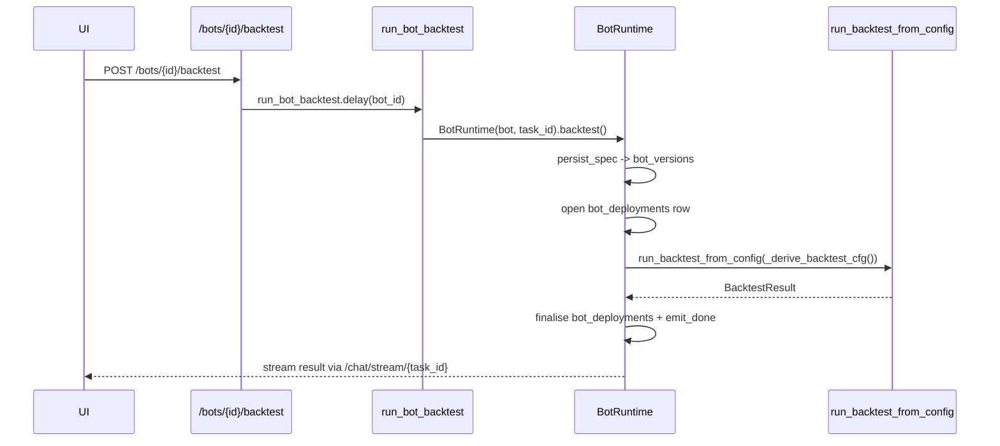

# Bots

> The smallest self-contained, deployable unit on AQP.

A **Bot** aggregates everything required to research, evaluate, and
deploy an algorithmic trading automation:

- a **trading universe** (symbol list or registry-driven model),
- a **data ingestion pipeline** preset,
- a **strategy graph** (alpha → portfolio → risk → execution, via
  `FrameworkAlgorithm`),
- a **backtest engine** (vbt-pro / event-driven / vectorbt / fallback),
- optional **ML model deployments** (`ModelDeployment` ids),
- optional **spec-driven agents** for supervision / per-bar consult /
  research chat,
- a **hierarchical RAG** access plan,
- **evaluation metrics** with thresholds,
- **risk caps**, and
- a **deployment target** (paper session / Kubernetes / backtest-only).

Bots live under a [`Project`](erd.md) (`ProjectScopedMixin`). Within a
project, bots are uniquely identified by their slug.

## Composition



`Bot` does **not** re-implement strategy / engine / agent / RAG logic.
It composes references and dispatches to existing primitives so all
hard rules from [AGENTS.md](../AGENTS.md) (`router_complete`,
`iceberg_catalog`, `AgentRuntime`, `HierarchicalRAG`, `emit/emit_done`)
remain the only paths into those subsystems.

## Subclasses

| Subclass | Required spec slots | Methods | Use case |
| --- | --- | --- | --- |
| `TradingBot` | `strategy`, `backtest` | `backtest()`, `paper()`, `deploy()`, `consult_agents()` | Live / paper / backtest trading |
| `ResearchBot` | `agents` | `chat()`, optional `backtest()` (only if `strategy` set) | Research agent + chat surface |

`TradingBot.chat()` raises `BotMethodNotSupported` — pair the bot with
a companion `ResearchBot`. `ResearchBot.paper()` raises
`BotMethodNotSupported` — clone the spec into a `TradingBot` first.

## Spec example

```yaml
name: Dual MA AAPL
slug: dual-ma-aapl
kind: trading
description: Dual MA crossover on AAPL/MSFT.

universe:
  symbols: [AAPL.NASDAQ, MSFT.NASDAQ]

data_pipeline:
  preset: ohlcv-daily
  source: alpaca

strategy:
  class: FrameworkAlgorithm
  module_path: aqp.strategies.framework
  kwargs:
    universe_model:
      class: StaticUniverse
      module_path: aqp.strategies.universes
      kwargs: { symbols: [AAPL.NASDAQ, MSFT.NASDAQ] }
    alpha_model:
      class: DualMACrossoverAlpha
      module_path: aqp.strategies.dual_ma
      kwargs: { fast: 10, slow: 50 }
    portfolio_model: { class: EqualWeightPortfolio }
    risk_model: { class: NoOpRiskModel }
    execution_model: { class: ImmediateExecutionModel }

backtest:
  engine: vbt-pro:signals
  kwargs: { initial_cash: 100000.0 }

agents:
  - spec_name: research.quant_vbtpro
    role: supervisor

rag:
  - levels: [l1, l2]
    orders: [first, second]
    corpora: [bars_daily, performance]

metrics:
  - { name: sharpe, threshold: 1.0, direction: max }
  - { name: max_drawdown, threshold: 0.25, direction: min }

risk:
  max_position_pct: 0.25
  max_daily_loss_pct: 0.02

deployment:
  target: paper_session
  brokerage: simulated
  feed: deterministic_replay
  initial_cash: 100000.0
  dry_run: true
```

Drop the file under [configs/bots/trading/](../configs/bots/trading/)
or [configs/bots/research/](../configs/bots/research/) — the registry
lazy-scans both directories on first lookup.

## Persistence

Three new tables, all `ProjectScopedMixin` (Alembic migration
`0020_bots`):

- **`bots`** — logical row with the latest active version of a named
  spec inside a project. Unique on `(project_id, slug)`.
- **`bot_versions`** — immutable, hash-locked snapshot of every
  `BotSpec` change. Unique on `(bot_id, spec_hash)` and `(bot_id,
  version)`.
- **`bot_deployments`** — one row per backtest / paper / chat / k8s
  invocation. References `version_id` so a run can be replayed against
  the exact spec that produced it.

The runtime mirrors the proven `AgentSpec` / `AgentSpecVersion` /
`AgentRunV2` triad from
[aqp/agents/runtime.py](../aqp/agents/runtime.py).

## Lifecycle

### Backtest



### Paper

`POST /bots/{id}/paper/start` dispatches `run_bot_paper`, which builds
a `PaperTradingSession` via the existing
[`build_session_from_config`](../aqp/trading/runner.py) and awaits its
async `run()`. Stop with `POST /bots/{id}/paper/stop/{task_id}` (reuses
[`publish_stop_signal`](../aqp/tasks/paper_tasks.py)).

### Chat (ResearchBot)

`POST /bots/{id}/chat` dispatches `chat_research_bot`, which iterates
the bot's `agents[]` and runs each through
[`AgentRuntime`](../aqp/agents/runtime.py). RAG retrieval, memory, and
guardrails behave identically to direct
`POST /agents/runs/v2/sync` calls — the bot is just a curator of agent
specs.

### Deploy

`POST /bots/{id}/deploy` dispatches `deploy_bot`, which delegates to
the configured target via
[`DeploymentDispatcher`](../aqp/bots/deploy.py):

| Target | Behaviour |
| --- | --- |
| `paper_session` | Launches a paper session in the Celery worker. |
| `backtest_only` | Runs a single backtest + persists result on the deployment row. |
| `kubernetes` | Renders `Deployment` + `ConfigMap` YAML to `deploy/k8s/bots/<slug>.yaml`. Optionally `kubectl apply`s when `apply=True` and `kubectl` is on PATH. |

The Kubernetes manifest's pod entrypoint is
`python -m aqp.bots.cli run <slug>` (see
[aqp/bots/cli.py](../aqp/bots/cli.py)).

## REST surface

All endpoints under `/bots`:

| Method | Path | Purpose |
| --- | --- | --- |
| `GET` | `/bots` | List (filter by `project_id`, `kind`, `status_filter`) |
| `POST` | `/bots` | Create (body: `{spec, project_id?}`) |
| `GET` | `/bots/{ref}` | Detail (`{ref}` = id or slug) |
| `PUT` | `/bots/{ref}` | Update (auto-snapshots a new version on change) |
| `DELETE` | `/bots/{ref}` | Delete |
| `GET` | `/bots/{ref}/versions` | List `bot_versions` |
| `GET` | `/bots/{ref}/deployments` | List `bot_deployments` |
| `POST` | `/bots/{ref}/backtest` | Dispatch `run_bot_backtest` (returns `TaskAccepted`) |
| `POST` | `/bots/{ref}/paper/start` | Dispatch `run_bot_paper` |
| `POST` | `/bots/{ref}/paper/stop/{task_id}` | Stop in-flight paper session |
| `POST` | `/bots/{ref}/deploy` | Dispatch `deploy_bot` |
| `POST` | `/bots/{ref}/chat` | Dispatch `chat_research_bot` (research only) |

Async lifecycle endpoints return
[`TaskAccepted`](../aqp/api/schemas.py) with `stream_url` pointing at
the existing `/chat/stream/{task_id}` WebSocket — no new transport.

## CLI

`python -m aqp.bots.cli` for shell-level operations:

```bash
python -m aqp.bots.cli list
python -m aqp.bots.cli show dual-ma-aapl --yaml
python -m aqp.bots.cli backtest dual-ma-aapl
python -m aqp.bots.cli paper dual-ma-aapl --run-name 2026-05-03
python -m aqp.bots.cli chat equity-research-bot "What is AAPL's edge?"
python -m aqp.bots.cli deploy dual-ma-aapl --target kubernetes
python -m aqp.bots.cli run dual-ma-aapl   # pod entrypoint
```

## UI

The bot builder lives at
[`/bots`](../webui/app/(shell)/bots/page.tsx) and reuses the existing
`@xyflow/react` canvas via
[`WorkflowEditor`](../webui/components/flow/WorkflowEditor.tsx). The
palette
([`webui/components/bots/botPalette.ts`](../webui/components/bots/botPalette.ts))
exposes ten kinds — Universe, DataPipeline, Strategy, Engine, MLModel,
Agent, RAG, Metric, Risk, Deploy. Each node maps 1:1 to a `BotSpec`
slot via
[`serializeBotSpec`](../webui/components/bots/botSerializer.ts); the
inverse `deserializeBotSpec` lets the builder edit a saved bot.

The detail page ships tabs:

- **Overview** — primary action buttons (Backtest / Start paper / Deploy / Render K8s manifest).
- **Builder** — the node-and-wire canvas.
- **Deployments** — every `bot_deployments` row.
- **Versions** — every `bot_versions` row.
- **Chat** — only for `ResearchBot` kind; embeds
  [`ResearchBotChat`](../webui/components/bots/ResearchBotChat.tsx)
  driven by `useChatStream`.

## Hard rules

- Bot agent calls go through
  [`AgentRuntime`](../aqp/agents/runtime.py); `BotRuntime` never calls
  `router_complete` directly.
- Bot RAG access goes through
  [`HierarchicalRAG`](../aqp/rag/hierarchy.py) via the agent's `rag:`
  clause.
- Bot data loading uses
  [`IngestionPipeline.run_path`](../aqp/data/pipelines/runner.py) and
  `iceberg_catalog.append_arrow`; never raw PyIceberg.
- Bot progress emits go through
  [aqp/tasks/_progress.py](../aqp/tasks/_progress.py) preserving the
  `{task_id, stage, message, timestamp, **extras}` payload shape.
- Strategies / engines / models in `BotSpec` use the existing
  `{class, module_path, kwargs}` factory and `@register`.
- New Alembic migrations are additive only; never edit a shipped one.

## Where things live

| Need | Path |
| --- | --- |
| BotSpec | [aqp/bots/spec.py](../aqp/bots/spec.py) |
| BaseBot ABC | [aqp/bots/base.py](../aqp/bots/base.py) |
| TradingBot | [aqp/bots/trading_bot.py](../aqp/bots/trading_bot.py) |
| ResearchBot | [aqp/bots/research_bot.py](../aqp/bots/research_bot.py) |
| BotRuntime | [aqp/bots/runtime.py](../aqp/bots/runtime.py) |
| Registry / persist_spec | [aqp/bots/registry.py](../aqp/bots/registry.py) |
| Deploy targets | [aqp/bots/deploy.py](../aqp/bots/deploy.py) |
| CLI | [aqp/bots/cli.py](../aqp/bots/cli.py) |
| ORM models | [aqp/persistence/models_bots.py](../aqp/persistence/models_bots.py) |
| Alembic migration | [alembic/versions/0020_bots.py](../alembic/versions/0020_bots.py) |
| Celery tasks | [aqp/tasks/bot_tasks.py](../aqp/tasks/bot_tasks.py) |
| REST routes | [aqp/api/routes/bots.py](../aqp/api/routes/bots.py) |
| Example specs | [configs/bots/](../configs/bots/) |
| UI builder | [webui/components/bots/](../webui/components/bots/) |
| Argo template | `rpi_kubernetes/kubernetes/mlops/bots/workflowtemplate-bot-deploy.yaml` |
