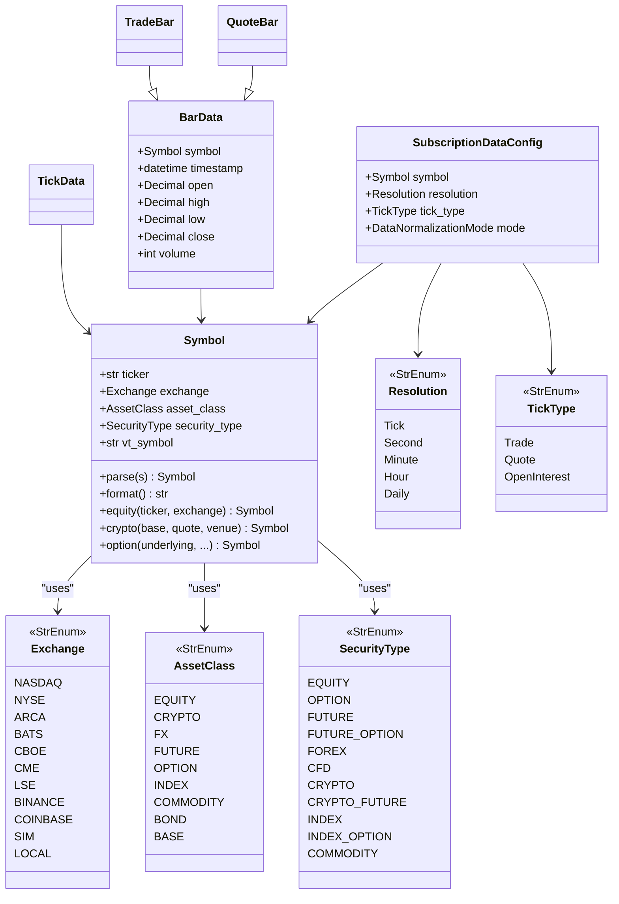
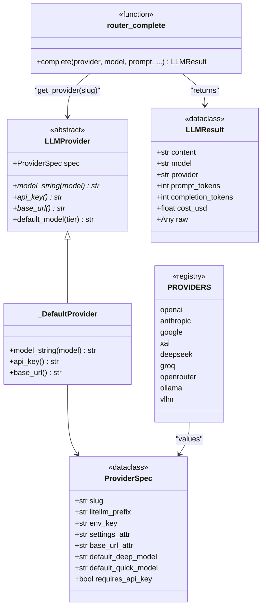
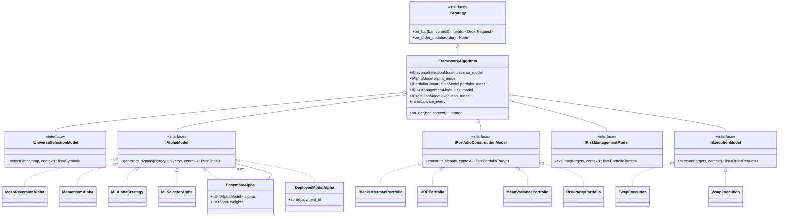
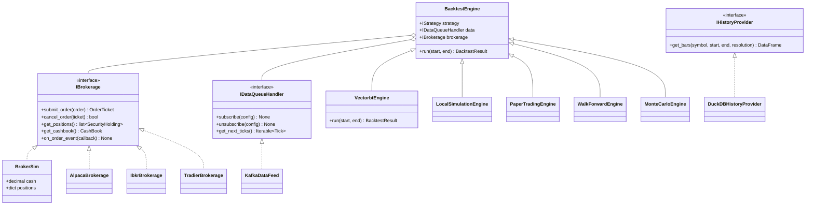
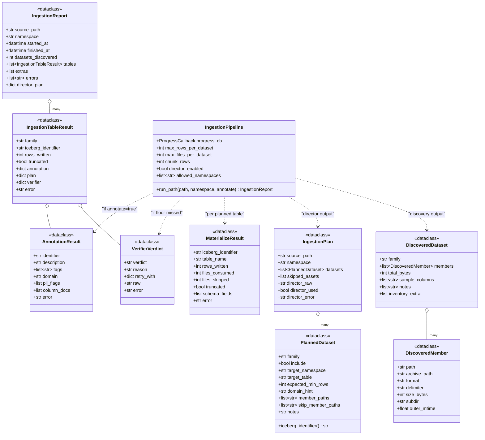
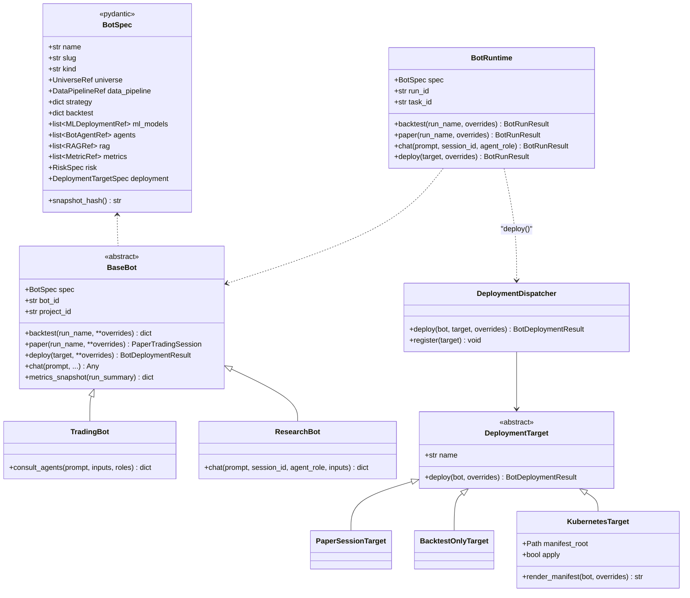

# Class Diagrams

> Pair with [docs/erd.md](erd.md) (database schema) and
> [docs/architecture.md](architecture.md) (system view).
> Doc map: [docs/index.md](index.md).

Hand-authored mermaid `classDiagram` blocks for the five hierarchies AI
coders most often need to navigate. Every diagram cites the canonical
file so you can jump from the diagram into the code in one click.

## 1. Symbol + core enums

The atom that flows through every data feed, strategy, and broker.
Defined in [aqp/core/types.py](../aqp/core/types.py).

**Key invariants**:

- `Symbol` is hashable + frozen. Round-trip via
  `Symbol.parse(symbol.format())` is the identity.
- `vt_symbol` is always `f"{ticker}.{exchange}"` (vnpy convention).
- Concrete instrument shapes (option chains, future contracts) live
  alongside `Symbol` as additional fields, not separate classes.

## 2. LLM provider registry

The router from [aqp/llm/providers/router.py](../aqp/llm/providers/router.py)
dispatches every LLM call through LiteLLM. Adding a provider is a
single dict entry in
[aqp/llm/providers/catalog.py](../aqp/llm/providers/catalog.py).

**Conventions**:

- Always call via `router_complete(provider=..., model=..., ...)`.
- Tier (`deep`/`quick`) routing happens via `settings.provider_for_tier`
  + `provider.default_model(tier)`.
- The control plane in [aqp/runtime/control_plane.py](../aqp/runtime/control_plane.py)
  can override `ollama_host` / `vllm_base_url` at runtime.

## 3. Strategy hierarchy

AQP follows the Lean 5-stage pattern (Universe → Alpha → Portfolio →
Risk → Execution). Concrete strategies are factory-instantiated from
config via the `class`/`module_path`/`kwargs` registry pattern.

The interfaces are in [aqp/core/interfaces.py](../aqp/core/interfaces.py);
concrete alphas in [aqp/strategies/](../aqp/strategies/) (one file per
alpha). See [docs/factor-research.md](factor-research.md) for the
authoring guide.

## 4. Backtest + paper + live (IBrokerage / IDataQueueHandler)

The same strategy runs unchanged across backtest, paper, and live —
the engines differ in how they implement the broker + data-queue
contract, not in how they call the strategy.

Files of interest:

- [aqp/backtest/engine.py](../aqp/backtest/engine.py) — base engine
- [aqp/backtest/vectorbt_engine.py](../aqp/backtest/vectorbt_engine.py)
- [aqp/backtest/broker_sim.py](../aqp/backtest/broker_sim.py) — brokerage
  simulator used by all non-live engines
- [aqp/trading/](../aqp/trading/) — concrete `IBrokerage`
  implementations for paper + live
- [aqp/streaming/](../aqp/streaming/) — Kafka and IBKR feed handlers

See [docs/backtest-engines.md](backtest-engines.md) for the full
engine matrix, [docs/paper-trading.md](paper-trading.md) for the
session lifecycle.

## 5. Generic ingestion pipeline

Discovery → Director → Materialise → Verify → Annotate. The
dataclasses below are the canonical contract between stages.

Files:

- [aqp/data/pipelines/discovery.py](../aqp/data/pipelines/discovery.py)
- [aqp/data/pipelines/director.py](../aqp/data/pipelines/director.py)
- [aqp/data/pipelines/materialize.py](../aqp/data/pipelines/materialize.py)
- [aqp/data/pipelines/annotate.py](../aqp/data/pipelines/annotate.py)
- [aqp/data/pipelines/runner.py](../aqp/data/pipelines/runner.py)
- [aqp/data/pipelines/extractors.py](../aqp/data/pipelines/extractors.py)

Walkthrough lives in [docs/data-catalog.md](data-catalog.md).

## 6. Bot entity (TradingBot / ResearchBot)

The Bot Entity Refactor introduced a first-class deployable unit that
aggregates universe + strategy + engine + ML + agents + RAG + metrics.
The runtime never re-implements those primitives — it composes
references and dispatches to the existing entry points.

Files:

- [aqp/bots/spec.py](../aqp/bots/spec.py)
- [aqp/bots/base.py](../aqp/bots/base.py)
- [aqp/bots/trading_bot.py](../aqp/bots/trading_bot.py)
- [aqp/bots/research_bot.py](../aqp/bots/research_bot.py)
- [aqp/bots/runtime.py](../aqp/bots/runtime.py)
- [aqp/bots/deploy.py](../aqp/bots/deploy.py)
- [aqp/bots/registry.py](../aqp/bots/registry.py)
- [aqp/bots/cli.py](../aqp/bots/cli.py)

Walkthrough lives in [docs/bots.md](bots.md).
