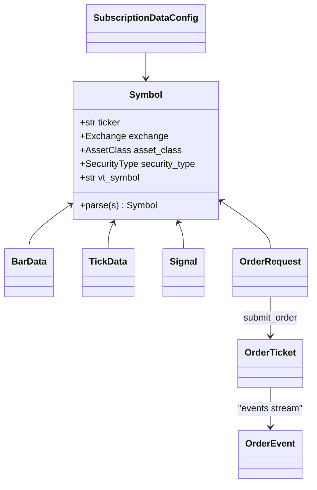

# Core Type System

> Doc map: [docs/index.md](index.md) · Full `Symbol` class diagram: [docs/class-diagram.md#1-symbol--core-enums](class-diagram.md#1-symbol--core-enums).

AQP 0.3 ports Lean's data model into Python with minimal surface area,
full backward compatibility, and strict ``dataclass``-only value objects.

## Quick map

| Lean (C#) | AQP (Python) | File |
|---|---|---|
| `Slice` | `Slice` | [`aqp/core/slice.py`](../aqp/core/slice.py) |
| `BaseData` | `BarData` (alias `TradeBar`), `QuoteBar`, `TickData` (alias `Tick`) | [`aqp/core/types.py`](../aqp/core/types.py) |
| `SubscriptionDataConfig` | `SubscriptionDataConfig` | same |
| `Resolution` / `TickType` | `Resolution` / `TickType` | same |
| `DataNormalizationMode` | `DataNormalizationMode` | same |
| `Symbol` / `SecurityIdentifier` | `Symbol` (composite `ticker.exchange`) | same |
| `Security` / `SecurityHolding` | `SecurityHolding` (extends `PositionData`) | same |
| `Cash` / `CashBook` | `Cash` / `CashBook` | same |
| `Order` / `OrderTicket` / `OrderEvent` | `OrderData` / `OrderTicket` / `OrderEvent` | same |
| `IndicatorBase<T>` / `RollingWindow<T>` | `IndicatorBase[T]` / `RollingWindow[T]` | [`aqp/core/indicators.py`](../aqp/core/indicators.py) |
| `MarketHoursDatabase` | `MarketHoursDatabase` | [`aqp/core/exchange_hours.py`](../aqp/core/exchange_hours.py) |
| `MapFile` / `FactorFile` | `MapFile` / `FactorFile` | [`aqp/core/corporate_actions.py`](../aqp/core/corporate_actions.py) |

## Migration notes

- **`BarData` is unchanged.** ``TradeBar`` is a type alias; existing
  backtest code keeps working.
- **``TickData`` is unchanged.** ``Tick`` is an alias.
- **``PositionData`` is unchanged.** The richer ``SecurityHolding`` is
  additive — convert via ``SecurityHolding.from_position(pos)``.
- **``on_bar(bar, ctx)`` remains the supported strategy entry point.**
  Strategies that implement ``on_data(slice, ctx)`` get called once per
  timestamp instead of once per symbol; the engine auto-detects which
  method to call.
- **Orders now surface as tickets.** The engine populates
  ``BacktestResult.tickets`` with :class:`OrderTicket` objects that
  carry the full ``OrderEvent`` stream for each order.

## Indicator registry

25 built-in indicators, all subclasses of ``IndicatorBase``. Resolve by
string via ``build_indicator("SMA", period=20)`` or import directly.

```python
from aqp.core.indicators import SimpleMovingAverage, warmup

sma = SimpleMovingAverage(20)
print(warmup(sma, [100, 101, 102]))  # NaN until 20 samples
```

## Subscription routing

Every downstream consumer (backtest engine, paper engine, RL env,
factor job) reads data through :class:`SubscriptionDataConfig` via
:class:`aqp.data.subscription.SubscriptionManager`. That swap enables
normalisation-aware queries and composite history providers without
touching strategy code.

## Type relationships



