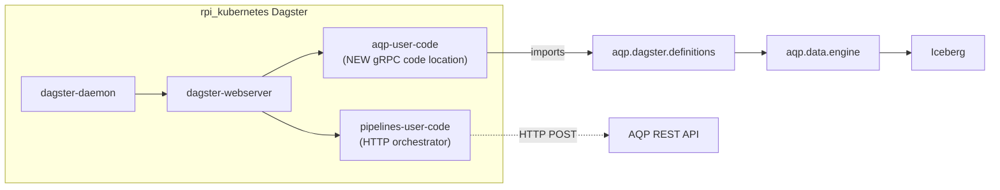

# AQP × Dagster

Hybrid integration: AQP ships its own Dagster code location for
asset-driven orchestration, **and** the existing rpi_kubernetes
`pipelines/dagster_user_code` continues to drive AQP via HTTP for
high-level platform-wide jobs.



## Code-location layout

| Module | What it does |
| --- | --- |
| [aqp/dagster/__init__.py](../aqp/dagster/__init__.py) | Lazy export of `defs`. |
| [aqp/dagster/definitions.py](../aqp/dagster/definitions.py) | Aggregates assets/jobs/schedules/sensors/resources. |
| [aqp/dagster/resources.py](../aqp/dagster/resources.py) | `AqpEngineResource`, `AqpIcebergResource`, `AqpDataHubResource`, `AqpComputeResource`. |
| [aqp/dagster/partitions.py](../aqp/dagster/partitions.py) | `daily_partitions`, `symbol_partitions`, `regulatory_partitions`, ... |
| [aqp/dagster/assets/sources.py](../aqp/dagster/assets/sources.py) | One asset per fetcher (`fred_observations`, `cfpb_complaints`, ...). |
| [aqp/dagster/assets/entities.py](../aqp/dagster/assets/entities.py) | Entity extractor + enricher assets. |
| [aqp/dagster/assets/catalog.py](../aqp/dagster/assets/catalog.py) | DataHub push / pull assets. |
| [aqp/dagster/assets/profiling.py](../aqp/dagster/assets/profiling.py) | Refresh dataset_profiles cache. |
| [aqp/dagster/assets/compaction.py](../aqp/dagster/assets/compaction.py) | Iceberg snapshot expiration / file rewrite. |
| [aqp/dagster/jobs.py](../aqp/dagster/jobs.py) | `full_data_refresh_job`, `regulatory_refresh_job`, `entity_extraction_job`, ... |
| [aqp/dagster/schedules.py](../aqp/dagster/schedules.py) | Daily / hourly / weekly schedules. |
| [aqp/dagster/sensors.py](../aqp/dagster/sensors.py) | `pipeline_manifests_changed` sensor. |
| [aqp/dagster/code_server/](../aqp/dagster/code_server/) | Dockerfile + entrypoint for the gRPC code location. |

## Running locally

```bash
pip install ".[dagster-aqp]"
dagster api grpc -m aqp.dagster.definitions
```

To explore via the local webserver:

```bash
dagster dev -m aqp.dagster.definitions
```

## Cluster integration (rpi_kubernetes)

Outside this PR's scope, but the integration plan is:

1. Build + push the AQP Dagster image:
   ```bash
   docker build -t ghcr.io/julianwiley/aqp-user-code:latest \
     -f aqp/dagster/code_server/Dockerfile .
   docker push ghcr.io/julianwiley/aqp-user-code:latest
   ```
2. In rpi_kubernetes, add an `aqp-user-code` deployment to
   `kubernetes/mlops/dagster/values-pipelines-user-code.yaml`
   referencing the image and starting `dagster api grpc -m
   aqp.dagster.definitions`.
3. Update `kubernetes/bootstrap/helm-runner/configmap-values.yaml`
   so the cluster bootstrap loads the new code location alongside
   the existing one.

## REST proxy

`aqp/api/routes/dagster.py` wraps the in-cluster GraphQL endpoint
(or falls back to the in-process `Definitions` for local dev).

| Path | Description |
| --- | --- |
| `GET /dagster/status` | URL + code-location info. |
| `GET /dagster/assets` | Asset list (GraphQL or in-process). |
| `GET /dagster/runs` | Recent runs (GraphQL only). |
| `POST /dagster/trigger` | Materialize one or more assets. |

Set `AQP_DAGSTER_GRAPHQL_URL=http://dagster.local/graphql` in the
shared cluster profile to wire the proxy to the cluster Dagster.

## HTTP orchestration retained

`pipelines/dagster_user_code/aqp_alphavantage_assets.py` (in
rpi_kubernetes) still triggers AQP intraday loads via HTTP. The new
code location complements rather than replaces it: HTTP is best for
"trigger AQP and wait for completion" semantics, gRPC is best for
"materialize a Dagster asset whose body is AQP Python code".
