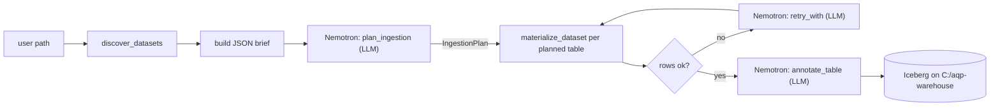

# Iceberg-first Data Catalog

> Doc map: [docs/index.md](index.md) · Sequence diagram: [docs/flows.md#1-generic-file--iceberg-ingestion](flows.md#1-generic-file--iceberg-ingestion).

The AQP data engine leans on Apache Iceberg as the canonical home for
non-OHLCV datasets. CSV / PSV / TSV / NDJSON / JSON-array files (in
folders, single files, or zipped archives) are walked, grouped by
stable filename family, **planned by a Nemotron-driven Director**,
streamed in chunks, and materialized into Iceberg tables under a
**host-persisted warehouse** at `C:/aqp-warehouse` (mounted into the
api/worker containers at `/warehouse`). An LLM annotation step layers
descriptions, tags, domain hints, PII flags, and per-column docs on top.

## Components

| Layer | Implementation |
|-------|----------------|
| Catalog client | [`aqp/data/iceberg_catalog.py`](../aqp/data/iceberg_catalog.py) (PyIceberg) |
| Discovery | [`aqp/data/pipelines/discovery.py`](../aqp/data/pipelines/discovery.py) |
| Streaming extractors | [`aqp/data/pipelines/extractors.py`](../aqp/data/pipelines/extractors.py) |
| **Director (LLM planner + verifier)** | [`aqp/data/pipelines/director.py`](../aqp/data/pipelines/director.py) + [`aqp/agents/prompts/data_director.py`](../aqp/agents/prompts/data_director.py) |
| Materialize | [`aqp/data/pipelines/materialize.py`](../aqp/data/pipelines/materialize.py) |
| Annotate (LLM) | [`aqp/data/pipelines/annotate.py`](../aqp/data/pipelines/annotate.py) |
| Orchestrator | [`aqp/data/pipelines/runner.py`](../aqp/data/pipelines/runner.py) |
| API | [`aqp/api/routes/datasets.py`](../aqp/api/routes/datasets.py) + [`aqp/api/routes/data_pipelines.py`](../aqp/api/routes/data_pipelines.py) |
| Celery tasks | `ingest_local_path`, `ingest_local_paths_with_director`, `annotate_dataset` in [`aqp/tasks/ingestion_tasks.py`](../aqp/tasks/ingestion_tasks.py) |
| Run scripts | [`scripts/iceberg_smoke.py`](../scripts/iceberg_smoke.py), [`scripts/ingest_regulatory.py`](../scripts/ingest_regulatory.py), [`scripts/_run_one_source.py`](../scripts/_run_one_source.py) |
| Web UI | `/data/catalog`, `/data/catalog/<ns>/<name>`, `/data/ingest` |

## Persistent host warehouse

AQP defaults to a **PyIceberg SQL catalog** rooted at a host-bind-
mounted directory, so the catalog (sqlite metadata + Parquet data
files) survives any container teardown. The bind is wired in
[`docker-compose.yml`](../docker-compose.yml):

```yaml
volumes:
  - "C:/aqp-warehouse:/warehouse"
```

> The original target was `D:/aqp-warehouse`; if `D:` is unavailable
> on a host, fall back to `C:/aqp-warehouse` (or any drive Docker
> Desktop file-sharing reaches — see Settings → Resources → File
> sharing on Windows).

Layout under `C:/aqp-warehouse`:

```
C:/aqp-warehouse/
├── README.md
├── catalog.db                     # PyIceberg SQL catalog (sqlite)
├── iceberg/
│   ├── catalog.db
│   └── <namespace>/<table>/
│       ├── data/*.parquet         # immutable data files
│       └── metadata/*.metadata.json + .avro
├── staging/                       # scratch dir for unzip / large extractions
└── logs/
    ├── ingest_<src>_<stamp>.log   # per-source progress
    ├── ingest_<src>_<stamp>.json  # per-source IngestionReport JSON
    └── ingest_<stamp>.json        # aggregate run audit
```

The REST catalog (`tabulario/iceberg-rest`) and MinIO services are
defined in compose under the **`legacy` profile** so they no longer
start by default. Bring them back if you need a multi-engine REST
catalog or an S3-backed warehouse:

```bash
docker compose --profile legacy up -d minio minio-init iceberg-rest
```

Verify host persistence end-to-end with:

```bash
docker exec aqp-api python -m scripts.iceberg_smoke              # write
docker compose down api worker
docker compose up -d api worker
docker exec aqp-api python -m scripts.iceberg_smoke --inspect-only
```

The smoke script writes a tiny `aqp_smoke.smoke_test` table, then a
follow-up `--inspect-only` invocation must list the namespace plus
both snapshots even after the containers are recreated from scratch.

## Director-driven ingest

The Director sits between discovery and materialization. It receives
a compact JSON brief for every candidate dataset family (file count,
total MB, sample columns, subdirectory hints, discovery notes) and is
prompted to emit a strict JSON `IngestionPlan`:

- `target_namespace` (chosen from `allowed_namespaces`)
- `target_table` (snake_case Iceberg name, ≤48 chars)
- `expected_min_rows` (used by the verifier to spot under-ingestion)
- `domain_hint` (e.g. `financial.regulatory.cfpb.hmda`)
- `skip_member_paths` (residual duplicates the heuristic missed)

Defaults live on `settings` (`AQP_LLM_DIRECTOR_*` env vars):

| Setting | Default | Purpose |
| ------- | ------- | ------- |
| `AQP_LLM_DIRECTOR_PROVIDER` | `ollama` | LLM provider slug |
| `AQP_LLM_DIRECTOR_MODEL` | `nemotron-3-nano:30b` | Ollama tag |
| `AQP_LLM_DIRECTOR_TEMPERATURE` | `0.1` | Determinism dial |
| `AQP_LLM_DIRECTOR_MAX_TOKENS` | `4096` | Output budget |
| `AQP_LLM_DIRECTOR_ENABLED` | `true` | Master switch |

When the LLM is unreachable, returns malformed JSON, or is disabled,
the runner uses a deterministic **identity plan** (one table per
discovered family). The flow always produces a plan; the LLM only
*improves* it.

After materialization a `verify_after_materialise` step is invoked
whenever rows-written < `expected_min_rows / 2` or every file was
skipped. The verifier asks the LLM whether to accept the result or
retry with adjusted knobs (`max_rows_per_dataset`,
`max_files_per_dataset`, `force_string_columns`). Retries are capped
at one per dataset.



## Regulatory ingest workflow (CFPB / USPTO / FDA / SEC)

The four regulatory corpora dropped under
`C:/Users/Julian Wiley/Downloads/{cfpb,uspto,fda,sec}` are exposed to
the api/worker containers via the `:/host-downloads:ro` bind mount in
[`docker-compose.yml`](../docker-compose.yml). The end-to-end driver
is [`scripts/ingest_regulatory.py`](../scripts/ingest_regulatory.py):

```bash
docker exec aqp-api python -m scripts.ingest_regulatory \
    --no-annotate \
    --max-rows 5000 \
    --max-files 5 \
    --chunk-rows 2000
```

The driver:

1. Probes Ollama (`GET /api/tags`) and pulls
   `nemotron-3-nano:30b` if missing (skip with `--skip-pull`).
2. Resolves which of `cfpb / uspto / fda / sec` exist under
   `--host-root` (default `/host-downloads`).
3. **Spawns one fresh Python subprocess per source** running
   [`scripts/_run_one_source.py`](../scripts/_run_one_source.py) so
   memory pressure from one corpus can't bleed into the next.
4. Streams each subprocess's progress to
   `/warehouse/logs/ingest_<src>_<stamp>.log` and captures the
   `IngestionReport` JSON to `/warehouse/logs/ingest_<src>_<stamp>.json`.
5. Aggregates a Markdown summary table and writes a top-level audit
   log to `/warehouse/logs/ingest_<stamp>.json`.

The fixed namespace mapping is:

| Source | Iceberg namespace |
| ------ | ----------------- |
| `cfpb` | `aqp_cfpb` |
| `uspto` | `aqp_uspto` |
| `fda`  | `aqp_fda` |
| `sec`  | `aqp_sec` |

USPTO weekly `ipa*.zip` files are pure XML and the XML extractor is
intentionally **not enabled** in the default profile; discovery
inventories them under the synthetic `__assets__` family with an
explanatory note. The two giant patent-filewrapper bundles
(`2011-2020-...zip` 30 GB, `2021-2026-...zip` 13 GB) are likewise
inventoried but not materialized in a default run; they need a
larger memory budget and tighter caps to ingest end-to-end.

The first end-to-end run on this host produced (with
`--max-rows 5000 --max-files 5 --chunk-rows 2000 --no-annotate`):

| Source | Namespace | Discovered | Tables | Rows |
| ------ | --------- | ----------:| -----: | ---: |
| cfpb   | aqp_cfpb  |         12 |     12 | 49,662 |
| uspto  | (aborted) |          – |      0 | 0 (subprocess OOM-killed on the 30 GB bundle) |
| fda    | aqp_fda   |        145 |    145 | 676,651 |
| sec    | aqp_sec   |        267 |    255 | 1,101,647 (12 tables ended at 0 rows after verifier-retry) |

All five namespaces (`aqp_cfpb`, `aqp_fda`, `aqp_sec`, `aqp_uspto`,
`aqp_smoke`) survive a `docker compose down` / `up` cycle because
the entire warehouse is on the host bind mount.

## Deployment modes

### docker-compose (default — host-persisted SQL catalog)

```bash
docker compose up -d
```

This brings up the api / worker / postgres / redis / chromadb /
mlflow / otel / jaeger / webui stack with the warehouse bind-mounted
from the host:

- `C:/aqp-warehouse:/warehouse`  in both `api` and `worker`.
- `AQP_ICEBERG_WAREHOUSE=/warehouse/iceberg` and
  `AQP_ICEBERG_STAGING_DIR=/warehouse/staging` are pre-set.
- `AQP_ICEBERG_REST_URI`, `AQP_S3_ENDPOINT_URL`, and the rest of the
  S3 knobs are explicitly cleared so PyIceberg takes the SQL fallback.

### docker-compose `legacy` profile (REST + MinIO)

To restore the older REST catalog + MinIO topology:

```bash
docker compose --profile legacy up -d minio minio-init iceberg-rest
```

Then set in `.env`:

```dotenv
AQP_ICEBERG_REST_URI=http://iceberg-rest:8181
AQP_ICEBERG_S3_WAREHOUSE=s3://aqp-iceberg/
AQP_S3_ENDPOINT_URL=http://minio:9000
AQP_S3_ACCESS_KEY=aqpminio
AQP_S3_SECRET_KEY=aqpminiosecret
AQP_S3_REGION=us-east-1
```

The MinIO data volume (`minio-data`, named) and the iceberg-rest
JDBC store remain inside Docker — note that the JDBC store is in-memory
by default, so the REST catalog metadata is lost on container restart
unless you bind-mount a Postgres-backed JDBC. The default SQL catalog
mode avoids this entirely.

### Local dev fallback (no docker)

When `AQP_ICEBERG_REST_URI` is empty (default in `.env.example`),
PyIceberg uses a local SQL catalog with a filesystem warehouse rooted
at `AQP_ICEBERG_WAREHOUSE` (default `./data/iceberg/`). No Docker
required:

```bash
pip install -e ".[iceberg]"
alembic upgrade head
uvicorn aqp.api.main:app --reload
```

## Configuration knobs

All settings live on `aqp.config.settings` and read from the standard
`AQP_*` env namespace.

| Variable | Default | Notes |
|----------|---------|-------|
| `AQP_ICEBERG_REST_URI` | empty | URL of the Iceberg REST catalog. Empty → SQL fallback (default). |
| `AQP_ICEBERG_CATALOG_NAME` | `aqp` | Catalog name PyIceberg registers under. |
| `AQP_ICEBERG_WAREHOUSE` | `/warehouse/iceberg` (compose) / `./data/iceberg` (native) | Filesystem warehouse + sqlite metadata location. |
| `AQP_ICEBERG_STAGING_DIR` | `/warehouse/staging` (compose) / `./data/iceberg-staging` (native) | Scratch dir for unzip / large extractions. |
| `AQP_ICEBERG_NAMESPACE_DEFAULT` | `aqp` | Default namespace if API callers omit `namespace`. |
| `AQP_ICEBERG_S3_WAREHOUSE` | empty | Object-store warehouse URI when REST is configured (`s3://aqp-iceberg/`). |
| `AQP_ICEBERG_MAX_ROWS_PER_DATASET` | `5000000` | Default row cap; flagged as `truncated` in lineage when hit. |
| `AQP_ICEBERG_MAX_FILES_PER_DATASET` | `2000` | Per-family file cap. |
| `AQP_LLM_DIRECTOR_PROVIDER` | `ollama` | LLM provider for plan/verify steps. |
| `AQP_LLM_DIRECTOR_MODEL` | `nemotron-3-nano:30b` | Model tag for plan/verify. |
| `AQP_LLM_DIRECTOR_TEMPERATURE` | `0.1` | Determinism dial. |
| `AQP_LLM_DIRECTOR_MAX_TOKENS` | `4096` | Output budget per LLM call. |
| `AQP_LLM_DIRECTOR_ENABLED` | `true` | Master kill switch. |
| `AQP_S3_ENDPOINT_URL` | empty | Required for MinIO (`legacy` profile only). |
| `AQP_S3_ACCESS_KEY` / `AQP_S3_SECRET_KEY` | empty | Required for MinIO (`legacy` profile only). |
| `AQP_S3_REGION` | `us-east-1` | |
| `AQP_S3_PATH_STYLE_ACCESS` | `True` | Required for MinIO; usually `False` for AWS S3. |

## Migration

```bash
alembic upgrade head
```

`0011_iceberg_catalog_columns` extends `dataset_catalogs` with
`iceberg_identifier`, `load_mode`, `source_uri`, `llm_annotations`, and
`column_docs`. Existing rows survive untouched (defaults to
`load_mode='managed'`).

## API surface

| Method | Path | Purpose |
|--------|------|---------|
| `GET` | `/datasets/namespaces` | List Iceberg namespaces. |
| `GET` | `/datasets/tables` | List tables (Iceberg ⨝ `DatasetCatalog`). |
| `GET` | `/datasets/{ns}/{name}` | Schema, partitions, snapshots, sample, annotations. |
| `POST` | `/datasets/{ns}/{name}/query` | Read-only DuckDB SQL preview. |
| `PATCH` | `/datasets/{ns}/{name}` | Edit description / tags / column docs / domain. |
| `POST` | `/datasets/{ns}/{name}/annotate` | Re-run LLM annotation (Celery). |
| `DELETE` | `/datasets/{ns}/{name}` | Drop Iceberg table + catalog row. |
| `POST` | `/pipelines/ingest` | Kick off `ingest_local_path` Celery task (single source). |
| `POST` | `/pipelines/ingest/regulatory` | Director-driven batch ingest of `cfpb / uspto / fda / sec` under `--host-root`. |
| `GET` | `/pipelines/discovery/preview` | Synchronous discovery walk. |
| `GET` | `/pipelines/director/plan` | Read-only plan preview from the LLM Director (no materialization). |

## Validation harness

The CFPB / USPTO / FDA / SEC sample directories are bigger than typical
test fixtures (USPTO 2011-2020 patent file-wrappers alone is ~30 GB).
Use [`scripts/validate_ingest_local.py`](../scripts/validate_ingest_local.py) to
exercise the pipeline against them with bounded row caps:

```powershell
python scripts/validate_ingest_local.py `
    --source "C:/Users/Julian Wiley/Downloads/cfpb" `
    --source "C:/Users/Julian Wiley/Downloads/uspto" `
    --source "C:/Users/Julian Wiley/Downloads/fda" `
    --source "C:/Users/Julian Wiley/Downloads/sec" `
    --max-rows 200000 `
    --max-files 200
```

Output: one JSON report per source under `data/ingest_reports/` plus an
aggregate `summary.json`. Use `--no-annotate` if Ollama/vLLM is offline.

## Smoke + unit tests

```bash
docker exec aqp-api python -m pytest \
    tests/data/test_pipelines_smoke.py \
    tests/data/test_director.py \
    tests/data/test_discovery_patches.py \
    -v
```

Coverage:

- `test_pipelines_smoke.py` — synthetic ZIP (CSV + NDJSON) → SQL
  fallback catalog → Iceberg, with the Director and the annotator
  both stubbed for hermeticity.
- `test_director.py` — JSON/CoT parsing, identity-plan fallback when
  the LLM is unreachable / returns garbage, verifier accept/retry.
- `test_discovery_patches.py` — SEC subdirectory disambiguation,
  USPTO XML routed to `__assets__`, FDA browser-duplicate `(N)`
  collapse.

## Inspect the catalog from the host

The catalog can be opened directly from any Python on the host:

```python
from pyiceberg.catalog import load_catalog

cat = load_catalog(
    "aqp",
    type="sql",
    uri="sqlite:///C:/aqp-warehouse/iceberg/catalog.db",
    warehouse="file:///C:/aqp-warehouse/iceberg",
)
print(cat.list_namespaces())
table = cat.load_table(("aqp_cfpb", "complaints"))
print(table.scan().to_pandas().head())
```

Backup is just a directory copy:

```powershell
robocopy C:\aqp-warehouse <destination> /MIR
```
