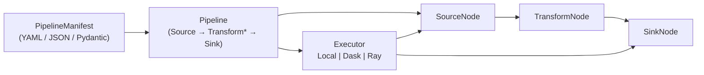

# AQP Data Engine

The data engine is the unified node-graph runner that owns every
ingestion path in AQP. It replaces the ad-hoc `ingestion_tasks` /
`IngestionPipeline` / per-source bulk loaders with a single
declarative `PipelineManifest` flowing through one of three compute
backends.

## Anatomy



## Modules

| File | Purpose |
| --- | --- |
| [aqp/data/engine/nodes.py](../aqp/data/engine/nodes.py) | `SourceNode`, `TransformNode`, `SinkNode` ABCs + `NodeContext`. |
| [aqp/data/engine/manifest.py](../aqp/data/engine/manifest.py) | `PipelineManifest`, `ComputeSpec`, `PartitionSpec`, `SchedulingSpec`. |
| [aqp/data/engine/pipeline.py](../aqp/data/engine/pipeline.py) | `Pipeline` DAG + `PipelineRunResult`. |
| [aqp/data/engine/executor.py](../aqp/data/engine/executor.py) | `LocalExecutor`, `DaskExecutor`, `RayExecutor`, `build_executor`. |
| [aqp/data/engine/registry.py](../aqp/data/engine/registry.py) | `register_node` decorator + node lookup. |
| [aqp/data/engine/compat.py](../aqp/data/engine/compat.py) | `LegacyIngestionAdapter` + `run_legacy_ingest_path` shim. |
| [aqp/data/compute/](../aqp/data/compute/) | `ComputeBackend` ABC + Local / Dask / Ray implementations. |
| [aqp/data/fetchers/](../aqp/data/fetchers/) | Source / transform / sink node library (auto-registers on import). |

## Manifest shape

```yaml
name: cfpb_complaints_daily
namespace: aqp_cfpb
description: "Daily CFPB complaints refresh"
source:
  name: source.cfpb
  kwargs: { max_pages: 5 }
transforms:
  - name: transform.arrow_select
    kwargs: { columns: ["complaint_id", "company", "product"] }
sink:
  name: sink.iceberg
  kwargs:
    namespace: aqp_cfpb
    table: complaints
compute:
  backend: auto
  chunk_rows: 50000
schedule:
  cron: "0 4 * * *"
  enabled: true
tags: ["regulatory", "cfpb"]
```

## REST surface

| Path | Description |
| --- | --- |
| `GET /engine/manifests` | List persisted manifests. |
| `POST /engine/manifests` | Save a manifest (creates or updates by namespace+name). |
| `GET /engine/manifests/{id}` | Read a manifest. |
| `POST /engine/manifests/{id}/run` | Materialize the manifest synchronously. |
| `POST /engine/run-adhoc` | Run a manifest without persisting it. |
| `GET /engine/runs` | List runs. |
| `GET /engine/runs/{id}` | Run detail. |
| `GET /fetchers` | List every registered node (source, transform, sink). |
| `GET /fetchers/{name}/schema` | Synthesize a JSON schema from the node `__init__`. |
| `POST /fetchers/probe` | Cheap reachability check for a source node. |
| `GET /compute/status` | Backend + thresholds + cluster wiring. |
| `POST /compute/pick` | Auto-promote a backend choice from a `(rows, bytes)` hint. |

## Compute backends

`pick_backend(SizeHint(rows, bytes))` reads `compute_local_to_dask_*`
and `compute_local_to_ray_*` thresholds from `aqp.config.Settings`
to promote between Local → Dask → Ray. Each backend is lazy-imported
so a missing optional dep degrades to the local backend with a
warning. Default thresholds (1M rows / 256 MiB → Dask, 25M rows /
8 GiB → Ray) are tuned for laptop dev; bump them via
`AQP_COMPUTE_LOCAL_TO_*` env vars for production clusters.

## Don'ts

- Don't write directly to Iceberg from a sink — call
  `iceberg_catalog.append_arrow` (rule #3). The bundled
  `sink.iceberg` already does this.
- Don't import Dagster from inside a node — keep the engine
  Dagster-agnostic so it stays usable from the API and Celery.
- Don't bypass `register_node` for new fetchers — the manifest
  builder UI and the `data_sources` table seeding both depend on it.
