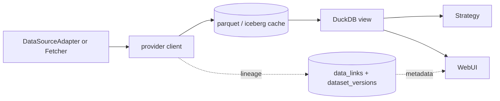

# Data plane expansion

> Doc map: [docs/index.md](index.md) · Catalog walkthrough: [docs/data-catalog.md](data-catalog.md).

The data plane groups together the source registry, the identifier
graph, and the adapters for FRED, SEC EDGAR and GDelt GKG 2.0. This
work layers on top of the original [ingestion](../aqp/data/ingestion.py)
and [news](../aqp/data/news) modules without replacing them — every
legacy adapter continues to work unchanged.

## Architecture

```
aqp/data/sources/
├── base.py                # DataSourceAdapter + IdentifierSpec + ProbeResult
├── domains.py             # DataDomain StrEnum
├── registry.py            # data_sources CRUD façade
├── resolvers/
│   └── identifiers.py     # IdentifierResolver (upsert + lookup)
├── fred/
│   ├── client.py          # fredapi-free HTTP client with retry
│   ├── series.py          # FredSeriesAdapter
│   └── catalog.py         # fred_series upsert
├── sec/
│   ├── client.py          # edgartools façade
│   ├── filings.py         # SecFilingsAdapter
│   ├── xbrl.py            # Financials / Form 4 / 13F standardisers
│   └── catalog.py         # sec_filings upsert
└── gdelt/
    ├── manifest.py        # GKG manifest parser
    ├── schema.py          # 27-column GKG 2.1 schema + tone parser
    ├── subject_filter.py  # Match orgs → Instrument
    ├── parquet_sink.py    # Download / decode / partition write
    ├── bigquery_client.py # Optional [gdelt-bq] federation
    ├── adapter.py         # GDeltAdapter (hybrid façade)
    └── catalog.py         # gdelt_mentions upsert
```

## Persistence

The 0007 migration adds six tables and seeds the
``data_sources`` registry with ten canonical rows. No existing table
is modified.

| Table | Purpose |
| --- | --- |
| `data_sources` | Registry of every source + capabilities + credentials ref. |
| `identifier_links` | Polymorphic, time-versioned alias graph (cik, cusip, isin, figi, lei, ticker, vt_symbol, …). |
| `data_links` | "Dataset version X covers entity Y" coverage for the UI. |
| `fred_series` | FRED economic-series master. |
| `sec_filings` | SEC filing master keyed on `accession_no`. |
| `gdelt_mentions` | Subset of GKG events that match a registered Instrument. |

Apply with `alembic upgrade head` or `aqp-bootstrap`.

## Sources

### FRED (`[fred]` extra)

```bash
pip install -e ".[fred]"
export AQP_FRED_API_KEY=...
aqp data fred ingest DGS10 UNRATE CPIAUCSL
```

REST endpoints:

- `GET /fred/series/search?q=...`
- `GET /fred/series/{id}`
- `GET /fred/series/{id}/observations`
- `POST /fred/ingest`

### SEC EDGAR (`[sec]` extra)

```bash
pip install -e ".[sec]"
export AQP_SEC_EDGAR_IDENTITY="Your Name you@example.com"
aqp data sec ingest AAPL --artifact financials
```

REST endpoints:

- `GET /sec/company/{cik_or_ticker}/filings`
- `GET /sec/company/{cik_or_ticker}/financials`
- `GET /sec/company/{cik_or_ticker}/insider`
- `GET /sec/company/{cik_or_ticker}/holdings`
- `POST /sec/ingest`

### GDelt GKG 2.0 (`[gdelt]` and/or `[gdelt-bq]` extras)

```bash
pip install -e ".[gdelt]"          # manifest path
pip install -e ".[gdelt-bq]"       # optional BigQuery federation

aqp data gdelt ingest --start 2024-01-01T00:00:00 \
  --end 2024-01-01T01:00:00 --tickers AAPL,MSFT
```

REST endpoints:

- `GET /gdelt/manifest?start=&end=`
- `POST /gdelt/ingest` (mode: manifest | bigquery | hybrid)
- `POST /gdelt/query` (BigQuery passthrough)
- `GET /gdelt/mentions?ticker=&start=&end=`

Set `AQP_GDELT_SUBJECT_FILTER_ONLY=true` (default) to keep only rows
that mention a registered Instrument; the full dataset is ~2.5 TB/year
so subject-filtering is essential on typical hardware.

## Cross-cutting surface

| Endpoint | Purpose |
| --- | --- |
| `GET /sources` | List every registered data source with capabilities. |
| `GET /sources/{name}/probe` | Run a cheap reachability check. |
| `PATCH /sources/{name}` | Toggle `enabled`. |
| `GET /identifiers/resolve?scheme=&value=` | Reverse-lookup an Instrument by any identifier. |
| `GET /identifiers/instrument/{vt_symbol}` | Full identifier graph for an Instrument. |
| `POST /identifiers/link` | Manually register a new identifier alias. |
| `GET /instruments/{vt_symbol}/data` | "What data do we have about this instrument?" aggregate. |

Solara explorer pages hang off `/sources`, `/fred`, `/sec`, `/gdelt`,
plus a new "Data Links" tab inside the Data Browser.

## CLI cheat sheet

```bash
aqp data sources list
aqp data sources probe fred
aqp data sources toggle alpaca --off

aqp data fred ingest DGS10 UNRATE --start 2023-01-01 --end 2023-12-31
aqp data sec ingest AAPL --form 10-K --artifact financials
aqp data gdelt ingest --start 2024-01-01T00:00:00 \
  --end 2024-01-01T01:00:00 --mode manifest

aqp data links show AAPL.NASDAQ
```

## Design notes

- Adapters implement `DataSourceAdapter` (not the legacy
  `BaseDataSource`) so non-bar data — FRED series, SEC filings, GDelt
  events — uses a contract shaped for its domain while keeping bar
  ingestion paths untouched.
- Identifier upserts go through `IdentifierResolver`, which also writes
  back to the legacy `Instrument.identifiers` JSON blob so code paths
  that never migrated keep reading the right value.
- The `data_sources.credentials_ref` column holds the *name* of the env
  var holding the credential — never the secret itself.

## Provider -> cache -> view



