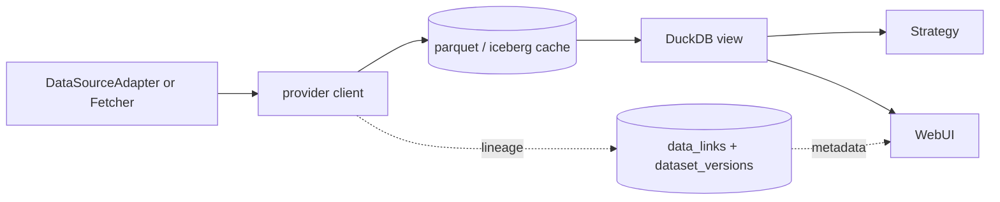

# Data plane expansion

> Doc map: [docs/index.md](index.md) · Catalog walkthrough: [docs/data-catalog.md](data-catalog.md) · Engine: [docs/data-engine.md](data-engine.md) · Entity registry: [docs/entity-registry.md](entity-registry.md) · DataHub sync: [docs/datahub-sync.md](datahub-sync.md) · Dagster: [docs/dagster.md](dagster.md).

The data plane groups together the source registry, the identifier
graph, and the adapters for FRED, SEC EDGAR and GDelt GKG 2.0. This
work layers on top of the original [ingestion](../aqp/data/ingestion.py)
and [news](../aqp/data/news) modules without replacing them — every
legacy adapter continues to work unchanged.

## Data fabric expansion (engine + compute + entity registry)

A second, additive layer sits above the per-source adapters:

- **Engine** ([aqp/data/engine](../aqp/data/engine)) — declarative
  Source → Transform* → Sink pipelines driven by a Pydantic
  `PipelineManifest`. Three executor flavors: `LocalExecutor`,
  `DaskExecutor`, `RayExecutor`. See [data-engine.md](data-engine.md).
- **Compute** ([aqp/data/compute](../aqp/data/compute)) — pluggable
  `ComputeBackend` ABC with Local / Dask / Ray implementations and a
  `pick_backend(SizeHint)` auto-promoter.
- **Source library** ([aqp/data/fetchers](../aqp/data/fetchers)) — every
  source / transform / sink registers itself as an engine node and
  upserts into `data_sources` at import time. New: `source.http`,
  `source.s3`, `source.gcs`, `source.azure_blob`, `source.archive`,
  `source.local_file`, `source.local_directory`, `source.database`,
  `source.kafka`, `source.websocket`, `source.finance_database`,
  `source.akshare`, `source.polygon`, `source.tiingo`,
  `source.quandl`, `source.coingecko`.
- **Profiling** ([aqp/data/profiling](../aqp/data/profiling)) —
  Arrow-native column stats, Redis + Postgres cached, refreshed
  automatically by the Iceberg sink.
- **Entity registry** ([aqp/data/entities](../aqp/data/entities)) —
  generic entities (companies, drugs, patents, ...) extracted from
  datasets and augmentable by LLM. See
  [entity-registry.md](entity-registry.md).
- **DataHub bidirectional sync** ([aqp/data/datahub](../aqp/data/datahub))
  — push AQP datasets, pull external platform metadata. See
  [datahub-sync.md](datahub-sync.md).
- **Dagster code location** ([aqp/dagster](../aqp/dagster)) — assets,
  jobs, schedules, sensors. Loaded into the cluster Dagster via
  gRPC. See [dagster.md](dagster.md).

Heavy optional deps ship under the `compute`, `sources`,
`datahub-sync`, `dagster-aqp` extras. The default install keeps the
engine importable — backends and fetchers degrade with a warning when
their optional dep is missing.

## Architecture

```
aqp/data/sources/
├── base.py                # DataSourceAdapter + IdentifierSpec + ProbeResult
├── domains.py             # DataDomain StrEnum
├── registry.py            # data_sources CRUD façade
├── resolvers/
│   └── identifiers.py     # IdentifierResolver (upsert + lookup)
├── fred/
│   ├── client.py          # fredapi-free HTTP client with retry
│   ├── series.py          # FredSeriesAdapter
│   └── catalog.py         # fred_series upsert
├── sec/
│   ├── client.py          # edgartools façade
│   ├── filings.py         # SecFilingsAdapter
│   ├── xbrl.py            # Financials / Form 4 / 13F standardisers
│   └── catalog.py         # sec_filings upsert
└── gdelt/
    ├── manifest.py        # GKG manifest parser
    ├── schema.py          # 27-column GKG 2.1 schema + tone parser
    ├── subject_filter.py  # Match orgs → Instrument
    ├── parquet_sink.py    # Download / decode / partition write
    ├── bigquery_client.py # Optional [gdelt-bq] federation
    ├── adapter.py         # GDeltAdapter (hybrid façade)
    └── catalog.py         # gdelt_mentions upsert
```

## Persistence

The 0007 migration adds six tables and seeds the
``data_sources`` registry with ten canonical rows. No existing table
is modified.

| Table | Purpose |
| --- | --- |
| `data_sources` | Registry of every source + capabilities + credentials ref. |
| `identifier_links` | Polymorphic, time-versioned alias graph (cik, cusip, isin, figi, lei, ticker, vt_symbol, …). |
| `data_links` | "Dataset version X covers entity Y" coverage for the UI. |
| `fred_series` | FRED economic-series master. |
| `sec_filings` | SEC filing master keyed on `accession_no`. |
| `gdelt_mentions` | Subset of GKG events that match a registered Instrument. |

Apply with `alembic upgrade head` or `aqp-bootstrap`.

## Sources

### FRED (`[fred]` extra)

```bash
pip install -e ".[fred]"
export AQP_FRED_API_KEY=...
aqp data fred ingest DGS10 UNRATE CPIAUCSL
```

REST endpoints:

- `GET /fred/series/search?q=...`
- `GET /fred/series/{id}`
- `GET /fred/series/{id}/observations`
- `POST /fred/ingest`

### SEC EDGAR (`[sec]` extra)

```bash
pip install -e ".[sec]"
export AQP_SEC_EDGAR_IDENTITY="Your Name you@example.com"
aqp data sec ingest AAPL --artifact financials
```

REST endpoints:

- `GET /sec/company/{cik_or_ticker}/filings`
- `GET /sec/company/{cik_or_ticker}/financials`
- `GET /sec/company/{cik_or_ticker}/insider`
- `GET /sec/company/{cik_or_ticker}/holdings`
- `POST /sec/ingest`

### GDelt GKG 2.0 (`[gdelt]` and/or `[gdelt-bq]` extras)

```bash
pip install -e ".[gdelt]"          # manifest path
pip install -e ".[gdelt-bq]"       # optional BigQuery federation

aqp data gdelt ingest --start 2024-01-01T00:00:00 \
  --end 2024-01-01T01:00:00 --tickers AAPL,MSFT
```

REST endpoints:

- `GET /gdelt/manifest?start=&end=`
- `POST /gdelt/ingest` (mode: manifest | bigquery | hybrid)
- `POST /gdelt/query` (BigQuery passthrough)
- `GET /gdelt/mentions?ticker=&start=&end=`

Set `AQP_GDELT_SUBJECT_FILTER_ONLY=true` (default) to keep only rows
that mention a registered Instrument; the full dataset is ~2.5 TB/year
so subject-filtering is essential on typical hardware.

## Cross-cutting surface

| Endpoint | Purpose |
| --- | --- |
| `GET /sources` | List every registered data source with capabilities. |
| `GET /sources/{name}/probe` | Run a cheap reachability check. |
| `PATCH /sources/{name}` | Toggle `enabled`. |
| `GET /identifiers/resolve?scheme=&value=` | Reverse-lookup an Instrument by any identifier. |
| `GET /identifiers/instrument/{vt_symbol}` | Full identifier graph for an Instrument. |
| `POST /identifiers/link` | Manually register a new identifier alias. |
| `GET /instruments/{vt_symbol}/data` | "What data do we have about this instrument?" aggregate. |
| `GET /data/universe?source=...` | Stock universe selection from managed snapshots, config, Alpha Vantage live listings, or catalog instruments. |
| `POST /pipelines/alpha-vantage/history` | Load Alpha Vantage stock history into an Iceberg `market.bars` table. |
| `GET /datasets/{namespace}/{name}/profile` | Profile an Iceberg dataset and suggest identifier mappings. |
| `POST /datasets/{namespace}/{name}/identifier-mappings/apply` | Persist selected identifier mappings through the resolver. |

Solara explorer pages hang off `/sources`, `/fred`, `/sec`, `/gdelt`,
plus a new "Data Links" tab inside the Data Browser.

## Data fabric overview

`GET /data/fabric/overview` aggregates everything the platform knows
about its data plane in one payload: registered sources, Iceberg
namespaces and table count, instrument and identifier counts, recent
catalog activity, and the per-endpoint AlphaVantage table list. The
Settings page's Data Fabric card consumes this surface to render a
single configuration view across:

- `data_sources` registry (toggle, probe, capabilities).
- AlphaVantage endpoint tables under `aqp_alpha_vantage` with their
  partition specs and last-refresh timestamps.
- Recent `dataset_catalogs` rows with their Iceberg identifiers.
- Identifier graph stats (instrument count, identifier_link count).

`AlphaVantageUniverseService.sync_snapshot` populates both the
`Instrument` master and the `identifier_links` table (writing
`ticker`, `vt_symbol`, and `alpha_vantage_symbol` rows per security)
so any cross-source resolver can map an Alpha-Vantage-only ticker
back to its canonical instrument id.

`GET /data/securities/{vt_symbol}/coverage` joins `data_links`,
`dataset_versions`, and `dataset_catalogs` to answer "what data do we
have for this instrument" without scanning Iceberg.

## Universe and catalog workflow

The Next.js Data Explorer and Data Browser use `/data/universe` as the common
stock-selection contract. The `source` query parameter controls where symbols
come from:

- `managed_snapshot` reads persisted `Instrument` rows refreshed by
  `POST /data/universe/sync`.
- `alpha_vantage` fetches a live Alpha Vantage listing-status snapshot,
  normalizes it, and returns it without persisting.
- `catalog` reads instruments known to the catalog/security master.
- `config` falls back to `AQP_DEFAULT_UNIVERSE`.

Iceberg table detail pages can profile sampled rows to locate columns that
look like `vt_symbol`, `ticker`, `cik`, `cusip`, `isin`, `figi`, or `lei`.
Suggested mappings report sample coverage against the known identifier graph
before the user applies them.

## CLI cheat sheet

```bash
aqp data sources list
aqp data sources probe fred
aqp data sources toggle alpaca --off

aqp data fred ingest DGS10 UNRATE --start 2023-01-01 --end 2023-12-31
aqp data sec ingest AAPL --form 10-K --artifact financials
aqp data gdelt ingest --start 2024-01-01T00:00:00 \
  --end 2024-01-01T01:00:00 --mode manifest

aqp data links show AAPL.NASDAQ
```

## Design notes

- Adapters implement `DataSourceAdapter` (not the legacy
  `BaseDataSource`) so non-bar data — FRED series, SEC filings, GDelt
  events — uses a contract shaped for its domain while keeping bar
  ingestion paths untouched.
- Identifier upserts go through `IdentifierResolver`, which also writes
  back to the legacy `Instrument.identifiers` JSON blob so code paths
  that never migrated keep reading the right value.
- The `data_sources.credentials_ref` column holds the *name* of the env
  var holding the credential — never the secret itself.

## Provider -> cache -> view



