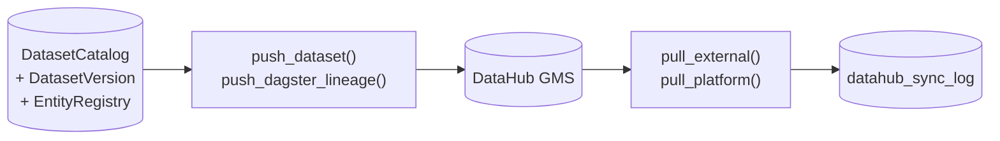

# DataHub Bidirectional Sync

The cluster's `recipe-aqp-iceberg-rest.yaml` and
`recipe-aqp-openapi.yaml` already pull AQP into DataHub on a
CronJob schedule. This sync layer adds **active push** from inside
AQP plus a **pull** of adjacent platform metadata (rpi MLflow,
agentic_assistants Iceberg, Kafka, Grafana) so the AQP UI always
reflects the cluster's catalog state.



## Modules

| File | Purpose |
| --- | --- |
| [aqp/data/datahub/client.py](../aqp/data/datahub/client.py) | `DataHubClient` (GMS REST + acryl-datahub SDK). |
| [aqp/data/datahub/emitter.py](../aqp/data/datahub/emitter.py) | `push_dataset`, `push_dagster_lineage`, `push_all`. |
| [aqp/data/datahub/puller.py](../aqp/data/datahub/puller.py) | `pull_platform`, `pull_external`. |
| [aqp/data/datahub/sync.py](../aqp/data/datahub/sync.py) | `sync_all` reconciliation orchestrator. |
| [aqp/data/datahub/mapping.py](../aqp/data/datahub/mapping.py) | `iceberg_dataset_urn`, `vt_symbol_urn`, `mlflow_model_urn`, `parse_urn`. |
| [aqp/tasks/datahub_tasks.py](../aqp/tasks/datahub_tasks.py) | Celery tasks (`push_dataset`, `pull_external_catalog`, `sync_all`). |
| [aqp/api/routes/datahub.py](../aqp/api/routes/datahub.py) | REST surface at `/datahub`. |
| [aqp/dagster/assets/catalog.py](../aqp/dagster/assets/catalog.py) | Dagster `datahub_push_datasets` + `datahub_pull_external` assets. |

## Settings

```env
AQP_DATAHUB_GMS_URL=http://datahub-datahub-gms.data-services:8080
AQP_DATAHUB_TOKEN=
AQP_DATAHUB_ENV=PROD
AQP_DATAHUB_PLATFORM=iceberg
AQP_DATAHUB_PLATFORM_INSTANCE=agentic-quant-platform
AQP_DATAHUB_SYNC_ENABLED=true
AQP_DATAHUB_SYNC_DIRECTION=bidirectional   # push | pull | bidirectional
AQP_DATAHUB_SYNC_INTERVAL_SECONDS=900
AQP_DATAHUB_EXTERNAL_PLATFORMS=mlflow,kafka,grafana
```

## REST surface

| Path | Description |
| --- | --- |
| `GET /datahub/status` | Configured URL, ping result, sync direction. |
| `POST /datahub/sync?direction=push|pull|bidirectional` | Trigger a sync now. |
| `POST /datahub/push` | Push one Dataset MCE (by `catalog_id` or `urn`). |
| `POST /datahub/push-all` | Push every `DatasetCatalog` row. |
| `POST /datahub/pull?platform=mlflow` | Pull one platform. |
| `GET /datahub/external` | Aggregate external pulls per platform. |
| `GET /datahub/log` | Recent `datahub_sync_log` rows. |
| `POST /datahub/mappings/resolve` | URN ↔ identifier round-trip. |
| `GET /datahub/mappings/lookup?urn=...` | Decompose a URN. |

## Don'ts

- Don't bypass `register_dataset_version` to record `datahub_urn` —
  the engine sink writes it automatically when the manifest sets a
  `datahub_urn` kwarg.
- Don't push individual MCEs from arbitrary modules. Always go
  through `aqp.data.datahub.emitter` so we keep one log table.
- Don't duplicate the cluster's CronJob ingest recipes inside AQP.
  Push from AQP for fast-feedback; the CronJobs remain the
  authoritative bulk-rebuild path.
