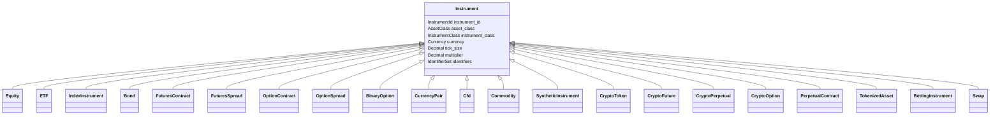
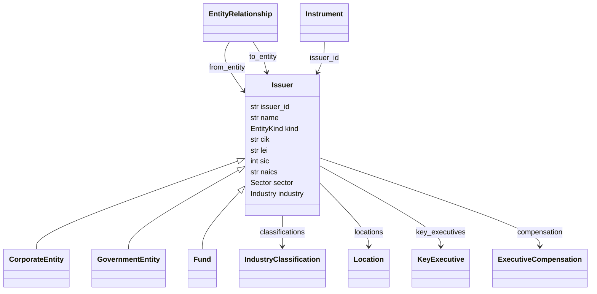
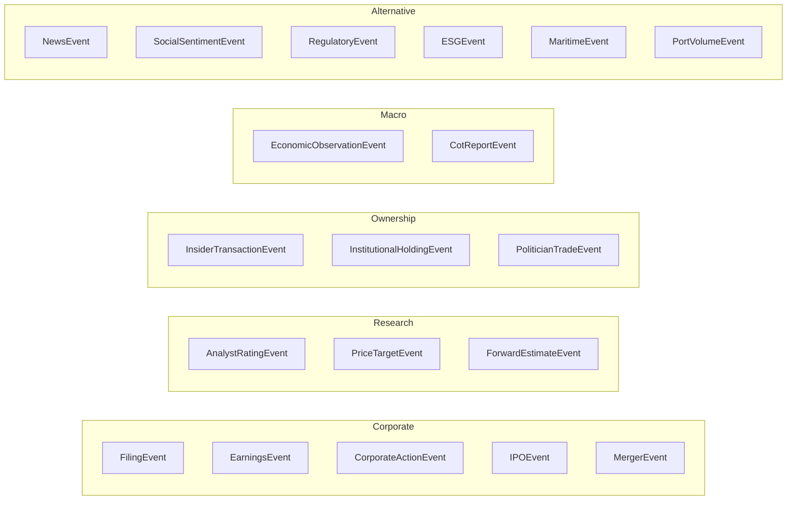
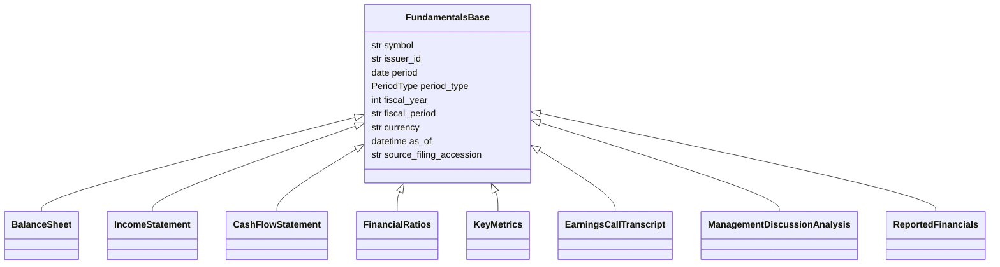

# Domain Model

> Doc map: [docs/index.md](index.md) · Schema diagrams: [docs/erd.md](erd.md) · Column reference: [docs/data-dictionary.md](data-dictionary.md).

The AQP platform's domain model lives under
[`aqp/core/domain/`](../aqp/core/domain/) and is the single source of truth
for every tradable-asset, issuer, event, market-data, fundamentals,
ownership, calendar, economic, and news primitive in the platform.

The expansion absorbs the best abstractions from four best-of-breed
open-source quant projects:

| Inspiration | What we took |
|---|---|
| [gs-quant](https://github.com/goldmansachs/gs-quant) | `(AssetClass, AssetType) → Instrument` dispatch ([`gs_quant/instrument/core.py`](https://github.com/goldmansachs/gs-quant/blob/master/gs_quant/instrument/core.py)), `XRef`/`Security` identifier flattening, `PricingContext`/`RiskMeasure` scaffolding ([`gs_quant/common.py`](https://github.com/goldmansachs/gs-quant/blob/master/gs_quant/common.py)) |
| [vnpy](https://github.com/vnpy/vnpy) | `ContractData` with `size`/`pricetick`/`min_volume`/option metadata, `Offset` (OPEN/CLOSE/CLOSE_TODAY/CLOSE_YESTERDAY) enum, 5-level `TickData`, uniform `*Request` envelopes |
| [nautilus_trader](https://github.com/nautechsystems/nautilus_trader) | Typed identifier value objects, polymorphic `Instrument` grid (`Equity`/`FuturesContract`/`OptionContract`/`CurrencyPair`/`Cfd`/`CryptoPerpetual`/`BettingInstrument`/`BinaryOption`/`SyntheticInstrument`/`TokenizedAsset`), `OrderBook`/`BookLevel` primitives, option greeks, DeFi scaffolds |
| [OpenBB Platform](https://github.com/OpenBB-finance/OpenBB) | `Fetcher[Q, R]` + `QueryParams` + `Data` triad, plus ~170 `standard_models` covering every research datatype from `balance_sheet` and `insider_trading` through `federal_funds_rate` and `cot` |

## Layout

```
aqp/core/domain/
├── identifiers.py         # Typed IDs + IdentifierScheme + IdentifierSet
├── enums.py               # 25+ StrEnum catalogs (AssetClass, InstrumentClass, OrderType, ...)
├── money.py               # Currency + Price/Quantity/Money precision-safe scalars
├── instrument.py          # Polymorphic Instrument hierarchy + (AssetClass, InstrumentClass) dispatch
├── issuer.py              # Issuer / CorporateEntity / Fund / GovernmentEntity graph
├── market_data.py         # Bar/Tick/QuoteTick/TradeTick/OrderBook/MarkPriceUpdate + RichSlice
├── orders.py              # DomainOrder hierarchy + full OrderEvent family
├── positions.py           # DomainPosition hierarchy + PositionEvent family
├── greeks.py              # OptionGreeks / OptionGreekValues / PortfolioGreeks
├── options.py             # OptionChain / OptionChainSlice / OptionSeriesId / StrikeRange
├── events.py              # DomainEvent union (filing/earnings/news/dividend/ipo/merger/esg/...)
├── fundamentals.py        # BalanceSheet / IncomeStatement / CashFlow / FinancialRatios / KeyMetrics
├── ownership.py           # InsiderTransaction / Form13F / ShortInterest / SharesFloat / ...
├── calendar_events.py     # CalendarEarnings/Dividend/Split/Ipo/EconomicCalendar + MarketHoliday
├── economic.py            # TreasuryRate/YieldCurve/FederalFundsRate/CPI/Unemployment/CoT/FRED
└── news.py                # NewsItem / CompanyNews / WorldNews / Sentiment
```

Persistence sibling modules under [`aqp/persistence/`](../aqp/persistence/):

- `models_instruments.py` — joined-table subclasses (InstrumentEquity, InstrumentOption, InstrumentFuture, …).
- `models_entities.py` — `issuers` + related graph tables.
- `models_fundamentals.py` — statements / ratios / metrics / transcripts / MD&A.
- `models_events.py` — corporate / calendar / analyst / regulatory / ESG event tables.
- `models_ownership.py` — insider / institutional / 13F / short-interest / float / politician-trades.
- `models_news.py` — news items + entity M2M + sentiment.
- `models_macro.py` — economic series / observations / CoT / treasury / yield curve / option-chain snapshots.
- `models_taxonomy.py` — taxonomy schemes + nodes + polymorphic entity tags + entity crosswalk.

The Alembic migration [`alembic/versions/0008_domain_model_expansion.py`](../alembic/versions/0008_domain_model_expansion.py) creates every new table, extends `instruments` with the polymorphic discriminator + richer columns, creates an `instruments_flat` back-compat view, and seeds `taxonomy_schemes` with SIC / NAICS / GICS / TRBC / ICB / BICS / NACE plus user-defined `thematic`, `region`, `risk` roots.

## Instrument hierarchy



Dispatch via `instrument_class_for(asset_class, instrument_class)` returns the concrete class:

```python
from aqp.core.domain import instrument_class_for, AssetClass, InstrumentClass

cls = instrument_class_for(AssetClass.EQUITY, InstrumentClass.OPTION)
assert cls.__name__ == "OptionContract"
```

YAML recipes can say:

```yaml
instrument:
  class: Equity
  kwargs:
    instrument_id: { symbol: AAPL, venue: NASDAQ }
    cik: "0000320193"
    isin: US0378331005
```

…and `aqp.core.registry.build_from_config` routes through the instrument registry automatically.

## Issuer graph



Every `Equity`, `Bond`, `ETF` points at an `Issuer` row. The `Issuer` mirrors OpenBB's `EquityInfoData` schema (CIK, CUSIP, ISIN, LEI, legal_name, SIC, HQ address, employees, sector, industry) so ingestion from any OpenBB-compatible provider flows in without shape changes.

## Event flow



All events inherit from `DomainEvent` and share `ts_event` / `ts_init` / `event_id` / `source` / `instrument_id` / `issuer` / `meta`. Downstream consumers can demultiplex by `kind` without importing the concrete class.

## Fundamentals



Every fundamentals model is a Pydantic `BaseModel` with `extra="allow"`, so provider-specific columns survive round-trips unchanged.

## Typed identifiers

```python
from aqp.core.domain import (
    InstrumentId, Symbol2, Venue, IdentifierScheme, IdentifierSet, IdentifierValue
)

iid = InstrumentId.from_str("AAPL.NASDAQ")
assert iid.symbol == Symbol2("AAPL")
assert iid.venue == Venue("NASDAQ")

ids = IdentifierSet()
ids.add(IdentifierValue(scheme=IdentifierScheme.CUSIP, value="037833100"))
ids.add(IdentifierValue(scheme=IdentifierScheme.LEI, value="HWUPKR0MPOU8FGXBT394"))
assert ids.value_of(IdentifierScheme.CUSIP) == "037833100"
```

The `IdentifierScheme` StrEnum covers 30+ taxonomies: ticker, vt_symbol, CIK, CUSIP, ISIN, SEDOL, FIGI, OpenFIGI, LEI, GVKEY, PermID, Refinitiv PermID, FactSet ID, DUNS, IRS EIN, FRED series id, BLS series id, ECB series id, GDelt theme, CoT code, SIC, NAICS, GICS, TRBC, ICB, NACE, BICS, ERC-20 address, EVM chain id, IBKR conid, Alpaca asset id, Polygon ticker, plus a `custom` escape hatch.

## Migration path

The expansion is designed to be **non-breaking for existing users**:

- Legacy `aqp.core.types.Symbol` / `BarData` / `QuoteBar` / `TickData` / `OrderRequest` / `OrderData` / `OrderEvent` / `OrderTicket` / `SecurityHolding` / `Cash` / `CashBook` / `Signal` / `PortfolioTarget` all keep their constructors and public API.
- The `Instrument` SQLAlchemy table keeps every pre-expansion column; new columns are nullable. A back-compat view `instruments_flat` serves the pre-refactor shape for any SQL consumer.
- Legacy rows with `instrument_class IS NULL` load cleanly as the base `Instrument` via a SQL `CASE` mapping.
- The richer typed IDs live in `aqp.core.domain.identifiers` and are opt-in. `Symbol.to_instrument_id()` and `Symbol.from_instrument_id()` bridge old and new.
- The `Slice` class keeps its legacy shape; `RichSlice` is the superset with `order_books`, `mark_prices`, `funding_rates`, `news`, `filings` buckets.

## Tests

Domain-model tests live in [`tests/core/`](../tests/core/):

- `test_identifiers.py` — typed IDs + IdentifierSet + scheme coverage (12 tests).
- `test_enums.py` — expanded enum catalog (11 tests).
- `test_instrument_hierarchy.py` — polymorphic Instrument + `(AssetClass, InstrumentClass)` dispatch (15 tests).
- `test_events.py` — unified `DomainEvent` family (13 tests).
- `test_fundamentals.py` — Pydantic statements + ratios + transcripts (14 tests).
- `test_ownership.py` — insider / institutional / 13F / short-interest (10 tests).
- `test_standard_models.py` — 99+102 paired `QueryParams`/`Data` port (6 tests).

Provider tests: [`tests/providers/test_fetcher_contract.py`](../tests/providers/test_fetcher_contract.py).

Persistence tests: [`tests/persistence/test_domain_migration.py`](../tests/persistence/test_domain_migration.py).
