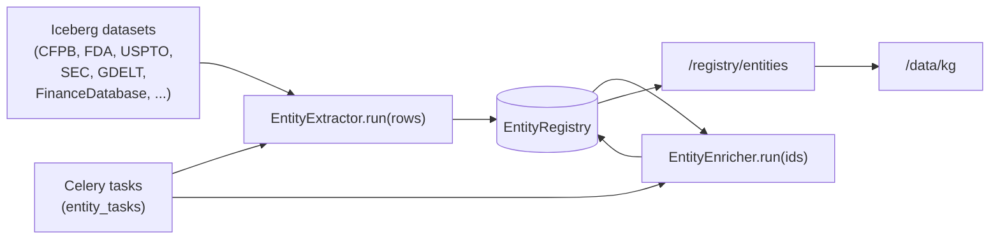

# Unified Entity Registry

The unified entity registry sits on top of the existing
[Issuer / Sector / Industry graph](erd.md) and widens it to cover
every entity AQP cares about: companies, drugs, products, patents,
persons, locations, securities, regulators, and free-form
"concept" rows. Extractors populate the rows from datasets;
LLM enrichers add descriptions, relations, dedup proposals, and
tags without ever mutating the source data.

## Tables

| Table | File |
| --- | --- |
| `entities` | [aqp/persistence/models_entity_registry.py](../aqp/persistence/models_entity_registry.py) |
| `entity_identifiers` | (same) |
| `entity_relations` | (same) |
| `entity_annotations` | (same) |
| `entity_dataset_links` | (same) |

Migration: [alembic/versions/0013_data_engine_expansion.py](../alembic/versions/0013_data_engine_expansion.py).

## Components

| Module | What it does |
| --- | --- |
| [aqp/data/entities/registry.py](../aqp/data/entities/registry.py) | `EntityRegistry` facade + `upsert_entity` / `link_identifier` / `add_relation` / `attach_to_dataset` / `search` / `neighbors` / `add_annotation`. |
| [aqp/data/entities/extractors/](../aqp/data/entities/extractors/) | Per-dataset extractors (regulatory, filings, news, instruments, finance_database). Each yields `EntityCandidate` dataclasses. |
| [aqp/data/entities/enrichers/](../aqp/data/entities/enrichers/) | LLM enrichers (description, relation, dedup, tagging). All route through `router_complete` per AGENTS.md hard rule #2. |
| [aqp/tasks/entity_tasks.py](../aqp/tasks/entity_tasks.py) | Celery wrappers (`extract_entities`, `enrich_entity`, `dedup_entities`). |
| [aqp/api/routes/entity_registry.py](../aqp/api/routes/entity_registry.py) | REST surface at `/registry/entities`. |

## REST surface

| Path | Description |
| --- | --- |
| `GET /registry/entities` | List entities (filter by kind, source_dataset, canonical_only). |
| `POST /registry/entities` | Create or update an entity. |
| `GET /registry/entities/search?q=` | Text search. |
| `GET /registry/entities/{id}` | Detail (identifiers + annotations). |
| `GET /registry/entities/{id}/neighbors` | Outgoing + incoming relations. |
| `GET /registry/entities/{id}/datasets` | Linked datasets. |
| `POST /registry/entities/{id}/identifiers` | Add an alias. |
| `POST /registry/entities/{id}/relations` | Add a typed edge. |
| `POST /registry/entities/{id}/annotations` | Attach a description / tag / note. |
| `POST /registry/entities/extract` | Queue a Celery extract task. |
| `POST /registry/entities/enrich` | Queue Celery enrichment tasks. |

## LLM enrichment

LLM enrichers are gated on `AQP_ENTITY_LLM_ENRICHMENT_ENABLED=true`
to avoid surprise spend. When disabled, `enrich_one` returns `None`
and the Celery task records a `skipped` count instead of calling the
router.

When enabled, the enricher uses `aqp.llm.providers.router.router_complete`
exclusively — never `litellm.completion` or `OllamaClient.generate`.
Output is parsed strict JSON; malformed blobs are dropped.

## Don'ts

- Don't extract entities by querying Postgres directly from a Celery
  task. Either pass an inline `rows` payload or read the Iceberg
  table via `aqp.data.iceberg_catalog.read_arrow` (the standard
  path used by `extract_entities`).
- Don't bypass `EntityRegistry` to write rows. Extractors should
  always go through `registry.upsert(...)`.
- Don't replace `add_annotation` with raw SQL inserts. The
  `EntityAnnotation` row is also surfaced in `/registry/entities/{id}`,
  the entity browser UI, and (eventually) DataHub glossary terms.
