# Entity Relationship Diagram

> Pair with [docs/data-dictionary.md](data-dictionary.md) (column-level
> detail) and [docs/domain-model.md](domain-model.md) (narrative).
> Doc map: [docs/index.md](index.md).

The Postgres schema has ~110 ORM classes spread across 11 model files
under [aqp/persistence/](../aqp/persistence/). One mega-ERD would be
unreadable, so this doc breaks the schema into focused diagrams by
domain. The final section is a global FK-only map showing only the
cross-domain joins.

Each per-domain ERD lists table names with the primary key (`PK`) and a
short subset of columns. For full column lists, see
[data-dictionary.md](data-dictionary.md).

## Global FK map

Cross-domain edges only — pick a starting table and trace where it
fans out.

```mermaid
erDiagram
    instruments ||--o{ instrument_equity : "polymorphic"
    instruments ||--o{ instrument_option : "polymorphic"
    instruments ||--o{ instrument_future : "polymorphic"
    instruments ||--o{ data_links : "instrument_id"
    instruments ||--o{ corporate_events : "vt_symbol"
    instruments ||--o{ news_items : "vt_symbol"
    issuers ||--o{ instruments : "issuer_id"
    issuers ||--o{ financial_statements : "issuer_id"

    data_sources ||--o{ datasets : "provider"
    dataset_catalogs ||--o{ dataset_versions : "catalog_id"
    dataset_versions ||--o{ data_links : "dataset_version_id"
    dataset_versions ||--o{ model_versions : "dataset_version_id"
    dataset_versions ||--o{ split_plans : "dataset_version_id"
    split_plans ||--o{ split_artifacts : "plan_id"

    strategies ||--o{ strategy_versions : "strategy_id"
    strategies ||--o{ backtest_runs : "strategy_id"
    backtest_runs ||--o{ orders : "backtest_id"
    backtest_runs ||--o{ fills : "backtest_id"
    backtest_runs ||--o{ signals : "backtest_id"
    backtest_runs ||--o{ ledger_entries : "backtest_id"

    sessions ||--o{ chat_messages : "session_id"
    sessions ||--o{ agent_runs : "session_id"
    crew_runs ||--o{ agent_decisions : "crew_run_id"
    agent_decisions ||--o{ debate_turns : "decision_id"
    backtest_runs ||--o{ agent_backtests : "backtest_id"
    agent_judge_reports ||--o{ agent_replay_runs : "judge_id"

    feature_sets ||--o{ feature_set_versions : "feature_set_id"
    feature_sets ||--o{ feature_set_usages : "feature_set_id"
```

## Core / Instruments

Joined-table inheritance. Every concrete instrument subclass shares the
parent `instruments` row and adds shape-specific columns in its own
table keyed on `instruments.id`. The discriminator is
`instruments.instrument_class`.

```mermaid
erDiagram
    instruments {
        uuid id PK
        string vt_symbol "AAPL.NASDAQ"
        string ticker
        string exchange
        string asset_class
        string security_type
        string instrument_class "discriminator"
        uuid issuer_id FK
        json identifiers
    }
    instrument_equity {
        uuid id PK_FK
        string isin
        string cusip
        string figi
        string lei
        string gics_sector
        float shares_outstanding
    }
    instrument_etf {
        uuid id PK_FK
        date inception_date
        float aum
        float expense_ratio
        bool is_leveraged
    }
    instrument_option {
        uuid id PK_FK
        string underlying
        float strike
        date expiry
        string kind "call|put"
        string style "european|american"
    }
    instrument_future {
        uuid id PK_FK
        string underlying
        date expiry
        float contract_size
        string cycle
    }
    instrument_fx_pair {
        uuid id PK_FK
        string base_currency
        string quote_currency
        float pip_size
    }
    instrument_crypto {
        uuid id PK_FK
        string subtype
        string chain
        string contract_address
        float max_leverage
    }
    instrument_index {
        uuid id PK_FK
        string administrator
        int constituent_count
    }
    instrument_bond {
        uuid id PK_FK
        float coupon
        date maturity
        string rating_sp
    }
    instrument_cfd {
        uuid id PK_FK
        string underlying
        float margin_rate
    }
    instrument_commodity {
        uuid id PK_FK
        string grade
        string unit_of_measure
    }
    instrument_synthetic {
        uuid id PK_FK
        json legs
        json leg_weights
    }
    instrument_betting {
        uuid id PK_FK
        string event_name
        string market_type
    }
    instrument_tokenized_asset {
        uuid id PK_FK
        string chain
        string contract_address
        string token_standard
    }

    instruments ||--o| instrument_equity : "spot"
    instruments ||--o| instrument_etf : "etf"
    instruments ||--o| instrument_option : "option"
    instruments ||--o| instrument_future : "future"
    instruments ||--o| instrument_fx_pair : "fx_pair"
    instruments ||--o| instrument_crypto : "crypto_token"
    instruments ||--o| instrument_index : "index"
    instruments ||--o| instrument_bond : "bond"
    instruments ||--o| instrument_cfd : "cfd"
    instruments ||--o| instrument_commodity : "spot_commodity"
    instruments ||--o| instrument_synthetic : "synthetic"
    instruments ||--o| instrument_betting : "betting"
    instruments ||--o| instrument_tokenized_asset : "nft"
```

## Market data lineage + Iceberg catalog

How AQP tracks every dataset that flows into Iceberg. The
`iceberg_identifier` column on `dataset_catalogs` was added in
[alembic/versions/0011_iceberg_catalog_columns.py](../alembic/versions/0011_iceberg_catalog_columns.py).

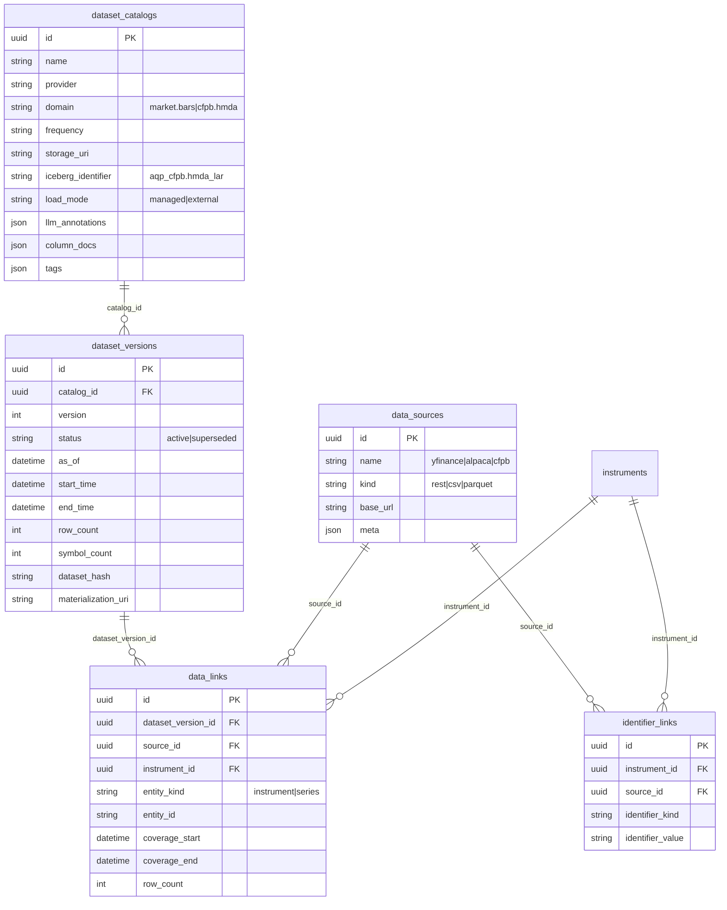

## Agentic + ML

Strategies, backtests, agent crews, ML deployments, and feature sets.

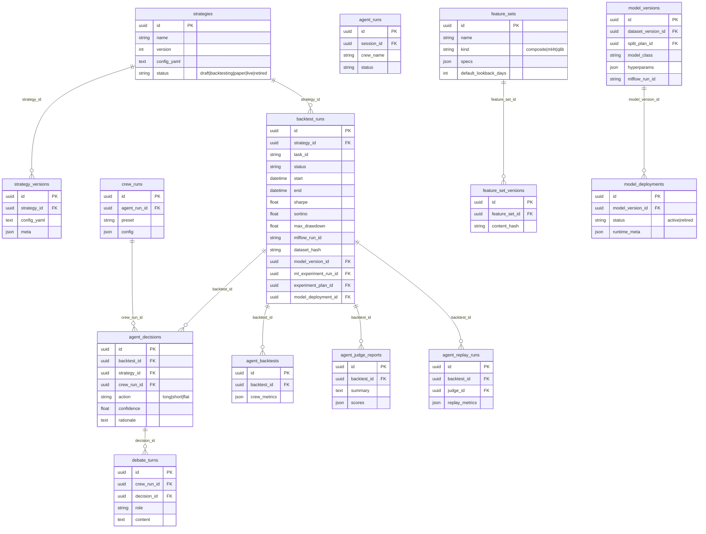

## Ledger (signals / orders / fills / entries)

Every signal, order, fill, and free-form audit entry written by
[`LedgerWriter`](../aqp/persistence/ledger.py).

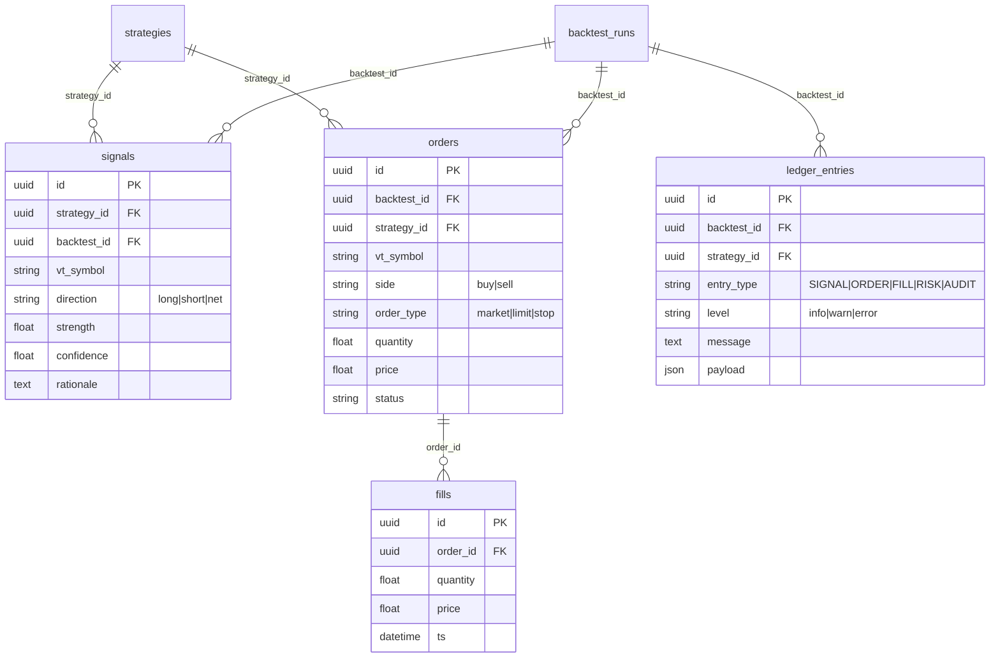

## News / Events / Fundamentals

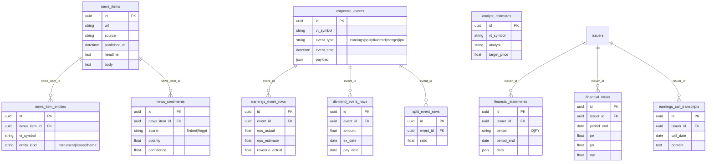

## Macro / FRED / GDelt

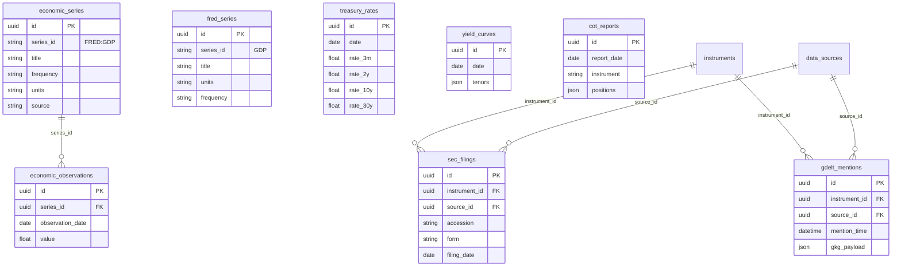

## Entities / Issuers / Ownership

```mermaid
erDiagram
    issuers {
        uuid id PK
        string name
        string lei
        string country
        string entity_kind "company|government|fund"
    }
    government_entities {
        uuid id PK_FK
        string country_code
        string level
    }
    funds {
        uuid id PK_FK
        string fund_family
        string fund_type
    }
    sectors {
        uuid id PK
        string code
        string name
    }
    industries {
        uuid id PK
        string code
        string name
        uuid sector_id FK
    }
    industry_classifications {
        uuid id PK
        uuid issuer_id FK
        uuid industry_id FK
        date as_of
    }
    entity_relationships {
        uuid id PK
        uuid parent_id FK
        uuid child_id FK
        string kind "subsidiary|owner|board"
    }
    locations {
        uuid id PK
        uuid issuer_id FK
        string country
        string city
    }
    key_executives {
        uuid id PK
        uuid issuer_id FK
        string name
        string title
    }
    insider_transactions {
        uuid id PK
        string vt_symbol
        string insider_name
        date transaction_date
        float quantity
    }
    institutional_holdings {
        uuid id PK
        string vt_symbol
        string holder_name
        date as_of
        float quantity
    }
    form_13f_holdings {
        uuid id PK
        string filer_cik
        string vt_symbol
        date period_end
    }
    short_interest {
        uuid id PK
        string vt_symbol
        date settlement_date
        float short_interest
    }
    politician_trades {
        uuid id PK
        string politician
        string vt_symbol
        date trade_date
        float amount
    }

    issuers ||--o| government_entities : "subclass"
    issuers ||--o| funds : "subclass"
    issuers ||--o{ industry_classifications : "issuer_id"
    sectors ||--o{ industries : "sector_id"
    industries ||--o{ industry_classifications : "industry_id"
    issuers ||--o{ entity_relationships : "parent_id"
    issuers ||--o{ locations : "issuer_id"
    issuers ||--o{ key_executives : "issuer_id"
```

## Taxonomy

Free-form tagging for issuers, instruments, and themes.

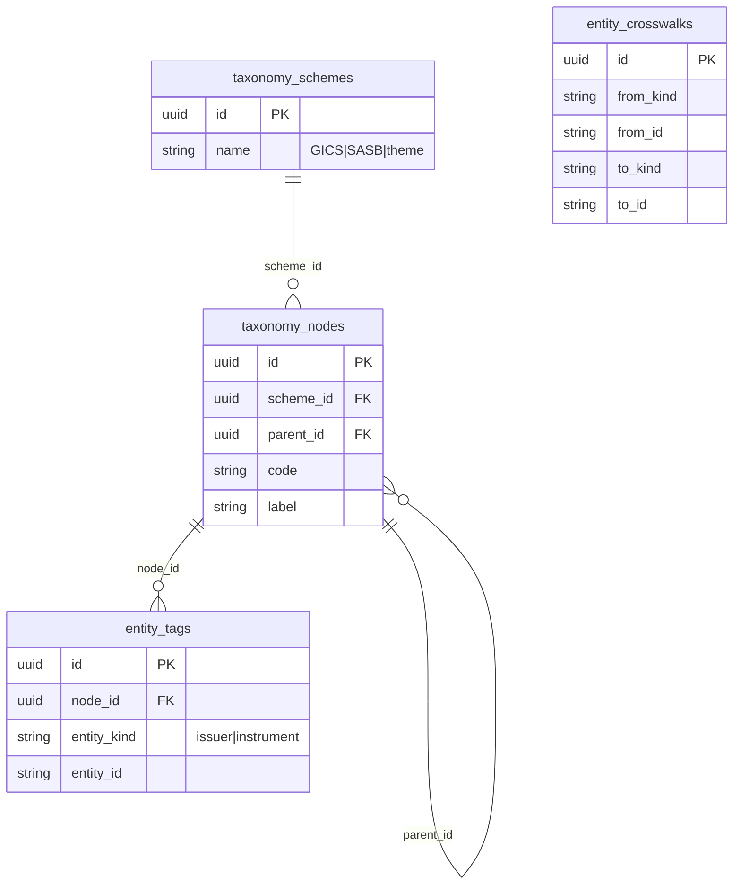

## Sessions / Chat / Optimization

The conversational + experimentation layer.

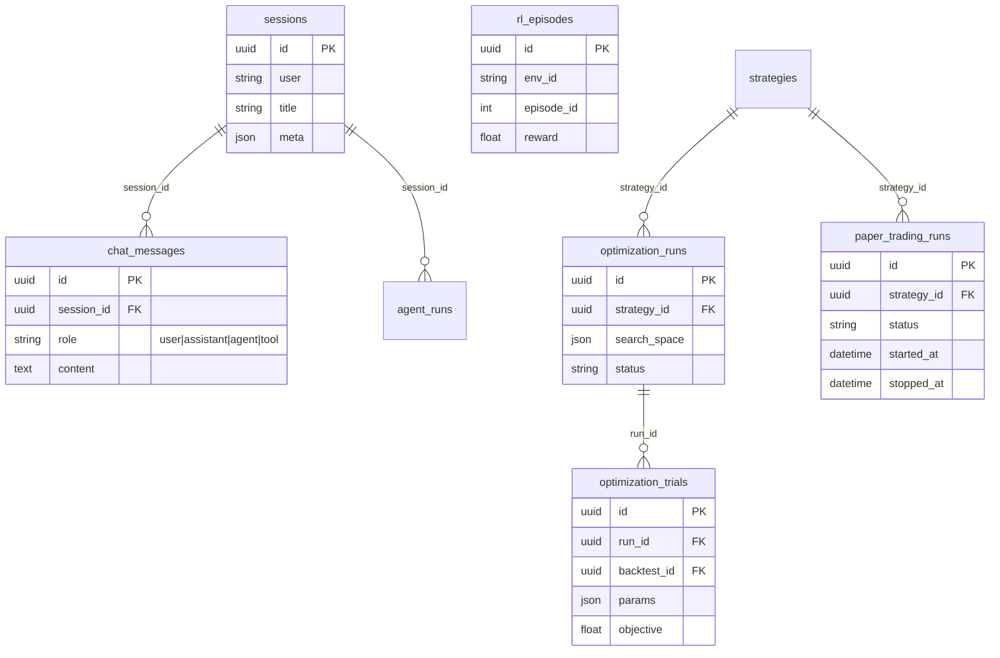

## Bots

Tables introduced by the Bot Entity Refactor (Alembic
[`0020_bots`](../alembic/versions/0020_bots.py)).

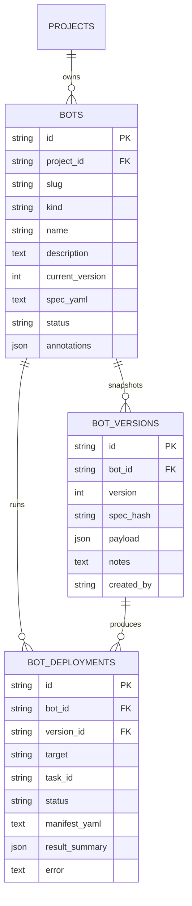

- `(project_id, slug)` is unique on `bots`.
- `(bot_id, spec_hash)` is unique on `bot_versions` (immutable snapshots).
- `bot_deployments.target` is one of `paper_session` / `kubernetes` /
  `backtest_only` / `chat` / `backtest`.

## Data layer expansion (sinks, producers, streaming links)

Tables introduced by the Data Pipelines Hub work (Alembic
[`0024_data_layer_expansion`](../alembic/versions/0024_data_layer_expansion.py)).
All four tables use `ProjectScopedMixin`.

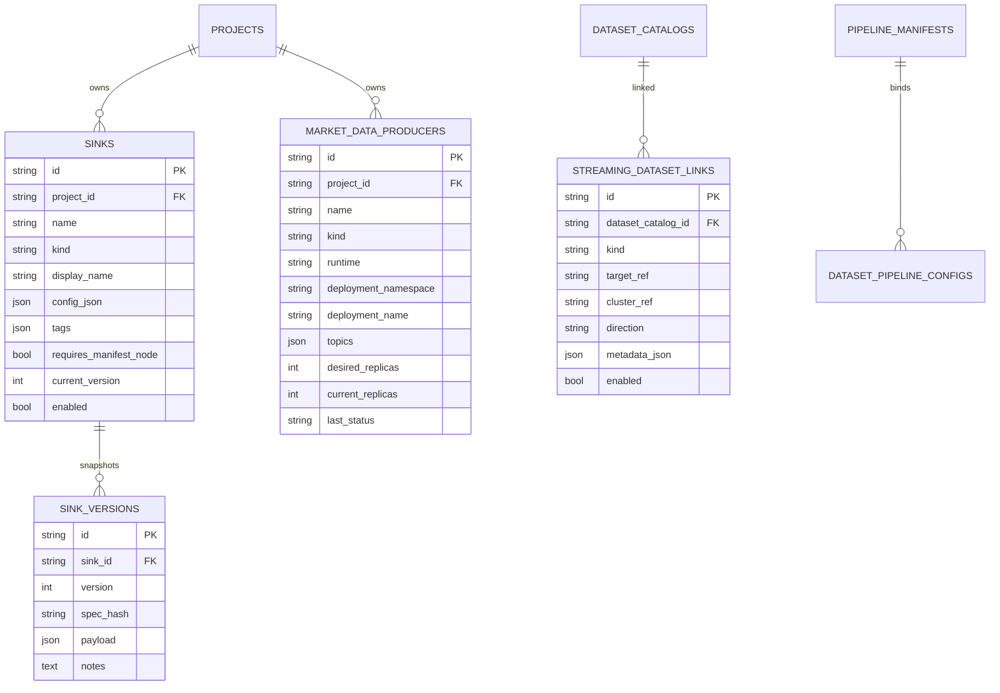

Notes:

- `(project_id, name)` is unique on `sinks` and `market_data_producers`.
- `(sink_id, spec_hash)` and `(sink_id, version)` are unique on
  `sink_versions` (mirrors the `bot_versions` pattern).
- `(dataset_catalog_id, kind, target_ref, direction)` is unique on
  `streaming_dataset_links` so the
  [refresh_links](../aqp/tasks/streaming_link_tasks.py) task can be
  re-run idempotently.

## ML alpha-backtest linkage (Alembic 0025)

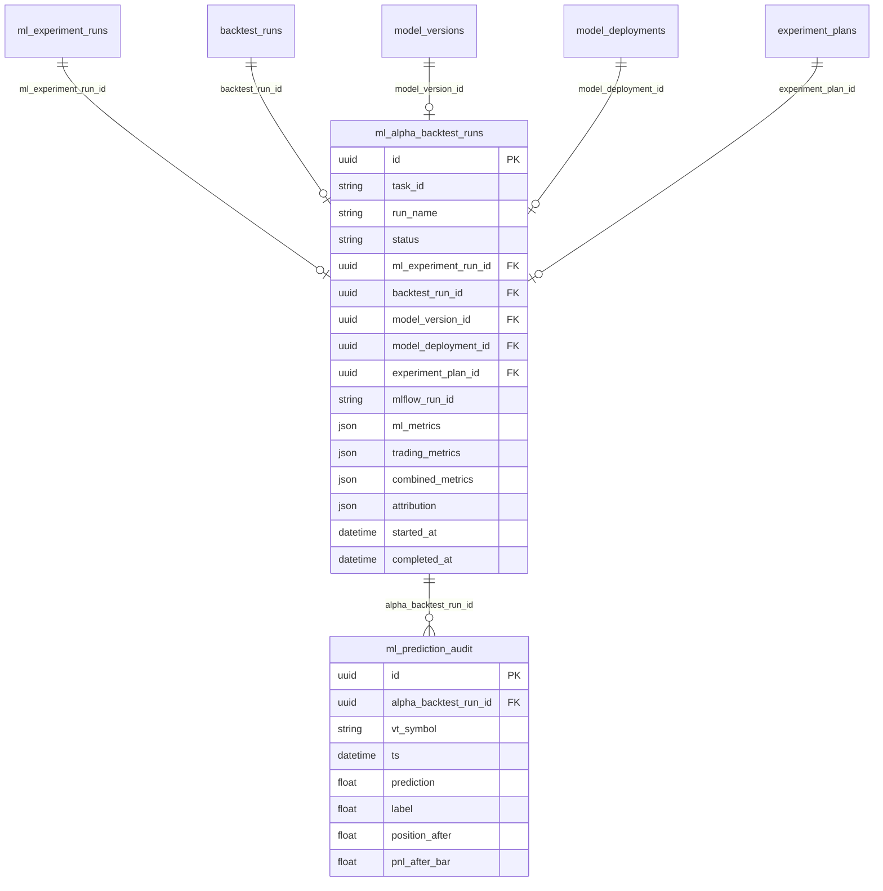

The four new FKs on `backtest_runs` (added by Alembic 0025) close the
loop from a backtest result back to the trained model that produced
its alpha:

- `model_version_id` — the registered `ModelVersion` row.
- `ml_experiment_run_id` — the `MLExperimentRun` that trained it.
- `experiment_plan_id` — the `ExperimentPlan` lineage row.
- `model_deployment_id` — the `ModelDeployment` used to wire the
  model into the strategy via `DeployedModelAlpha`.

## Adding a new model

When you add a new ORM class:

1. Add the class to the appropriate `aqp/persistence/models_*.py`
   (or `models.py` for cross-domain things).
2. Add an Alembic migration (`alembic revision --autogenerate -m
   "add foo"`). **Never edit a shipped migration.**
3. Update [docs/data-dictionary.md](data-dictionary.md) with the new
   table's columns.
4. Add the table to the relevant per-domain ERD above (or open a new
   one if it's a new domain).
5. If it has FKs into other domains, add those edges to the global FK
   map at the top of this file.
