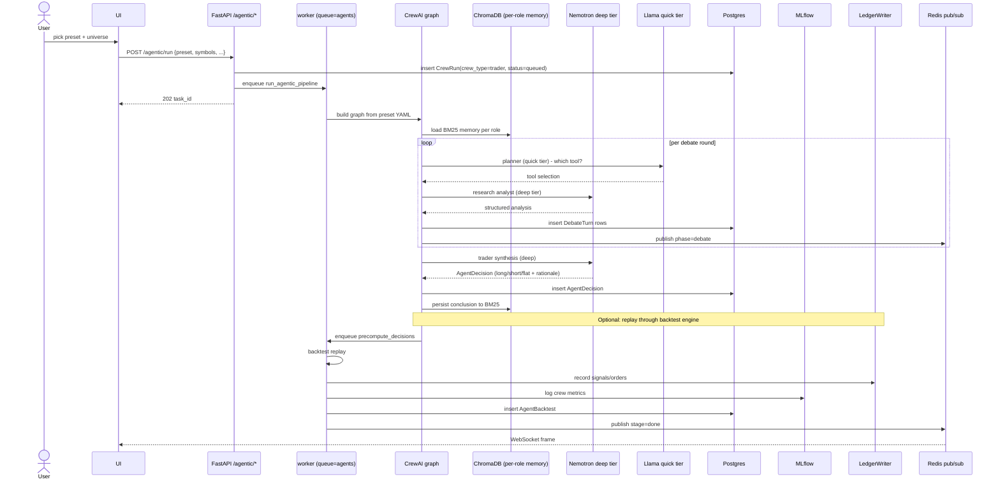
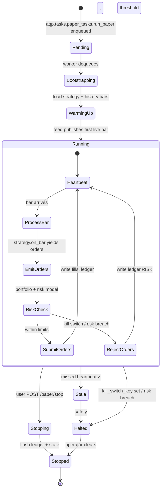
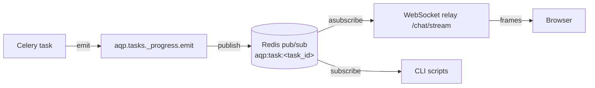

# Major Flows

> Pair with [docs/architecture.md](architecture.md) (system view) and
> [docs/erd.md](erd.md) (data model).
> Doc map: [docs/index.md](index.md).

End-to-end sequence and state diagrams for the four flows that human
and AI contributors most often need to reason about. Each diagram
cites the canonical files; if the diagram and the code disagree, the
code wins (and the doc is stale — please update).

## 1. Generic file → Iceberg ingestion

The discovery → director → materialise → verify → annotate pipeline
that powers the regulatory-corpus ingest. Canonical doc:
[docs/data-catalog.md](data-catalog.md).

```mermaid
sequenceDiagram
    actor User
    participant CLI as scripts/ingest_regulatory.py
    participant API as FastAPI
    participant Celery
    participant Disc as discovery
    participant Dir as director (Nemotron)
    participant Mat as materialize
    participant Verify as verifier (Nemotron)
    participant Ann as annotate (Nemotron)
    participant Iceberg
    participant DB as Postgres
    participant Bus as Redis pub/sub

    User->>CLI: invoke per source path
    CLI->>API: POST /pipelines/ingest/regulatory
    API->>Celery: enqueue ingest_local_paths_with_director
    API-->>CLI: 202 task_id
    CLI->>Bus: SUBSCRIBE aqp:task:&lt;task_id&gt;

    loop per source path
        Celery->>Disc: discover_datasets(path)
        Disc-->>Celery: list~DiscoveredDataset~
        Celery->>Dir: plan_ingestion(datasets)
        Dir-->>Celery: IngestionPlan
        Celery->>Bus: publish phase=plan
        loop per planned dataset
            Celery->>Mat: materialize_dataset(planned)
            Mat->>Iceberg: ensure_namespace + append_arrow*
            Mat-->>Celery: MaterializeResult
            alt rows below floor
                Celery->>Verify: verify_after_materialise
                Verify-->>Celery: VerifierVerdict
                opt retry
                    Celery->>Mat: re-run with new caps
                end
            end
            opt annotate=true
                Celery->>Ann: annotate_table
                Ann-->>Celery: AnnotationResult
                Ann->>DB: register_iceberg_dataset
            end
            Celery->>Bus: publish phase=materialize|verify|annotate
        end
    end

    Celery->>DB: write IngestionReport summary
    Celery->>Bus: publish stage=done
    Bus-->>CLI: final payload
    CLI->>CLI: render markdown summary + audit log
```

Canonical files:

- [aqp/data/pipelines/discovery.py](../aqp/data/pipelines/discovery.py)
- [aqp/data/pipelines/director.py](../aqp/data/pipelines/director.py)
- [aqp/data/pipelines/materialize.py](../aqp/data/pipelines/materialize.py)
- [aqp/data/pipelines/annotate.py](../aqp/data/pipelines/annotate.py)
- [aqp/data/pipelines/runner.py](../aqp/data/pipelines/runner.py)
- [aqp/tasks/ingestion_tasks.py](../aqp/tasks/ingestion_tasks.py)
- [scripts/ingest_regulatory.py](../scripts/ingest_regulatory.py)
- [scripts/_run_one_source.py](../scripts/_run_one_source.py)

## 2. Backtest dispatch

```mermaid
sequenceDiagram
    actor User
    participant UI as Next.js webui
    participant API as FastAPI /backtest
    participant DB as Postgres
    participant Celery as worker (queue=backtest)
    participant Strat as Strategy + Engine
    participant Duck as DuckDB
    participant Iceberg
    participant MLflow
    participant Bus as Redis pub/sub
    participant Ledger as LedgerWriter

    User->>UI: configure + run backtest
    UI->>API: POST /backtest {strategy_id, start, end, engine}
    API->>DB: insert BacktestRun(status=pending)
    API->>Celery: enqueue run_backtest(backtest_id)
    API-->>UI: 202 {task_id, stream_url}
    UI->>API: WebSocket /chat/stream/&lt;task_id&gt;

    Celery->>DB: load BacktestRun + Strategy
    Celery->>MLflow: start_run(experiment=aqp-default)
    Celery->>Iceberg: read bars (DuckDB view)
    Duck-->>Celery: pandas DataFrame
    Celery->>Strat: instantiate FrameworkAlgorithm(...)

    loop per bar
        Strat->>Strat: universe → alpha → portfolio → risk → execution
        Strat-->>Celery: list~OrderRequest~
        Celery->>Ledger: record_signal / record_order
        Ledger->>DB: insert signals / orders
        Celery->>Bus: publish progress
        Bus-->>UI: WebSocket frame
    end

    Celery->>MLflow: log_metrics + log_artifact(equity_curve.csv)
    Celery->>DB: update BacktestRun(status=completed, sharpe, ...)
    Celery->>Bus: publish stage=done
    Bus-->>UI: final summary
```

Canonical files:

- [aqp/api/routes/backtest.py](../aqp/api/routes/backtest.py)
- [aqp/tasks/backtest_tasks.py](../aqp/tasks/backtest_tasks.py)
- [aqp/backtest/engine.py](../aqp/backtest/engine.py)
- [aqp/backtest/runner.py](../aqp/backtest/runner.py)
- [aqp/strategies/framework.py](../aqp/strategies/framework.py)
- [aqp/persistence/ledger.py](../aqp/persistence/ledger.py)
- [aqp/mlops/autolog.py](../aqp/mlops/autolog.py)

## 3. Agentic crew run

The dual-tier (deep + quick LLM) CrewAI graph used by the
TradingAgents-style preset. Files:
[aqp/tasks/agentic_backtest_tasks.py](../aqp/tasks/agentic_backtest_tasks.py),
[aqp/agents/](../aqp/agents/).



Canonical files:

- [aqp/api/routes/agentic.py](../aqp/api/routes/agentic.py)
- [aqp/tasks/agentic_backtest_tasks.py](../aqp/tasks/agentic_backtest_tasks.py)
- [aqp/agents/](../aqp/agents/)
- [aqp/llm/providers/router.py](../aqp/llm/providers/router.py)

## 4. Paper trading session



The kill switch is a Redis key (`AQP_RISK_KILL_SWITCH_KEY`, default
`aqp:kill_switch`); set it from anywhere to stop a session.

Canonical files:

- [aqp/api/routes/paper.py](../aqp/api/routes/paper.py)
- [aqp/tasks/paper_tasks.py](../aqp/tasks/paper_tasks.py)
- [aqp/trading/runner.py](../aqp/trading/runner.py)
- [aqp/trading/session.py](../aqp/trading/session.py)
- [aqp/risk/](../aqp/risk/)

## 5. (Bonus) Live-data subscription

Browser asks the API for a live data stream; API allocates a Redis
pub/sub channel that bridges the broker feed to a WebSocket.

```mermaid
sequenceDiagram
    actor User
    participant UI
    participant API as FastAPI /live/subscribe
    participant Bridge as live broker bridge
    participant Broker as Alpaca / IBKR / sim
    participant Bus as Redis pub/sub (aqp:live:&lt;ch&gt;)
    participant WS as /live/&lt;channel_id&gt;

    User->>UI: open live tab
    UI->>API: POST /live/subscribe {venue, symbols}
    API->>Bridge: spawn bridge task
    Bridge->>Broker: subscribe to symbols
    API-->>UI: {channel_id, ws_url}
    UI->>WS: WebSocket connect

    loop per market event
        Broker-->>Bridge: bar / quote / trade
        Bridge->>Bus: publish on aqp:live:&lt;ch&gt;
        Bus-->>WS: deliver
        WS-->>UI: WebSocket frame
    end

    User->>WS: close tab
    WS->>Bridge: connection closed
    Bridge->>Broker: unsubscribe (if last consumer)
```

Canonical files:

- [aqp/api/routes/market_data_live.py](../aqp/api/routes/market_data_live.py)
- [aqp/streaming/](../aqp/streaming/)
- [aqp/ws/broker.py](../aqp/ws/broker.py)

## Cross-cutting: progress bus

Every long-running task in AQP uses the **same** progress bus pattern:



API to remember:

- `emit(task_id, stage, message, **extras)` — publish a progress frame.
- `emit_done(task_id, result)` — terminal `stage="done"` + result payload.
- `emit_error(task_id, error)` — terminal `stage="error"`.

Don't publish to Redis directly from your task code; always go through
[aqp/tasks/_progress.py](../aqp/tasks/_progress.py) so the frame
shape stays consistent.
