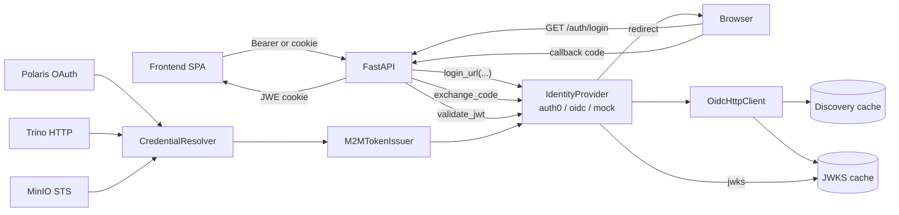

# Federated identity layer

AQP wraps every identity / token operation in a pluggable
:class:`aqp.auth.providers.IdentityProvider`. The provider drives both
user authentication (login, JWT validation, refresh) and
service-to-service auth (M2M tokens that downstream services like
Polaris / Trino consume via the credential resolver).

The pieces port (with attribution) from
`aqp_snippets/inspiration/auth0-server-python-main` (MIT, Copyright Auth0, Inc.)
into AQP-native modules.

## Architecture



## Components

| Component | Path |
| --- | --- |
| Provider ABC + metaclass | [aqp/auth/providers/protocol.py](../aqp/auth/providers/protocol.py) |
| Auth0 / generic OIDC / mock concrete providers | [aqp/auth/providers/](../aqp/auth/providers/) |
| OIDC HTTP plumbing (discovery, JWKS, token endpoint) | [aqp/auth/oidc_client.py](../aqp/auth/oidc_client.py) |
| PKCE helpers (RFC 7636 S256) | [aqp/auth/pkce.py](../aqp/auth/pkce.py) |
| Cookie / Redis session stores | [aqp/auth/session/](../aqp/auth/session/) |
| JWE cookie crypto (HKDF-SHA256 + A256CBC-HS512) | [aqp/auth/session/crypto.py](../aqp/auth/session/crypto.py) |
| M2M token issuer | [aqp/auth/m2m.py](../aqp/auth/m2m.py) |
| Login / callback / logout routes | [aqp/api/routes/auth.py](../aqp/api/routes/auth.py) |
| Backend JWT validator | [aqp/auth/oidc.py](../aqp/auth/oidc.py) |

## Login flow (backend session)

1. Browser hits `GET /auth/login` (optionally with a `return_to`).
2. AQP generates a PKCE verifier + state, stashes them in an
   encrypted transaction cookie (10-minute TTL), redirects to the
   provider's authorize URL.
3. Provider posts the authorization code to `GET /auth/callback`.
4. AQP looks up the transaction cookie by `state`, calls
   `provider.exchange_code(...)`, and stores the resulting token set
   in an encrypted session cookie (or Redis).
5. Subsequent requests carry the cookie; AQP decrypts it on demand
   and exposes the user via the existing `current_user` dep.

The bearer-token flow (`Authorization: Bearer`) keeps working unchanged
— the SPA can pick either path via the `backend_session_supported`
flag in `/auth/config`.

## M2M flow

When `AQP_AUTH_M2M_ENABLED=true`:

1. AQP startup calls `aqp.auth.m2m.install_m2m_store()`, which adds
   :class:`M2MStore` (priority 10) to the credential resolver chain.
2. A service like `polaris_client` resolves
   `CredentialKey("polaris", "oauth")` through
   :func:`aqp.credentials.get_resolver`.
3. The M2M store fetches `provider.m2m_token(audience, scope)` (Auth0
   `client_credentials` grant) and returns a `Credential` with
   `access_token`/`token` set.
4. The resolver merges this hit with the env-store payload (which
   carries the static `client_id`), so consumers see one merged
   `Credential`.
5. Tokens cache in `M2MTokenIssuer` until expiry minus a 30-second
   skew, so we don't mint per request.

The resolver chain falls through to the file/env stores if the M2M
issuer fails or is disabled — you never get a worse outcome than the
pre-M2M state.

## Configuration

The full env knob set lives in `.env.example` under the "Federated
identity (M2 / M3)" section. The minimum for an Auth0 deployment:

```env
AQP_AUTH_PROVIDER=auth0
AQP_AUTH_OIDC_ISSUER=https://your-tenant.auth0.com
AQP_AUTH_OIDC_AUDIENCE=https://aqp.local/api
AQP_AUTH_OIDC_CLIENT_ID=...
AQP_AUTH_OIDC_CLIENT_SECRET=...
AQP_AUTH_LOGIN_CALLBACK=http://localhost:8000/auth/callback
AQP_AUTH_LOGOUT_CALLBACK=http://localhost:3000/
AQP_AUTH_SESSION_SECRET=$(openssl rand -hex 32)
AQP_AUTH_M2M_ENABLED=true
AQP_AUTH_M2M_AUDIENCE=https://aqp.local/services
```

## Adding a new provider

1. Subclass :class:`aqp.auth.providers.IdentityProvider` and set
   `provider_kind` (the dispatch key matched against
   `AQP_AUTH_PROVIDER`).
2. Either inherit from
   :class:`aqp.auth.providers.GenericOidcProvider` (and override only
   the bits that diverge) or roll your own.
3. The metaclass auto-registers; restart the API and set
   `AQP_AUTH_PROVIDER=<your_kind>`.

## Testing

`tests/auth/` contains the canonical test patterns:

- `test_pkce.py` — RFC 7636 conformance.
- `test_session_crypto.py` — JWE round-trips, wrong-key rejection.
- `test_oidc_client.py` — token endpoint mock-driven tests.
- `test_providers.py` — Auth0 / generic OIDC / mock dispatch.
- `test_m2m.py` — issuer caching, resolver integration.

All tests run hermetic; nothing hits the network.

## Account management surface (Phase 7)

Phase 7 adds a dedicated account-management API surface under `/me/*`
implemented in [`aqp/api/routes/me.py`](../aqp/api/routes/me.py).
These routes expose profile updates, MFA and session operations, linked
identity management, and self-service account actions while keeping the
Auth0 Management API boundary centralized.

The Auth0 Management API integration lives in
[`aqp/auth/management_api.py`](../aqp/auth/management_api.py). Scope
enforcement for protected endpoints is available through
[`aqp/auth/auth0_fastapi.py`](../aqp/auth/auth0_fastapi.py) via
`Auth0FastAPI` opt-in dependencies. Audit and invite persistence for
this surface is recorded in
[`aqp/persistence/models_audit.py`](../aqp/persistence/models_audit.py)
(`security_audit_events` and `tenancy_invites`), and events are emitted
through [`aqp/auth/audit.py`](../aqp/auth/audit.py).

## Microsoft Entra ID secondary IdP (Phase 7)

AQP's primary Microsoft pattern is federation through Auth0 Universal
Login using an Auth0 Microsoft Enterprise Connection, documented in
[`docs/auth0-microsoft-federation.md`](auth0-microsoft-federation.md).
This keeps Auth0 as the default IdP while preserving one hosted login
surface and one claims projection path.

Direct Entra authentication remains supported as a fallback through
[`aqp/auth/providers/msal_entra.py`](../aqp/auth/providers/msal_entra.py).
When `AQP_AUTH_PROVIDER=msal_entra`, the legacy `MsalEntraProvider`
path activates without changing the backend tenancy-link semantics.
