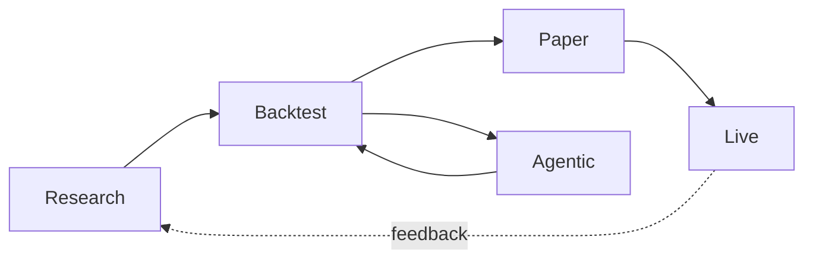

# Documentation Index

Triple-axis table of contents for the AQP docs.

> **Two entry points**:
>
> - Humans → [architecture.md](architecture.md)
> - AI agents → [../AGENTS.md](../AGENTS.md)
>
> Both link back here.

## By audience

### I'm new and human

1. [../README.md](../README.md) — what AQP is, screenshots, release notes.
2. [architecture.md](architecture.md) — system map + request lifecycle.
3. [../CONTRIBUTING.md](../CONTRIBUTING.md) — set up the dev environment.
4. [glossary.md](glossary.md) — terms used everywhere.
5. Pick a subsystem from the table below.

### I'm an AI agent

1. [../AGENTS.md](../AGENTS.md) — terse rule-set + project map.
2. [glossary.md](glossary.md) — definitions.
3. [erd.md](erd.md) + [class-diagram.md](class-diagram.md) — structural maps.
4. [flows.md](flows.md) — end-to-end sequences.
5. The relevant subsystem doc (table below).

## By lifecycle stage

| Stage | Docs |
| --- | --- |
| **Research** | [factor-research.md](factor-research.md), [ml-framework.md](ml-framework.md), [ml-libraries.md](ml-libraries.md), [ml-alpha-backtest.md](ml-alpha-backtest.md), [ml-flows.md](ml-flows.md), [ml-preprocessing-pipeline.md](ml-preprocessing-pipeline.md), [ml-builder.md](ml-builder.md), [ml-testing.md](ml-testing.md), [strategy-browser.md](strategy-browser.md), [data-plane.md](data-plane.md), [data-catalog.md](data-catalog.md), [data-pipelines-hub.md](data-pipelines-hub.md), [visualization-layer.md](visualization-layer.md) |
| **Backtest** | [backtest-engines.md](backtest-engines.md), [strategy-lifecycle.md](strategy-lifecycle.md) |
| **Agentic** | [agentic-pipeline.md](agentic-pipeline.md), [providers.md](providers.md) |
| **Bots** | [bots.md](bots.md) (smallest deployable unit; aggregates universe + strategy + engine + ML + agents + RAG + metrics) |
| **Paper / Live** | [paper-trading.md](paper-trading.md), [live-market.md](live-market.md), [streaming.md](streaming.md), [streaming-admin.md](streaming-admin.md) |
| **Cross-cutting** | [observability.md](observability.md), [webui.md](webui.md), [core-types.md](core-types.md), [domain-model.md](domain-model.md), [alpha-vantage.md](alpha-vantage.md) |

## By subsystem

### Architecture + reference

| Doc | Purpose |
| --- | --- |
| [architecture.md](architecture.md) | System component diagram + request lifecycle |
| [erd.md](erd.md) | Per-domain entity-relationship diagrams |
| [class-diagram.md](class-diagram.md) | Class hierarchies (Symbol, LLMProvider, Strategy, Engines, Pipeline) |
| [data-dictionary.md](data-dictionary.md) | Table-by-table column reference |
| [flows.md](flows.md) | Sequence diagrams for ingestion / backtest / agents / paper |
| [glossary.md](glossary.md) | Project-specific terminology |
| [domain-model.md](domain-model.md) | Narrative on the domain types |
| [core-types.md](core-types.md) | `Symbol`, enums, dataclasses |

### Data plane

| Doc | Purpose |
| --- | --- |
| [data-plane.md](data-plane.md) | Provider → cache → DuckDB view pipeline |
| [data-catalog.md](data-catalog.md) | Iceberg catalog + ingest pipeline |
| [visualization-layer.md](visualization-layer.md) | Trino-backed Superset and Bokeh exploration layer |
| [alpha-vantage.md](alpha-vantage.md) | AV provider quota + cache |
| [streaming.md](streaming.md) | Kafka topic taxonomy + ingester layout |
| [live-market.md](live-market.md) | Live subscription + WebSocket relay |

### Strategy + ML

| Doc | Purpose |
| --- | --- |
| [factor-research.md](factor-research.md) | Building factor / alpha strategies |
| [ml-framework.md](ml-framework.md) | Train → register → deploy → score |
| [ml-libraries.md](ml-libraries.md) | Per-library reference (TF/Keras/Prophet/sklearn/PyOD/sktime/HF) |
| [ml-alpha-backtest.md](ml-alpha-backtest.md) | `AlphaBacktestExperiment` orchestrator + `MLAlphaBacktestRun` schema |
| [ml-flows.md](ml-flows.md) | Lightweight workbench flows catalog |
| [ml-preprocessing-pipeline.md](ml-preprocessing-pipeline.md) | ML preprocessors as data-engine pipeline nodes |
| [ml-builder.md](ml-builder.md) | Graphical experiment builder UX |
| [ml-testing.md](ml-testing.md) | Interactive ML testing workbench |
| [backtest-engines.md](backtest-engines.md) | Engine catalogue + invariants (vbt-pro primary, event-driven, ZVT, AAT, fallback) |
| [vbtpro-integration.md](vbtpro-integration.md) | Deep vectorbt-pro integration: modes, hooks, agent + ML components, walk-forward |
| [strategy-lifecycle.md](strategy-lifecycle.md) | draft → backtested → paper → live |
| [strategy-browser.md](strategy-browser.md) | Data-browser → strategy spec UX |

### Agentic

| Doc | Purpose |
| --- | --- |
| [agentic-pipeline.md](agentic-pipeline.md) | Crew control plane |
| [providers.md](providers.md) | LLM provider registry + tier routing |

### Trading + operations

| Doc | Purpose |
| --- | --- |
| [paper-trading.md](paper-trading.md) | Session loop + risk model |
| [bots.md](bots.md) | Bot entity (TradingBot / ResearchBot), graphical builder, deployment |
| [observability.md](observability.md) | OTEL → Jaeger + structured logs |
| [webui.md](webui.md) | Next.js page tree |

## Latest changes

| Doc | Last touched |
| --- | --- |
| [data-catalog.md](data-catalog.md) | Persistent host warehouse + Director |
| [glossary.md](glossary.md) | New (covers Director, Iceberg conventions, tiers) |
| [architecture.md](architecture.md) | New (replaces README ASCII art) |
| [erd.md](erd.md) | New (per-domain ERDs across 110+ tables) |
| [class-diagram.md](class-diagram.md) | New (5 hierarchies) |
| [data-dictionary.md](data-dictionary.md) | New (15 sections) |
| [flows.md](flows.md) | New (5 flows) |

## Doc conventions

- **Mermaid** is the diagram format. GitHub renders it natively.
  Don't commit PNG/SVG diagrams unless they're irreplaceable.
- **Cross-link** with relative markdown paths (`[foo](foo.md)`) so
  the navigation works on GitHub and locally.
- **Cite code** with full repo paths from the doc:
  `[aqp/data/pipelines/director.py](../aqp/data/pipelines/director.py)`.
  Don't link to specific line numbers (they bit-rot fast).
- **Keep it short** — narrative goes in subsystem docs, definitions
  in [glossary.md](glossary.md), structure in
  [erd.md](erd.md) / [class-diagram.md](class-diagram.md). Don't
  repeat yourself.
