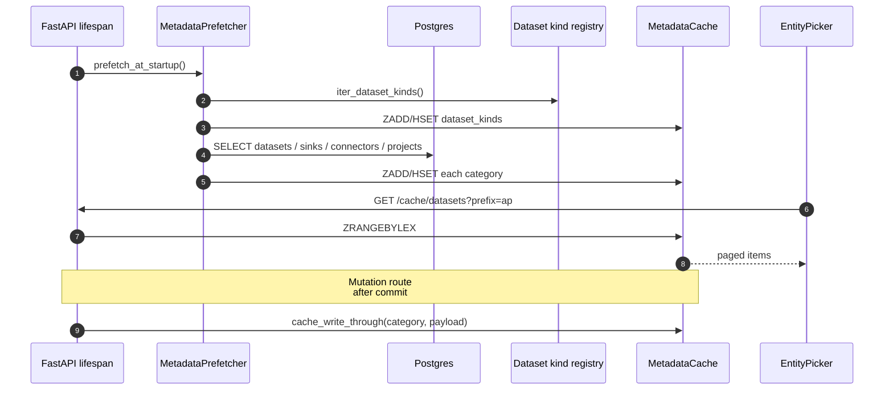

# Metadata cache

> Phase 0 of the self-service data fabric expansion. The metadata
> cache is the **single read path for entity dropdowns** in the AQP
> frontend. Free-text inputs that name a dataset, namespace, sink
> kind, Airbyte connector, project, or credential are forbidden in
> new code — every entity-name input is a
> [`EntityPicker`](../frontend/src/components/common/EntityPicker.tsx)
> that reads from `/cache/<category>` which in turn reads from
> [`MetadataCache`](../aqp/cache/client.py).

The cache is intentionally narrow:

- **Reads** are sub-millisecond `ZRANGEBYLEX` + `HGETALL` calls.
- **Writes** happen through `cache_write_through` synchronously after
  a Postgres `commit`. Nothing else writes to the cache namespace.
- **Refresh** runs on FastAPI startup and on a periodic schedule
  (default 5 min) so missed write-throughs self-heal.
- **Fallback** is an in-memory backend so unit tests + the local dev
  loop never hard-fail on a missing Redis.

## Categories

[`aqp.cache.keys.CACHE_CATEGORIES`](../aqp/cache/keys.py):

| Category | Source of truth | TTL | Writers |
| --- | --- | --- | --- |
| `datasets` | `dataset_catalogs` | 15 min | `metadata_catalog` patch + create routes |
| `namespaces` | `dataset_catalogs.iceberg_identifier` + `iceberg_catalog.list_namespaces` | 24 h | prefetcher only |
| `sink_kinds` | `aqp.data.fetchers.sinks.SINK_KINDS` | 24 h | prefetcher only |
| `sink_names` | `sinks` | 15 min | `/sinks` create / patch / delete |
| `airbyte_connectors` | curated catalog + `airbyte_connectors` rows | 15 min | `/airbyte/connections` create |
| `projects` | `projects` | 24 h | prefetcher only |
| `credentials` | `aqp.credentials.CredentialResolver.iter_known_keys` | 15 min | prefetcher only |
| `dataset_kinds` | `aqp.data.datasets` registry | 24 h | prefetcher only (in-process) |

Adding a new category means adding the constant in
[`aqp.cache.keys.CACHE_CATEGORIES`](../aqp/cache/keys.py) **and** a
populator method in
[`MetadataPrefetcher`](../aqp/cache/prefetch.py). The cache rejects
unknown categories at the helper boundary so a typo can't pollute
keys.

## Key naming

```
{prefix}:{category}:names              ZSET, lexicographically ordered
{prefix}:{category}:by_id:{id}         HASH, full payload
{prefix}:{category}:by_name:{name}     HASH, reverse lookup ({id})
{prefix}:idx:{category}                FT.CREATE index (when Redis Stack)
{prefix}:stamp:{category}              ISO timestamp of last refresh
```

Default `prefix = "aqp:cache"` (override via `AQP_CACHE_KEY_PREFIX`).
The `aqp:cache:*` namespace is reserved for this layer — no other
subsystem may write to it.

## Lifecycle



## Write-through hooks (Phase 0)

- [`aqp/services/metadata_catalog_service.py::patch_dataset`](../aqp/services/metadata_catalog_service.py)
- [`aqp/api/routes/metadata_catalog.py::create_metadata_dataset`](../aqp/api/routes/metadata_catalog.py)
- [`aqp/api/routes/airbyte.py::create_connection`](../aqp/api/routes/airbyte.py)
- [`aqp/api/routes/sinks.py::create_endpoint`](../aqp/api/routes/sinks.py)
- [`aqp/api/routes/sinks.py::patch_endpoint`](../aqp/api/routes/sinks.py)
- [`aqp/api/routes/sinks.py::delete_endpoint`](../aqp/api/routes/sinks.py)

Phases 1–3 add their own hooks as they touch the relevant routes.

## Settings

[`aqp/config/settings.py`](../aqp/config/settings.py):

| Setting | Default | What it does |
| --- | --- | --- |
| `AQP_CACHE_ENABLED` | `true` | Hard kill switch. When false the prefetch is skipped and the EntityPicker shows an empty dropdown. |
| `AQP_CACHE_REDIS_URL` | `""` | Empty falls back to `AQP_REDIS_URL`. Use a separate URL when isolating cache traffic. |
| `AQP_CACHE_REDIS_DB` | `2` | Logical DB on the Redis server. Avoids collisions with RAG (`db=0`) and the pubsub bus (`db=1`). |
| `AQP_CACHE_KEY_PREFIX` | `aqp:cache` | Hard prefix for every key. |
| `AQP_CACHE_REFRESH_INTERVAL_S` | `300` | Periodic full-prefetch interval. Write-through keeps the cache live; this is a safety-net rebuild. |
| `AQP_CACHE_MASTER_TTL_S` | `86400` | TTL for static categories (kinds, namespaces, projects). |
| `AQP_CACHE_INSTANCE_TTL_S` | `900` | TTL for instance categories (datasets, connectors, sinks, credentials). |
| `AQP_CACHE_FULLTEXT_INDEX` | `true` | Try `FT.CREATE` for richer search. Falls back gracefully when RediSearch is missing. |

## Don't

- **Don't** introduce a free-text input that names an existing
  entity. Use `EntityPicker` with the matching `kind`.
- **Don't** write to the cache directly — only through
  `cache_write_through` / `cache_invalidate`.
- **Don't** add a new key namespace under `aqp:cache:*` from outside
  this package.
- **Don't** assume the cache is reachable. Mutation routes log a
  warning when write-through fails; UIs gracefully degrade to the
  full Postgres read on `/cache/health`.
- **Don't** put non-metadata payloads in the cache (Postgres-shaped
  feature snapshots, vector embeddings, etc.). Those have their own
  homes (Iceberg, RAG, RedisKVDataset).
