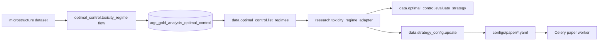

# Microstructure toxicity + regime-aware adapter

> **Audience:** anyone running paper or live HFT strategies who wants
> the platform to react automatically to toxic-flow regimes.

A pure Avellaneda-Stoikov / Lucic-Tse market maker is exposed to
adverse selection: when the order flow becomes informationally toxic
(elevated VPIN, spiky microprice variance, runaway cancellation
ratios), the dealer's quotes get picked off faster than the closed-
form predicts. The mathematical fix — increase ``γ`` (risk aversion)
and shrink ``order_size`` — needs to happen automatically and quickly,
because the toxicity window is short.

AQP wires that loop end-to-end via two MCP tools and one agent spec.

## The loop



1. The
   [optimal_control.toxicity_regime](../aqp/analysis/flows/optimal_control.py)
   flow runs on every fresh microstructure slice and writes a regime
   row to ``aqp_gold_analysis_optimal_control.toxicity_regime``.
2. The
   [research.toxicity_regime_adapter](../configs/agents/research_toxicity_regime_adapter.yaml)
   agent polls the regime table via the ``data.optimal_control.list_regimes``
   MCP tool.
3. When the label flips (benign → elevated → toxic), the agent updates
   a whitelist of fields on the active paper-trading YAML using the
   ``data.strategy_config.update`` writer tool.
4. The Celery paper worker picks up the new YAML on its next reload.

The whitelist is intentionally narrow:
``gamma``, ``sigma``, ``kappa``, ``k``, ``gamma_inv``, ``base_spread``,
``order_size``, ``max_position``. Anything else (broker, symbol,
account_id, kill-switch state) requires a different higher-privilege
tool — by design.

## Toxicity score

The flow computes a composite toxicity score per slice:

```
score = 0.6 · VPIN_recent + 0.25 · microprice_variance + 0.15 · cancel_ratio
```

Thresholds map score → regime → suggested multipliers:

| Score range | Regime | γ multiplier | order_size multiplier |
| --- | --- | --- | --- |
| < 0.5 · threshold | benign | 1.0 | 1.0 |
| ∈ [0.5·θ, θ) | elevated | 1.25 | 0.75 |
| ≥ threshold | toxic | 1.5 | 0.5 |

Default threshold ``θ = 0.6``. Tune via the flow's
``toxic_threshold`` param.

## Where the math comes from

VPIN: Easley, López de Prado, & O'Hara (2012), implemented in
[aqp/data/microstructure.py::vpin](../aqp/data/microstructure.py).
Microprice variance: the gap between the volume-weighted microprice
and the simple mid; large gaps indicate informational pressure on
one side of the book. Cancellation ratio: optional input; when
provided, captures the fraction of recent order activity that was
cancellations rather than trades — a leading indicator of HFT activity
ramping up.

## Manually inspecting a regime

```python
import pandas as pd
from aqp.analysis import run_flow

df = pd.read_csv("recent_l1_book.csv")
out = run_flow(
    "optimal_control.toxicity_regime",
    df,
    {
        "buy_volume_column": "buy_volume",
        "sell_volume_column": "sell_volume",
        "bid_qty_column": "bid_qty",
        "ask_qty_column": "ask_qty",
        "bid_price_column": "bid_price",
        "ask_price_column": "ask_price",
        "n_buckets": 50,
        "toxic_threshold": 0.6,
    },
)
print(out.metrics["regime"], out.metrics["composite_score"])
```

## Customising

- **Tighten the threshold.** Drop ``toxic_threshold`` to 0.4 in
  defensive products; raise it to 0.7 in alpha-only strategies that
  want the tighter spreads more often.
- **Add a cancellation column.** Pass
  ``cancellation_column="n_cancels"`` to the flow when the dataset
  exposes per-bar cancellation counts; the score will become more
  responsive to HFT activity.
- **Replace the agent.** The reference adapter is a simple multiplier
  agent. For richer policies, swap in an RL agent trained on
  [LucicTsePortfolioEnv](../aqp/rl/envs/lucic_tse_options_env.py) and
  invoke its policy from a custom AgentSpec body.

## Tests

- [tests/analysis/test_optimal_control_flows.py](../tests/analysis/test_optimal_control_flows.py)
  covers the flow's classification logic.
- [tests/data/mcp/test_strategy_config_tool.py](../tests/data/mcp/test_strategy_config_tool.py)
  covers the writer tool's whitelist + path-traversal guards.

## See also

- [docs/optimal-control.md](optimal-control.md) — Avellaneda-Stoikov
  + Cartea-Jaimungal closed forms.
- [docs/portfolio-options-mm.md](portfolio-options-mm.md) — Lucic-Tse
  framework that uses ``γ_inv`` instead of single-asset ``γ``.
- [docs/hft-backtest.md](hft-backtest.md) — running a tick-replay
  validation of the new parameters before they go to paper.
