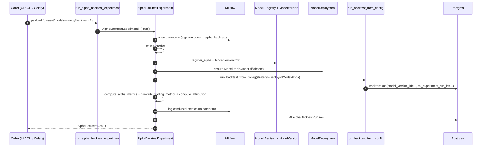

# `AlphaBacktestExperiment`

> The keystone "model used as alpha" experiment — train a model, register
> it, deploy it as `DeployedModelAlpha`, run a backtest, and persist
> combined ML + trading metrics under one MLflow parent run.

## When to use

Use `AlphaBacktestExperiment` whenever you want to answer the question
*"how does this model perform when its predictions actually drive
trades?"*. The standard `Experiment` family computes IC / RMSE / MAE in
isolation; `AlphaBacktestExperiment` adds Sharpe / Sortino / hit-rate
and links them back to the trained `ModelVersion` so the Strategy
Browser, MLflow UI, and Postgres catalog all converge.

## Shape

| Concept | Class / table |
| --- | --- |
| Orchestrator | [`aqp.ml.alpha_backtest_experiment::AlphaBacktestExperiment`](../aqp/ml/alpha_backtest_experiment.py) |
| Combined metrics | [`aqp.ml.alpha_metrics`](../aqp/ml/alpha_metrics.py) |
| Combined run row | `MLAlphaBacktestRun` (Alembic 0025) |
| Per-bar audit (opt-in) | `MLPredictionAudit` (Alembic 0025) |
| Celery task | `aqp.tasks.ml_tasks.run_alpha_backtest_experiment` (queue `ml`) |
| REST | `POST /ml/alpha-backtest-runs`, `GET /ml/alpha-backtest-runs[/{id}/predictions]` |

## Workflow



## Metric vocabulary

The combined metrics blob persisted on `MLAlphaBacktestRun.combined_metrics` rolls up:

- ML-side: `ic_spearman`, `ic_pearson`, `icir`, `mae`, `rmse`, `hit_rate`
- Trading-side: `sharpe`, `sortino`, `calmar`, `max_drawdown`, `total_return`, `turnover_adj_sharpe`
- Combined scalar: `score = combined_score(ml_metrics, trading_metrics)` —
  default weighting in [`aqp/ml/alpha_metrics.py`](../aqp/ml/alpha_metrics.py)
  prioritises Sharpe (0.45) but also rewards IC / IR / hit-rate so a
  high-IC model that fails to translate to PnL is penalised.

## Calling from code

```python
from aqp.ml.alpha_backtest_experiment import AlphaBacktestExperiment

experiment = AlphaBacktestExperiment(
    dataset_cfg=dataset_cfg,
    model_cfg=model_cfg,
    strategy_cfg=strategy_cfg,
    backtest_cfg=backtest_cfg,
    run_name="ridge-alpha-backtest",
    train_first=True,
    capture_predictions=True,
)
result = experiment.run()
print(result.combined_metrics)
```

## Calling from REST

```bash
curl -XPOST http://localhost:8000/ml/alpha-backtest-runs \
  -H 'content-type: application/json' \
  -d @configs/ml/alpha_backtest/ridge_alpha_backtest.yaml
```

The response is a `TaskAccepted` envelope; subscribe to
`/chat/stream/{task_id}` for progress events.

## Where this goes wrong

- Forgetting `train_first=False` when re-using an existing
  `deployment_id` will trigger a re-train. Set it explicitly.
- The combined-metric weights are heuristic — customise them per
  strategy by passing `weights={...}` to `combined_score`.
- `MLPredictionAudit` is gated behind
  `AQP_ML_PREDICTION_AUDIT_ENABLED`; default is `false` to keep the
  table small. Enable it for forensic explainability.

## Related

- [`docs/ml-framework.md`](ml-framework.md)
- [`docs/backtest-engines.md`](backtest-engines.md)
- [`docs/ml-testing.md`](ml-testing.md)
