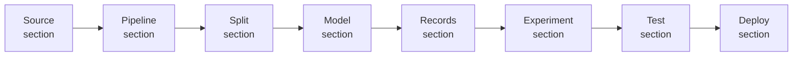

# Graphical ML experiment builder

> The `/ml/builder` page composes datasets, preprocessing, model
> definitions, experiment records, deployments, and quick tests on a
> shared XYFlow canvas. Same plumbing as the Bot Builder.

## Where it lives

- Page: [`webui/app/(shell)/ml/builder/page.tsx`](../webui/app/(shell)/ml/builder/page.tsx)
- Component: [`webui/components/ml/MlExperimentBuilderPage.tsx`](../webui/components/ml/MlExperimentBuilderPage.tsx)
- Palette: [`webui/components/ml/mlExperimentPalette.ts`](../webui/components/ml/mlExperimentPalette.ts)
- Serializer: [`webui/components/ml/mlExperimentSerializer.ts`](../webui/components/ml/mlExperimentSerializer.ts)
- Canvas: [`webui/components/flow/WorkflowEditor.tsx`](../webui/components/flow/WorkflowEditor.tsx)

## Palette layout

Each palette section maps onto a list of node `kind`s defined in
`mlExperimentPalette.ts`.

| Section | Sample kinds |
| --- | --- |
| Source | `Dataset`, `DatasetPreset`, `IcebergSlice`, `FetcherSource`, `PipelineManifestRef`, `FeatureSet` |
| Pipeline | `Preprocessing`, `MLScale`, `MLWinsorize`, `MLLag`, `MLRolling`, `MLDecompose`, `MLPyODOutliers`, `MLImputation` |
| Split | `Split`, `WalkForward`, `PurgedKFold`, `Quarterly`, `ChronologicalRatio` |
| Model | `SklearnModel`, `KerasModel`, `TensorflowModel`, `TorchModel`, `LightGBMModel`, `XGBoostModel`, `ProphetModel`, `SktimeModel`, `PyODModel`, `HuggingFaceModel` |
| Records | `Records`, `SignalRecord` |
| Experiment | `Experiment`, `ForecastExperiment`, `ClassificationExperiment`, `AnomalyExperiment`, `AlphaBacktestExperiment`, `FlowPreview` |
| Test | `SinglePredictTest`, `BatchPredictTest`, `ABCompareTest`, `ScenarioTest` |
| Deploy | `RegisterModelVersion`, `PromoteToProduction`, `CreateModelDeployment` |

## Dispatch

`mlExperimentSerializer.ts::dispatchFromGraph` inspects the canvas and
routes to the right backend endpoint:

- Graph contains an `AlphaBacktestExperiment` node →
  `POST /ml/alpha-backtest-runs`
- Graph contains a `Test*` node →
  `POST /ml/test/{single|batch|compare|scenario}`
- Otherwise → `POST /ml/experiment-runs`

This means a single canvas serializes either an experiment-style run
or an alpha-backtest run depending on what the user dropped on it.

## Interactive Workbench drawer

The toolbar exposes an "Interactive Workbench" button that opens a
right-hand drawer wrapping the
[`/ml/flows`](ml-flows.md) catalog. The form is auto-generated from
`GET /ml/flows` so adding a new flow lights up here automatically.

## Adding a new palette tile

1. Append an entry to the appropriate `PaletteSection` in
   `mlExperimentPalette.ts`.
2. Add an accent color to `ML_EXPERIMENT_ACCENTS`.
3. If the new kind needs special serialization (e.g. it must reach a
   bespoke endpoint), extend `mlExperimentSerializer.ts`'s helper sets
   and `dispatchFromGraph`.
