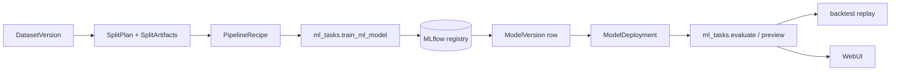

# `aqp.ml` — native qlib-style ML framework

> Doc map: [docs/index.md](index.md) · See [docs/factor-research.md](factor-research.md) for the alphalens-style evaluation pipeline.

`aqp.ml` is a vendored port of [Microsoft Qlib](https://github.com/microsoft/qlib)'s
feature / dataset / model / record abstractions, re-built as pure Python on top
of AQP's own DuckDB-backed data lake. There is **no qlib runtime dependency**
— installing the `ml` / `ml-torch` extras pulls in the underlying libraries
(LightGBM, XGBoost, CatBoost, PyTorch) only.

## Layers

```
┌────────────────────────────────────────────────┐
│ Model (aqp.ml.base.Model / ModelFT)            │
│   ├─ tree: LGBModel, XGBModel, CatBoostModel   │
│   ├─ linear: LinearModel (OLS/Ridge/Lasso/NNLS)│
│   ├─ ensemble: DEnsembleModel                  │
│   ├─ torch: DNN, LSTM, GRU, ALSTM, Transformer,│
│   │         TCN, TabNet, Localformer,          │
│   │         GeneralPTNN, Seq2Seq family        │
│   └─ stubs: GATs, HIST, TRA, ADD, ADARNN, …    │
├────────────────────────────────────────────────┤
│ DatasetH / TSDatasetH → prepare(segments)      │
├────────────────────────────────────────────────┤
│ DataHandler / DataHandlerLP                    │
│   ├─ DK_R raw | DK_I infer | DK_L learn views  │
│   └─ shared / infer / learn processors         │
├────────────────────────────────────────────────┤
│ DataLoader → AQPDataLoader (DuckDB + DSL)      │
└────────────────────────────────────────────────┘
```

## Quick start

```python
from aqp.ml.features.alpha158 import Alpha158
from aqp.ml.dataset import DatasetH
from aqp.ml.models.tree import LGBModel

handler = Alpha158(
    instruments=["SPY", "AAPL", "MSFT"],
    start_time="2018-01-01",
    end_time="2024-12-31",
    fit_start_time="2018-01-01",
    fit_end_time="2022-12-31",
)
dataset = DatasetH(
    handler=handler,
    segments={
        "train": ("2018-01-01", "2022-12-31"),
        "valid": ("2023-01-01", "2023-12-31"),
        "test":  ("2024-01-01", "2024-12-31"),
    },
)
model = LGBModel(num_leaves=63, learning_rate=0.05, n_estimators=500)
model.fit(dataset)
predictions = model.predict(dataset, segment="test")
```

Launch the same pipeline as a Celery task:

```python
from aqp.tasks.ml_tasks import train_ml_model

async_result = train_ml_model.delay(
    dataset_cfg={"class": "DatasetH", "module_path": "aqp.ml.dataset", "kwargs": {...}},
    model_cfg={"class": "LGBModel", "module_path": "aqp.ml.models.tree", "kwargs": {...}},
    run_name="alpha158-lgbm",
    strategy_id="<optional-strategy-uuid>",
)
```

## Feature factories

- **Alpha158** (`aqp.ml.features.alpha158.Alpha158DL`) ships the 9 k-bar +
  price/volume lookbacks + ~30 rolling families from the original qlib paper.
  Every feature is expressed via the DSL operators in
  `aqp.data.expressions` so adding a new family is one line of code.
- **Alpha360** (`aqp.ml.features.alpha360.Alpha360DL`) emits a 60-step OHLCV
  panel normalised by the latest close (or latest volume). Feed it into a
  `TSDatasetH` and pair with one of the sequence models.

Both handlers default to `Ref($close, -2) / Ref($close, -1) - 1` as the label,
matching qlib's standard 2-day forward-return target.

## Expression DSL

`aqp.data.expressions` now exposes ~50 operators grouped into four families:

- **Unary**: `Ref`, `Delta`, `Abs`, `Sign`, `Log`, `Power`, `Rank`
- **Rolling**: `Mean`, `Std`, `Var`, `Skew`, `Kurt`, `Sum`, `Min`, `Max`,
  `Med`, `Mad`, `Quantile`, `Count`, `IdxMax`, `IdxMin`, `EMA`, `WMA`,
  `Slope`, `Rsquare`, `Resi`
- **Pairwise**: `Corr`, `Cov`
- **Comparison / logical / conditional**: `Greater`, `Less`, `Gt`, `Ge`,
  `Lt`, `Le`, `Eq`, `Ne`, `And`, `Or`, `Not`, `Mask`, `If`

Example: construct a 20-bar z-scored OBV like factor::

    "($close - Mean($close, 20)) / (Std($close, 20) + 1e-12)"

## Recorders

`aqp.ml.recorder` ports `SignalRecord` / `SigAnaRecord` / `PortAnaRecord`:

- `SignalRecord.generate()` calls `model.predict(dataset)`, serialises
  `pred.pkl` + `label.pkl`, and logs them as MLflow artifacts.
- `SigAnaRecord.generate(signal_record=...)` runs
  `aqp.data.factors.evaluate_factor` to compute IC / Rank IC / quantile
  returns and pushes them into the active MLflow run.
- `PortAnaRecord.generate(signal_record=...)` turns the prediction panel
  into a top-K long / bottom-K short portfolio and reports Sharpe /
  Sortino / max-drawdown + qlib-style `risk_analysis` summary.

The `train_ml_model` Celery task auto-runs `SignalRecord` + any records
listed in the YAML so one `POST /ml/train` gives you predictions, factor
analysis, and a portfolio tearsheet in a single MLflow run.

## Model zoo (Tier A — shipping)

| Family           | Class                                                                   | Notes                                   |
|------------------|-------------------------------------------------------------------------|-----------------------------------------|
| Tree             | `LGBModel`, `XGBModel`, `CatBoostModel`, `DEnsembleModel`               | `ml` extra                              |
| Linear           | `LinearModel(estimator="ridge"|"lasso"|"ols"|"nnls")`                   | `ml` extra                              |
| Dense            | `DNNModel(layers=[256, 64], dropout=0.2)`                               | `ml-torch` extra                        |
| Sequence         | `LSTMModel`, `GRUModel`, `ALSTMModel` (attention head)                  | TS; `step_len=20`                       |
| Attention        | `TransformerModel`, `LocalformerModel` (local-window mask)              | TS                                      |
| Convolutional    | `TCNModel`                                                              | TS                                      |
| Tabular          | `TabNetModel`                                                           | requires `pytorch-tabnet`               |
| Generic          | `GeneralPTNN(model_class=..., model_module=...)`                        | bring-your-own `nn.Module`              |
| Seq2Seq          | `LSTMSeq2Seq`, `GRUSeq2Seq`, `LSTMSeq2SeqVAE`, `DilatedCNNSeq2Seq`, `TransformerForecaster` | ported from Stock-Prediction-Models |

## Model zoo (Tier B — scaffolded stubs)

These classes register into `aqp.core.registry` so the Strategy Browser
enumerates them, but `fit()` raises `NotImplementedError` with a pointer to
the canonical qlib implementation. Port them incrementally:

`GATsModel`, `HISTModel`, `TRAModel`, `ADDModel`, `ADARNNModel`,
`TCTSModel`, `SFMModel`, `SandwichModel`, `KRNNModel`, `IGMTFModel`.

## Persistence + MLflow wiring

Every `train_ml_model` run writes a `ModelVersion` row and (when
`register_alpha=True`) registers the pickled model in the MLflow Model
Registry. If you pass `strategy_id`, the run is filed under the
`strategy/<id[:8]>` MLflow experiment so the Strategy Browser can link
straight to it.

## Planning-first workflow (split / pipeline / experiment / deployment)

The ML stack now supports a planning layer so datasets, splits, and
preprocessing can be reused deterministically across runs.

1. Create a split plan (fixed / purged-kfold / walk-forward):

```bash
curl -X POST http://localhost:8000/ml/split-plans \
  -H "Content-Type: application/json" \
  -d '{
    "name": "alpha158-fixed-2019-2024",
    "method": "fixed",
    "vt_symbols": ["SPY.NASDAQ", "AAPL.NASDAQ", "MSFT.NASDAQ"],
    "start": "2019-01-01",
    "end": "2024-12-31",
    "config": {
      "segments": {
        "train": ["2019-01-01", "2022-12-31"],
        "valid": ["2023-01-01", "2023-12-31"],
        "test": ["2024-01-01", "2024-12-31"]
      }
    }
  }'
```

2. Save a pipeline recipe (`shared` / `infer` / `learn` processors):

```bash
curl -X POST http://localhost:8000/ml/pipelines \
  -H "Content-Type: application/json" \
  -d '{
    "name": "alpha158-default",
    "infer_processors": [{"class":"Fillna","module_path":"aqp.ml.processors","kwargs":{"fields_group":"feature","fill_value":0.0}}],
    "learn_processors": [{"class":"DropnaLabel","module_path":"aqp.ml.processors","kwargs":{"fields_group":"label"}}]
  }'
```

3. Create an experiment plan tying together dataset/split/pipeline/model
   config, then launch training with `experiment_plan_id`:

```bash
curl -X POST http://localhost:8000/ml/train \
  -H "Content-Type: application/json" \
  -d '{
    "run_name": "alpha158-lgb-plan",
    "experiment_plan_id": "<experiment-plan-id>",
    "register_alpha": true
  }'
```

4. Deploy a tested `ModelVersion` as a strategy alpha profile:

```bash
curl -X POST http://localhost:8000/ml/deployments \
  -H "Content-Type: application/json" \
  -d '{
    "name": "lgb-alpha-prod",
    "model_version_id": "<model-version-id>",
    "infer_segment": "infer",
    "long_threshold": 0.001,
    "short_threshold": -0.001
  }'
```

Then consume it in strategy YAML via:

```yaml
alpha_model:
  class: DeployedModelAlpha
  module_path: aqp.strategies.ml_alphas
  kwargs:
    deployment_id: "<deployment-id>"
```

## Train -> register -> deploy -> score



