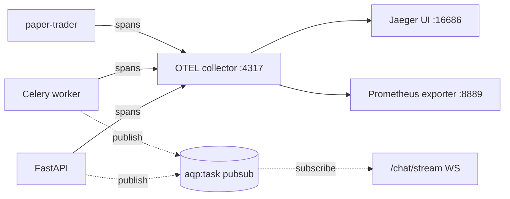

# Observability

> Doc map: [docs/index.md](index.md) · Progress bus reference: [docs/flows.md#cross-cutting-progress-bus](flows.md#cross-cutting-progress-bus).

AQP ships with opt-in OpenTelemetry tracing covering the full request
path: FastAPI → Celery → paper session → broker SDK → Postgres →
Redis. Install the `otel` extra to enable it::

    pip install -e ".[otel]"

## Quick start (Docker)

`docker compose up -d` starts an OpenTelemetry Collector and Jaeger
sidecar alongside the AQP services. Each service is pre-wired with
`AQP_OTEL_ENDPOINT=http://otel-collector:4317`.

Open [http://localhost:16686](http://localhost:16686) and pick a
service:

- `aqp-api` — FastAPI request handlers + Dash mount
- `aqp-worker` — Celery tasks (backtest, paper, ingestion)
- `aqp-paper-trader` — paper session loop

## Configuration

All knobs live in `aqp.config.Settings` / `.env`:

| Variable | Default | Purpose |
|---|---|---|
| `AQP_OTEL_ENDPOINT` | *empty* | OTLP endpoint. Empty → tracing disabled (safe dev default). |
| `AQP_OTEL_SERVICE_NAME` | `aqp` | Base service name. Suffixes `-api`, `-worker`, `-paper` added automatically. |
| `AQP_OTEL_SAMPLE_RATIO` | `1.0` | Parent-based head sampler ratio. `0.1` = 10% of traces. |
| `AQP_OTEL_PROTOCOL` | `grpc` | `grpc` (port 4317) or `http/protobuf` (port 4318). |

## Instrumentation map

Auto-instrumented on startup (see `aqp/observability/tracing.py`):

- `FastAPIInstrumentor` — every route becomes a span
- `CeleryInstrumentor` — every task becomes a span
- `SQLAlchemyInstrumentor` — every query becomes a span (attached in `aqp/persistence/db.py` when `AQP_OTEL_ENDPOINT` is set)
- `HTTPXClientInstrumentor` — every HTTPX call (broker REST, UI API client)
- `RedisInstrumentor` — every Redis command (pub/sub, kill-switch, Celery broker)

Manual spans are added via the `@traced` decorator
(`aqp/observability/decorators.py`):

```python
from aqp.observability import traced

@traced("paper.session.run")
async def run(self) -> PaperSessionResult:
    ...
```

Works transparently on sync and `async` callables; when `otel` isn't
installed the tracer is a no-op so the decorator has zero overhead.

## Custom exporters

The default is OTLP/gRPC. To use OTLP/HTTP instead:

```bash
AQP_OTEL_PROTOCOL=http/protobuf
AQP_OTEL_ENDPOINT=http://otel-collector:4318/v1/traces
```

For local development with just the console, install the OTel SDK and
point at a local Jaeger all-in-one:

```bash
docker run --rm -p 4317:4317 -p 16686:16686 jaegertracing/all-in-one:1.55
export AQP_OTEL_ENDPOINT=http://localhost:4317
```

## Kubernetes

Both the API/Worker image and the `paper` image have the OTel SDK
installed. The Kustomize manifests set `AQP_OTEL_ENDPOINT` to the
in-cluster collector service; port-forward Jaeger with:

```bash
kubectl -n aqp-dev port-forward svc/jaeger 16686:16686
```

## Troubleshooting

**Spans never show up in Jaeger.**
- Verify `AQP_OTEL_ENDPOINT` is set in the container: `docker compose exec api env | grep OTEL`.
- Check the collector logs for parsing errors: `docker compose logs otel-collector`.
- Drop the sample ratio to `1.0` while debugging.

**`ImportError: opentelemetry-exporter-otlp-proto-grpc` at startup.**
- You set `AQP_OTEL_ENDPOINT` but didn't install the `otel` extra. The tracer logs a warning and continues as a no-op, but to silence it run `pip install -e ".[otel]"`.

**Tests emit real spans.**
- They shouldn't — `tests/conftest.py` installs an `autouse` fixture that resets `AQP_OTEL_ENDPOINT=""` before each test. If you see real spans, check that the fixture is still in place.

## Metrics (optional)

The OTel Collector config in `deploy/otel/otel-collector-config.yaml`
also exports metrics on port 8889 via the Prometheus exporter, so you
can point a Prometheus scraper at the collector for JVM-style
service-level dashboards. The AQP code doesn't emit custom metrics
yet — PRs welcome.

## Tracing topology



