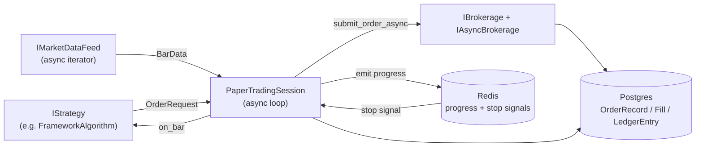

# Paper & live trading

> Doc map: [docs/index.md](index.md) · Session state machine: [docs/flows.md#4-paper-trading-session](flows.md#4-paper-trading-session).

AQP's paper trading engine is a Lean-inspired async runtime that shares
100% of its strategy code with the backtester. Orders from the same
`IStrategy` object flow through the **same ledger tables** regardless of
whether the session is a backtest, a paper replay, or a live session.

## Architecture



## Lifecycle

1. `aqp paper run --config <file>` (or `POST /paper/start`) builds a
   `PaperTradingSession` via
   [`aqp/trading/runner.py`](../aqp/trading/runner.py).
2. `_connect` subscribes the feed to the strategy's universe.
3. For each bar (up to `max_bars` or forever):
   - Check the kill switch (`POST /portfolio/kill_switch`).
   - Append to an in-memory history window.
   - Call `strategy.on_bar(bar, context)` — identical to the backtest.
   - For each returned `OrderRequest`:
     - Run the pre-trade risk check (`RiskManager.check_pretrade`).
     - Submit via `brokerage.submit_order_async` (or the sync bridge).
     - Persist the `OrderRecord` and ledger entry.
   - Drain order updates (simulated path) and emit fills.
4. Every `state_flush_every_bars` bars, a snapshot of the session state
   is flushed to the `paper_trading_runs.state` JSONB column.
5. On shutdown (kill switch, stop signal, `max_bars`, or feed EOF), the
   engine drains, writes the final row, and emits `done` to the progress
   bus.

## Broker adapters

Each adapter lives in `aqp/trading/brokerages/` and implements **both**
`IBrokerage` (sync, for backtest parity) and `IAsyncBrokerage`.

### Alpaca (`[alpaca]` extra)

```yaml
brokerage:
  class: AlpacaBrokerage
  kwargs: {paper: true}    # flip to false for live
```

Requires `AQP_ALPACA_API_KEY` and `AQP_ALPACA_SECRET_KEY`. The adapter
maintains a background `TradingStream` that re-emits order updates
through the session's `_order_event_queue`.

### Interactive Brokers (`[ibkr]` extra)

```yaml
brokerage:
  class: InteractiveBrokersBrokerage
  kwargs: {exchange: SMART, currency: USD}
```

Requires a running TWS or IB Gateway. Defaults:
`AQP_IBKR_HOST=127.0.0.1`, `AQP_IBKR_PORT=7497` (paper),
`AQP_IBKR_CLIENT_ID=1`. The feed uses `client_id + 100` so it doesn't
collide with the trading client.

### Tradier (generic REST template)

```yaml
brokerage:
  class: TradierBrokerage
```

Requires `AQP_TRADIER_TOKEN` and `AQP_TRADIER_ACCOUNT_ID`. Demonstrates
how to subclass [`RestBrokerage`](../aqp/trading/brokerages/rest.py) —
five small overrides give you a full paper/live venue:
`_order_payload`, `_parse_order(s)`, `_parse_positions`, `_parse_account`,
`_order_detail_path/_orders_path/_positions_path/_account_path`.

## Credential flow

`aqp.config.Settings` reads every broker secret from the `AQP_*`
environment (via `.env`). Adapters pick those up automatically at
construction time, so YAML recipes rarely need to inline secrets.

Order of precedence:

1. Explicit `kwargs` in the YAML recipe (highest)
2. Explicit `kwargs=` passed to `build_from_config`
3. `AQP_*` environment variables
4. Package defaults (sandbox URLs, paper=True, etc.)

## Kill-switch integration

The paper session wraps every iteration in a check against
[`aqp.risk.kill_switch.is_engaged`](../aqp/risk/kill_switch.py). Toggling
the switch via `POST /portfolio/kill_switch` (or the UI's Portfolio
page) causes the session to:

1. Stop accepting new bars from the feed.
2. Cancel every open order via `brokerage.cancel_order_async`.
3. Flush final state + close brokerage/feed connections.
4. Emit `done` to the task progress channel.

Set `session.stop_on_kill_switch: false` in the recipe to disable this
behaviour (not recommended).

## Remote / Kubernetes runs

The `paper-trader` Docker image (`--target paper`) runs `aqp paper run`
as a single-replica k8s `Deployment`. See
[`deploy/k8s/base/paper-trader.yaml`](../deploy/k8s/base/paper-trader.yaml).

To run on a remote host over SSH:

```bash
AQP_ALPACA_API_KEY=... AQP_ALPACA_SECRET_KEY=... \
  aqp paper run --config configs/paper/alpaca_mean_rev.yaml --celery
```

The `--celery` flag enqueues the job onto the shared worker pool; the
shell can exit and the session keeps running. Use `aqp paper stop
<task_id>` to drain it gracefully from anywhere.

## Observability hooks

All broker calls and the main session loop are instrumented with
OpenTelemetry spans (see [observability.md](observability.md)):

| Span name | Emitted by |
|---|---|
| `paper.session.run` | `PaperTradingSession.run` |
| `paper.session.bar` | Each bar processed |
| `paper.session.submit_order` | Order submission gate |
| `broker.submit_order` | Every concrete broker adapter |
| `broker.cancel_order` | Every concrete broker adapter |
| `broker.query_positions` | Every concrete broker adapter |
| `broker.query_account` | Every concrete broker adapter |

Each span carries a `broker.venue` attribute (`alpaca`, `ibkr`,
`tradier`, or `sim`).
