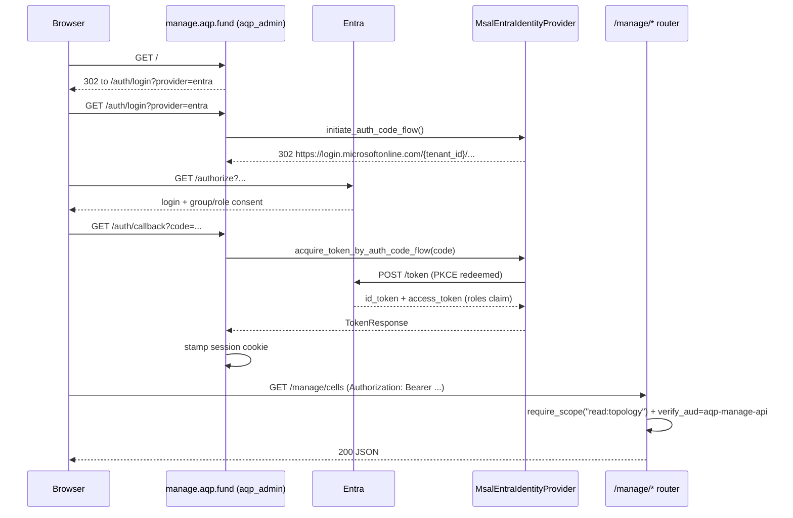

# Entra ID internal-tenant rollout — full-depth plan

**Status**: draft (Workstream A in progress as of this commit)
**Owner**: AQP Identity & Access (`@aqp/identity-platform` Entra group)
**Track**: AGENTS rule 27 (identity), rule 42 (TerraformRuntime),
rule 44 (EntraTenantLink approval flow)
**Related code**:
- `aqp_platform/terraform/modules/aqp_entra_directory/`
- `aqp_platform/terraform/modules/aqp_ui_identity/`
- `aqp/auth/providers/msal_entra.py`
- `aqp/persistence/models_terraform.py::EntraTenantLink`
- `aqp/auth/user.py::_apply_entra_tenant_link`

## TL;DR

We bring Microsoft Entra ID under Terraform control as the **first user
pool** for the managed AQP platform. Three apps (staff login, manage
API, CI federation), seven directory groups, app roles, federated
credentials for GitHub Actions, and named-location / CA-policy data
sources land in code. Apply path: `terraform plan` locally, `aqp
deploy` in CI through `TerraformRuntime` so every change writes a
`terraform_runs` audit row. AQP staff tokens issued by the internal
tenant get priority routing through the existing
`MSALEntraIdentityProvider`; Auth0 stays as the B2C / customer
fallback.

This is a Phase-1 rollout for the internal AQP staff tenant only.
Customer-tenant onboarding stays with the existing `EntraTenantLink`
B2B approval flow (rule 44) and is NOT in scope here.

---

## 1. Objectives + non-objectives

### 1.1 In scope

1. **Terraform-controlled internal tenant**. Every Entra resource that
   AQP staff need is declared in `aqp_platform/terraform/modules/
   aqp_entra_directory/`. No clickops in the Azure Portal.
2. **Three apps**: staff login (`aqp-staff`), manage API resource
   server (`aqp-manage-api`), CI federation (`aqp-ci-github`).
3. **Seven directory groups** mapping to seven app roles on the manage
   API (Admin, Operator, Auditor, Compliance, Finance, Engineer, Viewer).
4. **Federated credentials** so GitHub Actions can authenticate to
   Entra without a stored client secret.
5. **Named locations + CA policy references**. Named locations are
   Terraform-managed; conditional access policies are read by data
   source only (CA policies require manual P2 authoring).
6. **First user pool**: AQP staff login flow through MSAL-Entra at
   `manage.aqp.fund` with priority over Auth0; pre-link the internal
   tenant in `entra_tenant_links` with `meta.kind='internal'`.
7. **Helper scripts** for plan-preview, apply-via-runtime, link
   seeding, secret rotation, login verification, and role audit.
8. **CI workflow** that runs plan-on-PR, apply-on-main through
   TerraformRuntime so every change lands a `terraform_runs` row.
9. **Documentation**: 1 concept page, 3 how-to runbooks, 1 ADR.

### 1.2 Out of scope (deliberately)

- Customer-tenant Entra integration. Customers' tenants land via the
  existing `EntraTenantLink` B2B wizard (rule 44) — this rollout is
  staff-only.
- Conditional Access policy authoring. CA policies require P2 licensing
  and manual review by Security; we read them as data sources but do
  NOT mutate them from Terraform.
- Auth0 retirement. Auth0 remains as the B2C fallback for customer
  user pools and the documented degraded-mode entry path.
- ADFS / hybrid join. Out of scope; AQP is cloud-native, Entra-only.

### 1.3 Success criteria

| Criterion | How verified |
| --- | --- |
| AQP staff can log in to `manage.aqp.fund` via Entra | Manual smoke test + `scripts/identity/verify_entra_login.py` round-trip |
| Group membership maps to app roles | `scripts/identity/list_entra_app_role_assignments.py` confirms mapping |
| Every Entra mutation lands a `terraform_runs` row | Audit query: `SELECT COUNT(*) FROM terraform_runs WHERE stack_slug='aqp_entra_directory'` |
| GitHub Actions plan/apply works without stored secrets | `entra-terraform.yml` workflow run shows OIDC token mint |
| The `entra_tenant_links` row for the AQP tenant exists with `kind=internal` | `scripts/identity/seed_entra_internal_tenant.py --dry-run` reports `existing` |

---

## 2. Architecture

### 2.1 Resource graph

```mermaid
graph LR
    subgraph "Entra tenant: wiley-tech.onmicrosoft.com"
        APP_STAFF[aqp-staff app]
        APP_API[aqp-manage-api app]
        APP_CI[aqp-ci-github app]
        SP_STAFF[SP: aqp-staff]
        SP_API[SP: aqp-manage-api]
        SP_CI[SP: aqp-ci-github]
        ROLE_ADMIN[role: Admin]
        ROLE_OP[role: Operator]
        ROLE_AUD[role: Auditor]
        ROLE_COMP[role: Compliance]
        ROLE_FIN[role: Finance]
        ROLE_ENG[role: Engineer]
        ROLE_VIEW[role: Viewer]
        GRP_ADM[group: AQP-Admins]
        GRP_OPS[group: AQP-Operations]
        GRP_AUD[group: AQP-Auditors]
        GRP_COMP[group: AQP-Compliance]
        GRP_FIN[group: AQP-Finance]
        GRP_ENG[group: AQP-Engineering]
        GRP_SOC[group: AQP-SOC]
        FED_PR[fed_cred: PR]
        FED_MAIN[fed_cred: main]
        FED_PROD[fed_cred: prod env]
        NL_OFFICE[named_location: Corp office IPs]
    end

    APP_STAFF -- service_principal --> SP_STAFF
    APP_API -- service_principal --> SP_API
    APP_CI -- service_principal --> SP_CI
    APP_API -- defines --> ROLE_ADMIN
    APP_API -- defines --> ROLE_OP
    APP_API -- defines --> ROLE_AUD
    APP_API -- defines --> ROLE_COMP
    APP_API -- defines --> ROLE_FIN
    APP_API -- defines --> ROLE_ENG
    APP_API -- defines --> ROLE_VIEW

    GRP_ADM -- assigned --> ROLE_ADMIN
    GRP_OPS -- assigned --> ROLE_OP
    GRP_AUD -- assigned --> ROLE_AUD
    GRP_COMP -- assigned --> ROLE_COMP
    GRP_FIN -- assigned --> ROLE_FIN
    GRP_ENG -- assigned --> ROLE_ENG
    GRP_SOC -- assigned --> ROLE_OP
    GRP_SOC -- assigned --> ROLE_AUD

    APP_CI -- has --> FED_PR
    APP_CI -- has --> FED_MAIN
    APP_CI -- has --> FED_PROD

    APP_STAFF -- pre_authorized --> APP_API
```



### 2.2 Token flow



### 2.3 Identity-pool priority

For tokens hitting `manage.aqp.fund`:

1. **MSAL-Entra (priority 100)** — verifies the JWT issuer matches
   `https://login.microsoftonline.com/{internal_tenant_id}/v2.0`. If
   yes, validates the access token via JWKS, looks up the user, maps
   the `roles` claim to AQP scopes.
2. **Auth0 (priority 200)** — if MSAL declines (issuer mismatch),
   falls back to the Auth0 verifier. Customers + B2C users land here.
3. **Local provider (priority 1000)** — dev fallback only.

The numerical priorities are exposed as `auth_msal_priority` /
`auth_auth0_priority` settings; lower = earlier in the chain.

---

## 3. Phases

### 3.1 Phase 0 — Prerequisites (Week 0)

| Task | Owner | Output |
| --- | --- | --- |
| Confirm `wiley-tech.onmicrosoft.com` tenant id | Identity team | `AQP_ENTRA_INTERNAL_TENANT_ID` env var seeded in Vault |
| Provision a global-admin service account | Identity team | `terraform-bootstrap@wiley-tech.onmicrosoft.com` with Application.ReadWrite.All + Group.ReadWrite.All + RoleManagement.ReadWrite.Directory |
| Provision OIDC issuer trust for GitHub Actions | DevOps | `https://token.actions.githubusercontent.com` registered in tenant federation |
| Create empty `aqp_entra_directory` Terraform state file | DevOps | S3 / TF Cloud workspace for the new module |

### 3.2 Phase 1 — Module land + plan-only validation (Week 1)

1. Pin `hashicorp/azuread` provider in `aqp_platform/terraform/versions.tf`.
2. Author `aqp_platform/terraform/modules/aqp_entra_directory/`
   (versions, variables, main, outputs, README, terraform.tfvars.example).
3. Wire module call into `aqp_platform/terraform/environments/wiley-tech/main.tf`.
4. Run `scripts/identity/entra_terraform_plan.sh` locally; eyeball
   plan-output line-by-line.
5. Open PR; CI runs `entra-terraform.yml` plan-only against the dev
   Entra tenant.

**Exit criteria**: PR plan looks correct, no resource drift, no
secrets in plan output.

### 3.3 Phase 2 — Apply + smoke test (Week 2)

1. Merge PR.
2. CI runs `aqp deploy` against the `wiley-tech` Terraform target;
   `TerraformRuntime` logs the run to `terraform_runs`.
3. Run `scripts/identity/seed_entra_internal_tenant.py --apply` to
   upsert the `entra_tenant_links` row.
4. Run `scripts/identity/verify_entra_login.py` to round-trip a real
   login.
5. Run `scripts/identity/list_entra_app_role_assignments.py` to
   verify group→role mapping.

**Exit criteria**: AQP super-admin successfully logs in via Entra.

### 3.4 Phase 3 — Provider chain priority + cutover (Week 3)

1. Land settings additions: `auth_msal_internal_tenant_id`,
   `auth_msal_priority`, etc.
2. Update `aqp/auth/providers/__init__.py` so the resolver routes
   internal-tenant tokens to MSAL first.
3. Flip `manage.aqp.fund` to prefer `provider=entra` in the login
   chooser (Auth0 stays as a "Sign in with another method" link).
4. Run a 24-hour bake: monitor `auth_login_total{provider="entra"}`
   and `auth_login_failure_total` Prometheus counters.

**Exit criteria**: ≥95% of staff logins go through Entra; no
regressions in Auth0 fallback path.

### 3.5 Phase 4 — Group + role onboarding (Week 4)

1. Manually populate the seven directory groups from existing AQP
   staff lists. (Out of Terraform; group membership is managed in the
   Azure Portal or via PIM.)
2. Run `scripts/identity/list_entra_app_role_assignments.py --org-chart`
   to produce a CSV deliverable for HR + Security.
3. Open a PR adjusting `var.app_role_definitions` if any role
   permissions need tweaking based on real-world feedback.

**Exit criteria**: Every active staff member maps to at least one role
with the principle of least privilege.

### 3.6 Phase 5 — CI cutover + secret retirement (Week 5)

1. Move all GitHub Actions workflows that authenticate to Entra (e.g.
   to read the manage API for deploy gates) to the new federated
   credential — no more `AZURE_CLIENT_SECRET` in repo secrets.
2. Rotate any stale Entra app secrets out of Vault.
3. Document the new flow in
   `aqp_docs/docs/how-to/entra-rotate-secrets.md`.

**Exit criteria**: `gh secret list` shows no `AZURE_*_SECRET` entries;
`scripts/secrets/scan_for_static_creds.py` (existing) is clean.

---

## 4. Risks + mitigations

| Risk | Severity | Mitigation |
| --- | --- | --- |
| Tenant lockout (every admin's account gets MFA-locked) | Critical | Maintain TWO break-glass accounts excluded from CA policies; document in `entra-rotate-secrets.md`. Both stored in physical safe + redundant FIDO2 keys. |
| Group→role mapping mistake grants over-privileged access | High | Plan output is reviewed line-by-line on every PR. `audit_log_export_tasks` writes every role-assignment change to the audit lake; daily Prometheus alert on `entra_role_assignment_changes_total > N`. |
| Federated credential subject claim too broad | High | Per-environment / per-branch federated credentials, NEVER the catch-all `repo:*:ref:refs/heads/*` form. PR template requires explicit subject path. |
| Customer-tenant tokens accidentally routed to MSAL-internal | Medium | Issuer check on every MSAL provider invocation; mismatch falls through to Auth0. Unit test: `tests/auth/test_msal_internal_tenant_isolation.py`. |
| CA policy data source returns stale ids | Low | Data source re-reads on every `terraform plan`; if a CA policy is renamed, plan flags drift. |
| MSAL flow store memory leak across multiple workers | Low | Existing `_FlowStore` has TTL; plus `aqp.auth.session` backend is the durable store. |

---

## 5. Rollback procedures

### 5.1 Hot rollback (provider chain change misbehaves)

```bash
# Within 5 minutes of the bad change.
kubectl set env -n aqp deploy/aqp-admin AQP_AUTH_MSAL_PRIORITY=9999
kubectl rollout status -n aqp deploy/aqp-admin
# This pushes MSAL to last-priority; Auth0 takes over again.
```

### 5.2 Cold rollback (Terraform-managed Entra resources broken)

```bash
# Revert the bad commit; CI re-applies the previous good state.
git revert <bad-commit>
git push
# Ensure the revert PR's plan shows the inverse of the bad apply,
# then merge.
```

If the revert can't undo the change (e.g. group deletion), restore
from the daily Entra config export (Workstream G in this rollout).

### 5.3 Catastrophic rollback (full tenant compromise)

1. Use a break-glass account to suspend the compromised app
   registrations via the Azure Portal.
2. Run `scripts/identity/seed_entra_internal_tenant.py --revoke` to
   set the `EntraTenantLink.status` to `revoked`.
3. Force a Terraform state import of the manually-disabled apps so
   subsequent applies don't try to re-enable.
4. File a security incident; freeze all Terraform applies until the
   compromise is contained.

---

## 6. SLO + security commitments

### 6.1 Availability

| Metric | Target |
| --- | --- |
| Entra IdP login success rate | ≥99.5% (rolling 28 days) |
| Token introspection latency p99 | ≤500 ms |
| Terraform plan time (full module) | ≤90 s |
| Terraform apply time (full module) | ≤180 s |

### 6.2 Security commitments

1. **No app secrets stored**. Every CI integration uses federated
   credentials. The two staff-app secrets (used as a degraded fallback
   for the bootstrap window) are stored in Vault Transit and rotated
   every 90 days.
2. **Group changes are audited**. Every `app_role_assignment` change
   lands in the audit lake (Phase 7 §10.1) with the actor's identity.
3. **Plan-only on PR**. The CI pipeline NEVER applies on PR; only
   `push` to `main` after merge triggers an apply, which routes
   through `TerraformRuntime`.
4. **Break-glass excluded**. Two accounts are documented, MFA-only
   (FIDO2 hardware), excluded from time-based CA policies, and used
   ONLY in declared incidents.

---

## 7. Open questions + future work

- **PIM integration**. We don't yet wire Privileged Identity
  Management for just-in-time elevation of the `Admin` role. Phase 6
  (out of this rollout) brings PIM under Terraform via the
  `azurerm_role_management_policy` resource family.
- **B2B guest auto-provisioning**. Internal-tenant scope only here;
  customer-side B2B continues to flow through the existing
  `EntraTenantLink` wizard.
- **Tenant restrictions v2**. Outbound TR v2 (preventing AQP staff
  from authenticating to *other* tenants from corp devices) is
  network-team scope, not in this rollout.
- **Continuous Access Evaluation**. CAE is on by default for Entra
  apps; no Terraform configuration is needed but document in the
  concepts page.

---

## 8. References

- Microsoft Entra ID terminology: <https://learn.microsoft.com/entra/identity/>
- `hashicorp/azuread` provider docs: <https://registry.terraform.io/providers/hashicorp/azuread/latest/docs>
- AGENTS.md hard rule 27 — identity flows go through `IdentityProvider`.
- AGENTS.md hard rule 42 — TerraformRuntime is the only sanctioned apply path.
- AGENTS.md hard rule 44 — `EntraTenantLink` approval flow.
- ADR-011 — `aqp_docs/docs/architecture/decisions/011-entra-as-first-pool.md` (this PR).
- Phase 4 §7 (RESTRUCTURING_PLAN.md) — service mesh + workload identity (already shipped).
- Phase 5 §8 (RESTRUCTURING_PLAN.md) — per-tenant MCP + sandbox (already shipped).
