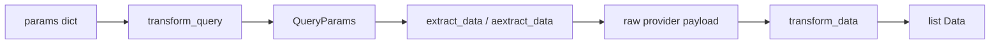

# Providers: Fetcher / QueryParams / Data

AQP's provider layer ports OpenBB's ``Fetcher[Q, R]`` + ``QueryParams`` + ``Data``
triad ([original](https://github.com/OpenBB-finance/OpenBB/tree/develop/openbb_platform/core/openbb_core/provider/abstract))
plus a catalog registry keyed by domain path.

The pattern complements, rather than replaces, the existing
[`aqp.data.sources.DataSourceAdapter`](../aqp/data/sources/base.py) contract:

| Pattern | Best for |
|---|---|
| `DataSourceAdapter` (bulk) | Batch ingest → materialize Parquet → emit `DataLink` lineage rows. Used by FRED / SEC EDGAR / GDelt. |
| `Fetcher` (typed spot) | UI and agent queries — "fetch AAPL's latest balance sheet", "list upcoming earnings in XLF". |

Both surfaces share the same `data_sources` registry: a fetcher declares its
`vendor_key` which maps 1:1 to a `data_sources.name` row for credential +
rate-limit metadata.

## Concepts



- **`QueryParams`** — typed input. Pydantic `BaseModel` with `extra="allow"`, optional `__alias_dict__` mapping Python names to provider-native wire names.
- **`Data`** — typed output. Pydantic `BaseModel` with `extra="allow"`, camelCase validation aliases, snake_case serialization aliases.
- **`Fetcher[Q, R]`** — lifecycle: `transform_query(params: dict) → Q` then `extract_data(Q, credentials) → Any` then `transform_data(Q, Any) → R`. Implement the async variant (`aextract_data`) for providers that need to await I/O; the sync path is wired automatically.
- **`AnnotatedResult[R]`** — wraps `result` with a `metadata` dict (`next_page_token`, `rate_limit_remaining`, `retrieved_at`…).

## Authoring a new standard_model

Every research data shape ports from OpenBB's `standard_models/`. Pick a home
in `aqp/providers/standard_models/<family>.py` (e.g. `fundamentals.py` for
financial statements, `macro.py` for economic series) and write the paired
classes. Where possible, the `Data` class extends the matching primitive
from [`aqp/core/domain/`](../aqp/core/domain/) so the platform's canonical
schema and the wire format are the **same type**.

```python
# aqp/providers/standard_models/equity.py
from datetime import date as dateType
from decimal import Decimal
from pydantic import Field, field_validator

from aqp.providers.base import Data, QueryParams


class EquityHistoricalQueryParams(QueryParams):
    symbol: str
    start_date: dateType | None = None
    end_date: dateType | None = None
    interval: str = "1d"

    @field_validator("symbol", mode="before", check_fields=False)
    @classmethod
    def _u(cls, v: str) -> str:
        return v.upper() if isinstance(v, str) else v


class EquityHistoricalData(Data):
    date: dateType
    open: float
    high: float
    low: float
    close: float
    volume: float | int | None = None
    vwap: float | None = None
```

## Authoring a provider fetcher

Drop a file under `aqp/providers/fetchers/<vendor>/<endpoint>.py` (for
example `fetchers/yfinance/equity_info.py`). Reference the shared
`standard_models`:

```python
from typing import Any

from aqp.providers.base import CostTier, Fetcher
from aqp.providers.catalog import register_fetcher
from aqp.providers.standard_models.equity import (
    EquityInfoData,
    EquityInfoQueryParams,
)


@register_fetcher("reference.equity_info", priority=5)
class YfinanceEquityInfoFetcher(
    Fetcher[EquityInfoQueryParams, list[EquityInfoData]]
):
    vendor_key = "yfinance"
    cost_tier = CostTier.FREE
    require_credentials = False
    description = "Yahoo Finance equity reference data."

    @staticmethod
    def transform_query(params: dict[str, Any]) -> EquityInfoQueryParams:
        return EquityInfoQueryParams(**params)

    @staticmethod
    def extract_data(query: EquityInfoQueryParams, credentials):
        import yfinance as yf
        ticker = yf.Ticker(query.symbol)
        return ticker.info

    @staticmethod
    def transform_data(query, data, **kwargs) -> list[EquityInfoData]:
        return [EquityInfoData(
            symbol=query.symbol,
            name=data.get("longName"),
            sector=data.get("sector"),
            employees=data.get("fullTimeEmployees"),
        )]
```

The `register_fetcher` decorator inserts the class into the process-wide
[`FetcherCatalog`](../aqp/providers/catalog.py) under the domain path
`reference.equity_info` with priority 5 (higher = primary).

## Using the catalog

```python
from aqp.providers.catalog import fetcher_catalog, pick_fetcher
from aqp.providers.base import CostTier

# Direct pick
fetcher = pick_fetcher("reference.equity_info", vendor="yfinance")
result = fetcher.fetch({"symbol": "AAPL"})

# Primary for a domain
primary = fetcher_catalog().primary("fundamentals.balance_sheet")
bs_rows = primary.fetch({"symbol": "MSFT", "period": "quarterly", "limit": 8})

# Free-only policy
free = pick_fetcher("estimates.analyst", max_cost_tier=CostTier.FREE)

# Diff providers (same query, multiple fetchers)
for fetcher, result, error in fetcher_catalog().fanout(
    "reference.equity_info", {"symbol": "AAPL"},
):
    if error:
        print(fetcher.vendor_key, "failed:", error)
    else:
        print(fetcher.vendor_key, "returned", len(result), "rows")
```

## Catalog domain paths

The canonical domain-path vocabulary is enumerated in
[`aqp/data/sources/domains.py`](../aqp/data/sources/domains.py)::`DataDomain`
and mirrored by the catalog keys. Common paths:

| Path | Data |
|---|---|
| `reference.equity_info` | Company metadata (CIK, LEI, HQ, employees, …) |
| `reference.etf_info` / `reference.index_info` / `reference.futures_info` | Instrument reference |
| `reference.symbol_map` / `reference.cik_map` | Identifier cross-walks |
| `market.snapshots` / `market.quotes` | Live snapshots |
| `fundamentals.statements` / `fundamentals.ratios` / `fundamentals.metrics` | Financial statements + derived metrics |
| `fundamentals.transcripts` / `fundamentals.mda` | Earnings-call and MD&A narrative |
| `fundamentals.historical_dividends` / `fundamentals.historical_splits` / `fundamentals.market_cap` | Historical time-series |
| `ownership.insider` / `ownership.institutional` / `ownership.13f` / `ownership.short` / `ownership.float` / `ownership.government` | Ownership |
| `estimates.analyst` / `estimates.forward` / `estimates.price_target` | Consensus + forward |
| `calendar.earnings` / `calendar.dividend` / `calendar.split` / `calendar.ipo` / `calendar.economic` | Upcoming events |
| `news.company` / `news.world` / `news.sentiment` / `social.sentiment` | News + sentiment |
| `macro.fed` / `macro.treasury` / `macro.prices` / `macro.employment` / `macro.gdp` / `macro.yield_curve` / `macro.cot` | Macro |
| `options.chain` / `options.snapshot` / `options.unusual` / `options.greeks` | Options |
| `futures.curve` / `futures.historical` | Futures |
| `esg.score` / `esg.risk` | ESG |

Use `fetcher_catalog().domains()` at runtime to enumerate every registered
path.

## Testing

Every fetcher should round-trip through the contract tests in
[`tests/providers/test_fetcher_contract.py`](../tests/providers/test_fetcher_contract.py).
The key guarantees exercised there:

- `transform_query` returns the declared `QueryParams` subclass.
- `extract_data` runs synchronously through `fetch()` even when the fetcher
  implements the async variant.
- `transform_data` returns values whose type matches the declared return
  shape (`R` in `Fetcher[Q, R]`).
- `describe()` emits a JSON-serialisable summary for UI catalog browsers.
- Catalog policies (`primary()`, `pick(vendor=...)`, `pick(max_cost_tier=...)`,
  `fanout()`) route correctly.
