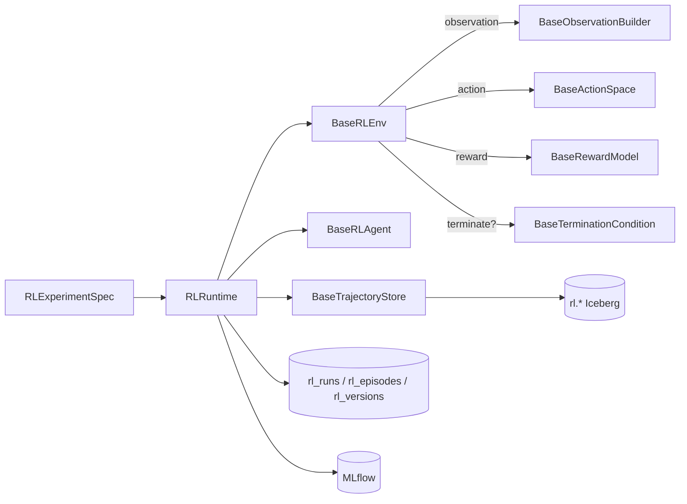

# Reinforcement learning framework

The RL layer in AQP follows a metaclass-driven, registry-first design
inspired by FinRL's library structure and FinRobot's tool-augmented
agent runtime. Every concrete component (env, observation, action,
reward, termination, policy, agent, data pipeline, ensembler,
experiment, trajectory store) auto-registers through
[`aqp/rl/core/base.py`](../aqp/rl/core/base.py) so the API and the lab
UI can browse them at runtime.

This page is the canonical entry point. For shorter cuts:

- [`docs/rl-lab.md`](rl-lab.md) — interactive RL Lab + builders.
- [`docs/rl-components.md`](rl-components.md) — auto-generated component
  reference (browse via `/rl/components` in the UI).
- [`docs/rl-iceberg.md`](rl-iceberg.md) — Iceberg trajectory / equity /
  reward-decomposition tables and DuckDB views.

## Contracts

## Hard rules

1. All RL training / evaluation / paper-trading / replay /
   walk-forward goes through
   [`aqp/rl/runtime.py::RLRuntime`](../aqp/rl/runtime.py). Tasks
   (`aqp/tasks/rl_tasks.py`) and API routes (`aqp/api/routes/rl.py`)
   wrap it — they never call `agent.train` directly.
2. `rl_experiment_versions` rows are immutable, hash-locked.
   Re-snapshotting via
   [`aqp/rl/registry.py::persist_spec`](../aqp/rl/registry.py)
   inserts a new row when the hash changes.
3. All trajectory persistence flows through
   [`aqp/rl/trajectories/iceberg_writer.py::IcebergTrajectoryStore`](../aqp/rl/trajectories/iceberg_writer.py)
   → [`iceberg_catalog.append_arrow`](../aqp/data/iceberg_catalog.py)
   per the AQP data-plane rules.
4. Reward terms register with `rl_kind = "rl_reward"`; envs with
   `rl_env`; data pipelines with `rl_data`; etc. (see
   [`aqp/rl/core/base.py`](../aqp/rl/core/base.py)).
5. LLM calls inside `LLMHybridAgent` route through
   [`router_complete`](../aqp/llm/providers/router.py) per the AQP rules.

## Packages

| Path | Purpose |
| --- | --- |
| [`aqp/rl/core/`](../aqp/rl/core/) | Abstract bases + `RLComponent` metaclass + schema helpers. |
| [`aqp/rl/spec.py`](../aqp/rl/spec.py) | `RLExperimentSpec` declarative blueprint. |
| [`aqp/rl/runtime.py`](../aqp/rl/runtime.py) | `RLRuntime` single sanctioned executor. |
| [`aqp/rl/envs/`](../aqp/rl/envs/) | Concrete envs (existing + FinRL ports + placeholders). |
| [`aqp/rl/rewards/`](../aqp/rl/rewards/) | Composable reward terms. |
| [`aqp/rl/observations/`](../aqp/rl/observations/) | Observation builders. |
| [`aqp/rl/actions/`](../aqp/rl/actions/) | Action-space implementations. |
| [`aqp/rl/terminations/`](../aqp/rl/terminations/) | End-of-episode predicates. |
| [`aqp/rl/data_pipelines/`](../aqp/rl/data_pipelines/) | Iceberg / Yahoo / Alpaca / streaming / replay pipelines. |
| [`aqp/rl/agents/`](../aqp/rl/agents/) | SB3 / ElegantRL / RLlib / CleanRL / LLM-hybrid + classical / Q-family / actor-critic / evolutionary. |
| [`aqp/rl/ensemblers/`](../aqp/rl/ensemblers/) | Walk-forward / best-of-N / curriculum / meta-ensemble. |
| [`aqp/rl/experiments/`](../aqp/rl/experiments/) | Experiment runners (basic / walk-forward / ablation / alpha-backtest). |
| [`aqp/rl/applications/`](../aqp/rl/applications/) | One-call FinRL-style apps (stock / portfolio / crypto / fundamentals / paper). |
| [`aqp/rl/trajectories/`](../aqp/rl/trajectories/) | Iceberg-backed trajectory writer + DuckDB views. |
| [`aqp/persistence/models_rl.py`](../aqp/persistence/models_rl.py) | ORM for specs, versions, runs, evaluations, refs, registrations. |
| [`aqp/api/routes/rl.py`](../aqp/api/routes/rl.py) | REST surface (existing routes + new ones). |
| [`aqp/tasks/rl_tasks.py`](../aqp/tasks/rl_tasks.py) | Celery tasks driven by `RLRuntime`. |
| [`webui/components/rl/`](../webui/components/rl/) | RL Lab + builders + library + runs UI. |
| [`configs/rl/`](../configs/rl/) | Preset / reward / observation / data-pipeline YAMLs. |
| [`tests/rl/`](../tests/rl/) | Hermetic test suite. |

## Spec lifecycle

1. **Author** an `RLExperimentSpec` (YAML or in-code Pydantic).
2. **Persist** via `aqp.rl.registry.persist_spec` → `rl_experiment_specs`
   + `rl_experiment_versions` (hash-locked snapshot).
3. **Run** via `RLRuntime.train` / `.evaluate` / `.paper` / `.replay` /
   `.walk_forward` → opens an `rl_runs` row, builds the env / agent
   from `build_from_config`, drives training, persists per-step
   trajectories to Iceberg, finalises the run row.
4. **Inspect** via the API (`/rl/runs/{id}/equity`, `/trajectories`,
   `/reward-decomposition`, `/episodes`) and the lab UI run detail
   page (equity chart, reward decomposition, episode summary, replay
   slider).

## Inspiration sources

- **FinRL** (`aqp_snippets/inspiration/FinRL-master`) — env taxonomy
  (StockTrading, StockPortfolio, multi-crypto), `DataProcessor` /
  `FeatureEngineer` / `df_to_array`, `DRLAgent` / `DRLEnsembleAgent`,
  composite reward. Ported as registered presets in
  `aqp.rl.envs.finrl_*`, `aqp.rl.data_pipelines.*`, and the
  `WalkForwardEnsembler`.
- **FinRobot** (`aqp_snippets/inspiration/FinRobot-master`) — multi-agent LLM
  workflow + tool-augmented analysis. Bridged via `LLMHybridAgent`
  (LLM proposes, RL refines) and `FundamentalBuilder`.
