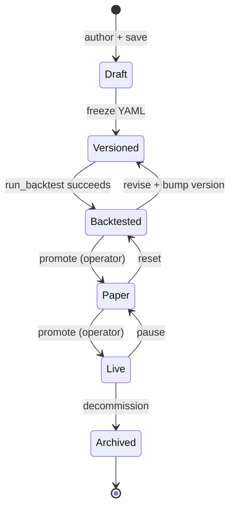

# Strategy Lifecycle

> Doc map: [docs/index.md](index.md) · Backtest dispatch sequence: [docs/flows.md#2-backtest-dispatch](flows.md#2-backtest-dispatch).

Every strategy in AQP follows the same six-step cycle: **build → save →
version → test → paper → live**.

## Build

Open the Strategy Development page (``/strategy``) or hand-write a YAML
recipe under ``configs/strategies/``. Every recipe has the shape:

```yaml
strategy:
  class: FrameworkAlgorithm
  kwargs:
    universe_model: {class: StaticUniverse, kwargs: {symbols: [...]}}
    alpha_model:    {class: MeanReversionAlpha, kwargs: {...}}
    portfolio_model: {class: HierarchicalRiskParity, kwargs: {...}}
    risk_model:     {class: BasicRiskModel, kwargs: {...}}
    execution_model: {class: MarketOrderExecution, kwargs: {}}
backtest:
  class: EventDrivenBacktester
  kwargs: {initial_cash: 100000, start: "2023-01-01", end: "2024-12-31"}
```

## Save + version

Clicking **Save as new strategy** calls ``POST /strategies/`` which
writes a ``Strategy`` row plus ``StrategyVersion`` v1. Every subsequent
``PUT /strategies/{id}`` auto-bumps the version; the diff viewer in the
UI and the ``GET /strategies/{id}/versions/{v}/diff`` endpoint surface a
unified diff between any two versions.

## Test

The **Test** card in the Strategy Development page posts to
``POST /strategies/{id}/test`` with an engine + window. A Celery task
runs the backtest, stores a ``StrategyTest`` row, and links it back to
the strategy. The **Tests** tab lists every run with its Sharpe,
drawdown, and total return.

Each test also fires the MLflow autolog signal, so every test becomes a
first-class MLflow run tagged ``aqp.celery.task = aqp.tasks.backtest_tasks.run_backtest``.

## Paper + live

When a strategy has a green testing record, promote it via
``POST /paper/start`` (the same pipeline the Paper Trading page uses).
The paper engine shares 100% of the strategy code path with the
backtester — no code changes required.

## Archive

``DELETE /strategies/{id}`` soft-deletes by setting ``status=archived``.
Archived strategies are hidden from the default list but all versions +
tests remain queryable via the API for audit.

## State machine



