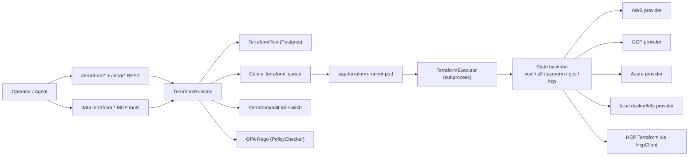

# Terraform IaC control plane

Phase 7 of the multi-tenant rollout introduces the 5th sibling
spec-runtime — **`TerraformRuntime`** — that joins `AgentRuntime`,
`BotRuntime`, `RLRuntime`, `AnalysisRuntime`, and `WorkflowRuntime`.

The runtime is the only sanctioned executor for `terraform plan/apply/
destroy/refresh` operations. Routes / Celery tasks / MCP tools wrap it;
nothing calls `subprocess.run(["terraform", ...])` directly outside
[`aqp/terraform/runner.py::TerraformExecutor`](../aqp/terraform/runner.py).

## Architecture

## Spec → version → run lifecycle

1. **Author a `TerraformStackSpec`** (Pydantic). Hash is SHA-256 of
   canonical JSON.
2. **`persist_spec(spec)`** creates a new
   `terraform_stack_spec_versions` row only when the hash changes
   (AGENTS rule 43).
3. **`TerraformRuntime(spec).plan(workspace_id=...)`** opens a
   `TerraformRun` row (rule 34: carries `experiment_id` + `test_id`
   FKs), enqueues the plan task on the `terraform` Celery queue.
4. **Runner pod executes** `terraform init && terraform plan -out
   tfplan.binary`, captures stdout/stderr to files in the workspace
   dir, parses `terraform show -json tfplan.binary` into a structured
   plan summary, optionally runs OPA Rego policies.
5. **Plan run lands in `awaiting_approval`.** The frontend
   `/infra/terraform/workspaces/[id]` page renders an "Apply this
   plan" button.
6. **`TerraformRuntime(spec).apply(plan_run_id=...)`** opens a child
   `TerraformRun`, executes `terraform apply tfplan.binary`,
   snapshots the resulting state into a `TerraformStateVersion` row.

## Code generation

CDKTF was deprecated by HashiCorp on 2025-12-10. Python-side HCL
generation uses **Jinja2 templates** under
[`aqp/terraform/codegen/templates/`](../aqp/terraform/codegen/templates):

- `storage_{aws,gcp,azure,local}.tf.j2`
- `faas_local.tf.j2` (KEDA + per-queue ScaledObjects)
- `agents_local.tf.j2` (bot pods with `aqp-data-mcp` sidecar)
- `secrets_local.tf.j2` (ESO + ClusterSecretStore + ExternalSecret per `secret_mappings`)
- `generic.tf.j2` (fallback for `module_source` references)

Operator-authored stacks live under [`terraform/modules/`](../terraform/modules/)
and are reachable via `spec.module_source = "../../modules/storage"`.

## State backends

Five backends are supported (`AQP_TERRAFORM_STATE_BACKEND`):

| Kind     | Backend block                              |
| -------- | ------------------------------------------ |
| local    | `terraform { backend "local" { ... } }`    |
| s3       | `backend "s3" { bucket / key / dynamodb }` |
| azurerm  | `backend "azurerm" { storage_account_name }` |
| gcs      | `backend "gcs" { bucket / prefix }`        |
| hcp      | HCP Terraform via `HcpClient`              |

The HCP path uses
[`aqp/terraform/hcp_client.py`](../aqp/terraform/hcp_client.py) (thin
httpx wrapper around `app.terraform.io/api/v2`) — no
`python-terrasnek` dep so cold installs without HCP credentials still
boot cleanly.

## Kill switch

`POST /terraform/halt` is the 6th endpoint fanned out by the topbar
`KillSwitch` (alongside `/agents/halt`, `/quant-agents/halt`,
`/paper/stop-all`, `/bots/halt-all`, `/rl/halt-all`,
`/workflows/halt`). On halt every `queued | running |
awaiting_approval` `TerraformRun` is marked `cancelled` + `halted=True`.

## Policy gate (OPA)

`TerraformPolicyAttachment` rows bind a workspace to one or more OPA
Rego policy files. The runtime calls
[`PolicyChecker.check`](../aqp/terraform/policy.py) after every plan;
`hard_mandatory=True` attachments block the corresponding apply on
violation. When `opa` is not on PATH the checker no-ops (so dev / CI
without OPA installed still works).

## Frontend

Vite/React surfaces under [`frontend/src/routes/infra/`](../frontend/src/routes/infra/):

- `/infra` — 7 tabbed panes (overview / bots / queues / pipeline /
  secrets / k8s / canary) + a Terraform inline summary.
- `/infra/terraform` — workspace list with per-row Plan / Apply /
  Destroy (friction-gated).
- `/infra/terraform/workspaces/[id]` — workspace detail + run history
  + latest state outputs.
- `/infra/terraform/runs/[id]` — run detail with live WS progress
  stream (`/terraform/ws/runs/{id}`).
- `/infra/terraform/stacks` — stack spec catalog.

## Where to look for X

| Task | Path |
| --- | --- |
| Add a new module kind | [`aqp/terraform/codegen/templates/`](../aqp/terraform/codegen/templates/) + [`aqp/persistence/models_terraform.py::TERRAFORM_MODULE_KINDS`](../aqp/persistence/models_terraform.py) |
| Add an MCP tool | [`aqp/data/mcp/tools/terraform.py`](../aqp/data/mcp/tools/terraform.py) |
| Add a REST route | [`aqp/api/routes/terraform.py`](../aqp/api/routes/terraform.py) |
| Add a Celery task | [`aqp/tasks/terraform_tasks.py`](../aqp/tasks/terraform_tasks.py) |
| Edit the runner pod | [`terraform/modules/terraform_runner/main.tf`](../terraform/modules/terraform_runner/main.tf) |
| Add a state backend | [`aqp/terraform/codegen/wrapper.py`](../aqp/terraform/codegen/wrapper.py) |
| Add an OPA policy | Reference the file URI via `TerraformPolicyAttachment.policy_set_uri` |
