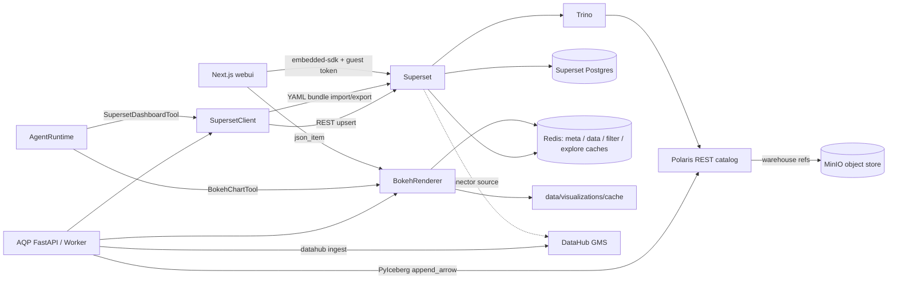

# Visualization Layer

AQP's visualization layer adds Apache Superset for BI exploration and Bokeh
for agent-produced interactive charts. With the `visualization` Compose profile,
**Apache Polaris** is the Iceberg REST catalog; **MinIO** is the S3-compatible
warehouse backing table files. Superset, Trino, and AQP (PyIceberg) all talk to
the same Polaris catalog and warehouse.

## Topology



The default lightweight Compose stack still uses the local PyIceberg SQL
catalog rooted at `/warehouse`; the visualization overlay points api / worker
(and Trino) at **Polaris + MinIO** so they share the same Iceberg metadata and
table snapshots. Configure PyIceberg with `AQP_ICEBERG_REST_URI` and
`AQP_ICEBERG_REST_EXTRA_PROPERTIES_JSON` (Polaris realm header) as set in
[`docker-compose.viz.yml`](../docker-compose.viz.yml).

## Local Startup

```bash
docker compose -f docker-compose.yml -f docker-compose.viz.yml --profile visualization up -d
```

Default local endpoints:

- FastAPI: `http://localhost:8000`
- WebUI: `http://localhost:3000`
- Trino: `http://localhost:8080`
- Superset: `http://localhost:8088` (admin / admin)

Change `SUPERSET_SECRET_KEY`, `SUPERSET_GUEST_TOKEN_JWT_SECRET`, and
`AQP_SUPERSET_PASSWORD` outside local development. The Superset image is
pinned to `apache/superset:4.1.1` (see [deploy/superset/Dockerfile](../deploy/superset/Dockerfile));
bump together with the Superset Postgres schema migration.

## Provisioning Superset

The web UI exposes a Sync Superset action under `/visualizations`. It
posts to `POST /visualizations/superset/sync`, which enqueues
[aqp.tasks.visualization_tasks.sync_superset_assets_task](../aqp/tasks/visualization_tasks.py).
The task provisions:

- Superset database `AQP Trino Iceberg` (Trino SQLAlchemy URI)
- Superset datasets for every preset in [aqp.data.dataset_presets.PRESETS](../aqp/data/dataset_presets.py)
  whose Iceberg table is present
- Category-aware starter charts (price / intraday / fundamentals / macro /
  options / lob / screening / futures / fx / tabular / crypto / universe)
- Dashboard shell `aqp-market-data-explorer`

After the dashboard exists, enable embedding for it in Superset and set
`AQP_SUPERSET_DEFAULT_DASHBOARD_UUID` to the embedded dashboard UUID.

## Interactive Bokeh Explorer

The `/visualizations` page renders a [BokehExplorer](../webui/components/visualizations/BokehExplorer.tsx)
component with:

- **Dataset select** populated from `GET /visualizations/datasets` (live
  Iceberg tables ∪ curated presets, with `has_preset` flagging tables the
  user can ingest on demand).
- **Chart kind select** (`line | scatter | histogram | candlestick | table`).
- **x / y / groupby autocompletes** populated from
  `GET /visualizations/datasets/{identifier}/columns`.
- **Limit input** capped at 50 000 rows.

Clicking *Render* re-mounts a `<BokehEmbed>` against
`POST /visualizations/bokeh/render`, which returns a Bokeh `json_item`
payload. The web UI loads matching BokehJS from the CDN and calls
`Bokeh.embed.embed_item`.

```bash
curl -X POST http://localhost:8000/visualizations/bokeh/render \
  -H "Content-Type: application/json" \
  -d '{"kind":"line","dataset_identifier":"aqp_equity.sp500_daily","x":"timestamp","y":"close","groupby":"vt_symbol"}'
```

## Agent Tools

Two `BaseTool` subclasses expose the visualization layer to spec-driven
agents (see [aqp/agents/tools/visualization_tools.py](../aqp/agents/tools/visualization_tools.py)
and the `TOOL_REGISTRY` in [aqp/agents/tools/__init__.py](../aqp/agents/tools/__init__.py)):

| Tool key | What it does |
| --- | --- |
| `bokeh_chart` | Render an Iceberg dataset to a Bokeh `json_item`; returns a compact `{cache_key, kind, dataset_identifier}` payload so the agent can re-fetch later without blowing its token budget. |
| `superset_dashboard` | List Superset dashboards / datasets, or mint a guest token + embed URL for a given UUID. Falls back to `AQP_SUPERSET_DEFAULT_DASHBOARD_UUID` when no UUID is supplied. |

Per AGENTS rule #2, neither tool calls `router_complete` directly — the
agent runtime drives the LLM, the tools read or render existing data only.

## Bulk Asset Bundles

Superset ships a CLI-compatible asset bundle format (`metadata.yaml` plus
`databases/`, `datasets/`, `charts/`, `dashboards/` YAML directories
zipped together). AQP wraps it through:

- [aqp.visualization.superset_bundle](../aqp/visualization/superset_bundle.py)
  with `export_bundle` / `import_bundle` (REST round-trip) and
  `read_bundle_dir` / `write_bundle_dir` (filesystem round-trip).
- Two Celery tasks `export_superset_bundle_task` / `import_superset_bundle_task`
  in [aqp.tasks.visualization_tasks](../aqp/tasks/visualization_tasks.py).
- Two FastAPI routes `POST /visualizations/superset/bundle/{export,import}`.
- A curated repo bundle at [deploy/superset/bundles/aqp_market_data/](../deploy/superset/bundles/aqp_market_data/)
  that gets populated by a first export.

The `aqp viz` CLI exposes the same operations:

```bash
aqp viz sync                                                              # provision via REST
aqp viz export --out deploy/superset/bundles/aqp_market_data              # write YAML directory
aqp viz import deploy/superset/bundles/aqp_market_data --overwrite        # replay into Superset
aqp viz render --dataset aqp_equity.sp500_daily --kind line --out chart.json
aqp viz cache-clear --older-than-hours 24
aqp viz datahub                                                           # push to DataHub (no-op when off)
```

## Caching

Two layers cooperate:

1. **Superset → Redis.** Superset's metadata, chart-data, filter-state,
   explore-form, and SQL Lab caches are configured against the AQP Redis
   instance in [deploy/superset/superset_config.py](../deploy/superset/superset_config.py)
   (`aqp_superset_meta_*`, `aqp_superset_data_*`, `aqp_superset_filter_*`,
   `aqp_superset_explore_*`, `aqp_superset_results_*`).
2. **AQP Bokeh renderer → two-tier cache.** [aqp.visualization.bokeh_renderer](../aqp/visualization/bokeh_renderer.py)
   serves cached `json_item` payloads from Redis (key `aqp:viz:bokeh:{cache_key}`,
   TTL = `AQP_VISUALIZATION_CACHE_TTL_SECONDS`) and falls back to a
   gitignored file tier under `data/visualizations/cache`. The file tier
   also TTL-expires via mtime checks. Backend selection lives in
   `AQP_VISUALIZATION_CACHE_BACKEND ∈ {both, redis, file}` (default `both`).

Cache keys are derived from the spec **plus** the underlying Iceberg
`current_snapshot.snapshot_id`, so any write to a source table naturally
invalidates the chart by changing the key. Force-evict via the UI button,
`POST /visualizations/cache/clear`, or `aqp viz cache-clear`.

## Tracing

Every Superset client request, every Bokeh render, and every sync run is
wrapped in an OpenTelemetry span via the canonical
[aqp.observability.tracing.get_tracer](../aqp/observability/tracing.py)
helper. Spans of interest:

| Span | Notable attributes |
| --- | --- |
| `superset.client.<method>` | `http.method`, `http.url`, `superset.path`, `superset.auth`, `superset.csrf`, `http.status_code` |
| `superset.sync_assets` | `superset.dataset_count`, `superset.chart_count`, `superset.dashboard_count`, `superset.upserted_*` |
| `bokeh.render_item` | `bokeh.dataset`, `bokeh.kind`, `bokeh.limit`, `bokeh.cache_key`, `bokeh.cache_hit`, `bokeh.rows` |
| `superset.bundle.{export,import}` | `superset.bundle.bytes`, `superset.bundle.dashboard_count`, `superset.bundle.overwrite` |

When `AQP_OTEL_ENDPOINT` is unset the tracer degrades to a no-op so dev
hosts pay nothing.

## DataHub Push

[aqp.tasks.visualization_tasks.push_superset_to_datahub_task](../aqp/tasks/visualization_tasks.py)
builds a DataHub Superset ingestion recipe in-memory and replays it via
`datahub.ingestion.run.pipeline.Pipeline`. The task short-circuits cleanly
when either:

- `AQP_DATAHUB_GMS_URL` is empty (no DataHub configured), or
- `AQP_DATAHUB_SUPERSET_SYNC_ENABLED=false` (the default — opt-in).

When enabled, the recipe pushes Superset databases, datasets, charts, and
dashboards into DataHub against the AQP platform-instance set on
`AQP_DATAHUB_PLATFORM_INSTANCE`, sinking through the canonical
`datahub-rest` sink. Trigger via `POST /visualizations/datahub/sync`,
`aqp viz datahub`, or schedule via the existing Celery beat surface.

The Superset connector lives under the `acryl-datahub[superset]` extra
which is now part of both the `datahub-sync` and `visualization` extras
in [pyproject.toml](../pyproject.toml).

## Settings reference

| Setting | Default | Purpose |
| --- | --- | --- |
| `AQP_SUPERSET_BASE_URL` | `http://localhost:8088` | Superset URL the AQP backend talks to. |
| `AQP_SUPERSET_PUBLIC_URL` | `http://localhost:8088` | Superset URL the browser hits (often the same outside k8s). |
| `AQP_SUPERSET_USERNAME` / `_PASSWORD` / `_PROVIDER` | `admin` / `admin` / `db` | Service account used by `SupersetClient`. |
| `AQP_SUPERSET_GUEST_USERNAME` / `_FIRST_NAME` / `_LAST_NAME` | `aqp_guest` / `AQP` / `Guest` | Guest identity baked into embed JWTs. |
| `AQP_SUPERSET_DEFAULT_DASHBOARD_UUID` | empty | UUID returned to `/visualizations/superset/guest-token` when no override is supplied. |
| `AQP_TRINO_URI` / `_CATALOG` / `_SCHEMA` | `trino://trino@localhost:8080/iceberg` / `iceberg` / `aqp` | Superset → Trino SQLAlchemy URI baseline. |
| `AQP_VISUALIZATION_CACHE_DIR` | `./data/visualizations/cache` | File-tier cache directory (already gitignored). |
| `AQP_VISUALIZATION_CACHE_TTL_SECONDS` | `3600` | TTL applied to both cache tiers. |
| `AQP_VISUALIZATION_CACHE_BACKEND` | `both` | One of `both | redis | file`. |
| `AQP_VISUALIZATION_BUNDLE_DIR` | `./data/visualizations/bundles` | Where exported zip bundles land. |
| `AQP_DATAHUB_SUPERSET_SYNC_ENABLED` | `false` | Toggle the DataHub Superset push. |
